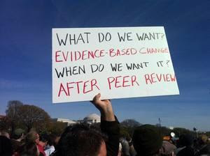

```{r setup, include=FALSE}
knitr::opts_chunk$set(echo = T,message=F,error=F,warning = F)
require(tidyverse)
require(kableExtra)
```

layout: true

<div class="slide-footer"><span> 
PPOL561 | Accelerated Statistics for Public Policy II

&emsp;&emsp;&emsp;&emsp;&emsp;&emsp;&emsp;&emsp;&emsp;

Week 1 <!-- Week of the Footer Here -->

&emsp;&emsp;&emsp;&emsp;&emsp;&emsp;&emsp;&emsp;&emsp;&emsp;&emsp;&emsp;

Introduction & Research <!-- Title of the lecture here -->

</span></div> 

---

class: outline

# Outline for Today 

<br>
<br>


- **Course Overview**

- **Presentations**

- **Research Design**

---

class: newsection

# Course Overview

---

.center[]

---

## General

- **_Meet_**: Wednesdays 12:30 to 3:00 PM in **Healy 104**

- **_Recitation_**: Wednesdays from 4:00 to 5:00 in **Old North G-02**

- **_Teaching Assistant_**: Maddie Pickens 

- **_Office Hours_**: 
  - _Professor_: 1pm to 3pm Tuesdays
  - _TA_: by appointment (email/slack)

- **_Class Website_** (https://ericdunford.com/ppol561) &rarr; Lecture materials 
  
- **_Canvas_** &rarr; Readings

- **_Slack_** &rarr; Communication

---

## Course Goals

![:space 3]

1. **Causality**: understand the challenge of isolating causal effects via random assignment, experiments, instrumental variables and other methods;

2. **Modeling**: understand and implement advanced statistical models, such as limited dependent variable models (binary, ordered, and multinomial outcomes), selection models, and panel models;

3. **`R` Programming**: use `R` to manipulate data and conduct advanced statistical analysis.

4. **Communication/Presentation**: effectively communicate statistical analysis and present publication-quality tables and graphics.

---
  
## Course Calendar

<center> 

```{r,echo=F,message=F,tidy=T}
read_csv(here::here('Syllabus/spring-2020-timeline.csv')) %>% 
  {.[is.na(.)]="";.} %>% 
  kable(., "html") %>% 
  kable_styling(font_size = 17,position = 'center')
```

---

## Course Policies

![:space 4]

- **Attendance/Participation**

- **Late Assignments**

- **Proof of Diligent Debugging**

- **No Practice Exams**

- **Sit with someone different each class**

- **Instructional Continuity**

- **Use of Class Materials**

---

## Work Load

+ Six homework assignments
+ One 10-minute "group" presentation
+ Two 2-hour written exams (midterm and final)

![:space 5]

.center[

| **** | **** | 
|----------------|----------------|
| 	 |	       |
| 	   |		       |
| 	   |		       |
|  	 |	       |
|    	 |	       |

]

---

## Succeeding in this course

<br><br>

- **Come Prepared**

- **Ask Questions**

- **Collaborate**

- **Start Homeworks Early**

- **Utilize the Teaching Assistant**

---

## Concerns

- **__**
  
  + Some have a lot of previous methods exposure; others less so.
  + We all have different substantive interests

- **__** 

  + Slow me down
  + Ask questions
  + I will re-schedule the course calendar if we need time

- **__** 

  + It'll happen. Read, follow along with the lecture, and you'll be fine

+ **__**

---


class:newsection

# Presentations

---

## General

- **_Randomly paired_** with another student; presentation date also randomly assigned. 

- **_10 minute, in-class presentation with slides_** on a paper related to the material we are discussing. 

- Presentations will be given at the **_start of class_** each week. 
  + Presenters should set up their slides prior to the start of class.
  + First presentation is on January 29th (and every week thereafter, except for the week of the midterm)

- ****

- [**Presentation Rubric**](presentation_rubric_PPOL561.pdf)

---

## Presentation Schedule

<center>

```{r,echo=F,message=F,tidy=T}
read_csv(here::here('Students/presentation_schedule.csv')) %>% 
  mutate(Week=c(3:9,11:14)) %>% 
  select(Group,Week,everything()) %>% 
  {.[is.na(.)]="";.} %>% 
  select(-contains('email')) %>% 
  kable(., "html", booktabs = T,align = c('c','c','c')) %>%
  kable_styling(latex_options = c("striped", "scale_down","repeat_header"),
                full_width = T,
                font_size = 24,
                row_label_position = 'c') 
```


---

## Main things to hit

![:space 5]

- What is the issue and why is it **interesting**?

- Why is it **hard to answer** the question?

- What is the **inferential** issue?

- How did this paper **meet the challenge**?

- What did they **find**?

---

![:space 7]

- **Be interesting**

  + Do **__** read notes
  
  + Don't pack too much in

  + Start strong with a “hook” and with interesting context
  

<br>

- **Know your audience**

  + They have advanced statistical knowledge

  + But they have not read the paper


---

![:space 7]

- **Be Concise**

  + You can't cover everything so don't try
  
  + Do not show huge tables of numbers &rarr; in fact, don't copy and paste any tables into your slide.
  
  + Generate compelling visuals.

  + If something is on a slide, explain it clearly.  (Otherwise cut it!)
  

- **Be Ready**

  + Practice out-loud at least twice (preferably to someone who hasn’t read the paper)
  
  + 10 minutes – not more, not less
  
  + Prepare for questions


---

## Critiques require context

An effective critique includes an explanation of how your point would change results

<br>

- ****: 
> There are too many variables!

- ****: 
> Multicollinearity of variable $X_1$ and $X_2$ could increase the variance of $\beta_1$ and could explain its statistical insignificance


---

## Critiques require context

An effective critique includes an explanation of how your point would change results

<br>

- ****:
> They didn’t include a variable for $Z$

- ****:
> $Z$ was omitted and we believe that excluding it matters as $Z$ is likely correlated with variable $X$, making us wonder if omitted variable bias has distorted the estimate of the effect of $X$ on $Y$.


---

## Critiques require context

An effective critique includes an explanation of how your point would change results


- ****: 

> The study was only of California.

- ****:
> The study was only of California, which is a very diverse state.

- ****:
> I’m concerned about the generalizability of the findings because I expect the coefficient on X to be different in a diverse state such as California due to …

---

## Critiques require context

![:space 7]
- Better to have 1 or 2 critique well explained than many poorly explained

- It's okay to piggy-back on some of the critiques addressed in subsequent publications; but you need to have some original content. 

- Be clear and explicit about why you think your proposed adjustment or issue pointed out might change the outcome of the analysis. 

- Be fair

  + Avoid "collect more data"-type critiques.

---

## Tips

- **_Start preparing early_**

- **_Coordinate_** & **_communicate_** with your partner  

- Hunt for an **_interesting paper_** (makes the exercise far more enjoyable)

  + Have a paper you already think is really interesting? Look at other papers in that journal. Georgetown subscribes to hundreds of academic journals.
  
  + Check out media/non-academic publications for features on academic work, such as the [Monkey Cage](https://www.washingtonpost.com/news/monkey-cage/). These articles will direct you to political science/public policy related work. 
  
- Keep in mind the paper must be a **_peer-reviewed_**, empirical article; ideally using one or more of the methods covered in this class

---

class: newsection

# Research Design

---

![:space 5]

.pull-left[
<br>
<br>
- **Inference**: a belief based on evidence _and_ rules for processing that evidence

<br>

- **Methodology**: tools for gathering and analyzing data to make valid inferences
]

.pull-right[

```{r,fig.align="center",fig.width=7,fig.height=7,echo=F}
DiagrammeR::mermaid("
graph TB
  A(Questions)-->B{Data}
  B-->C(Methodology)
  C-->D[Beliefs]
  D-->E[Claims]
  E-->A
  D-->A
", height=650)
```
]

---

###Two Types of Inference

![:space 5]

**Descriptive Inference** &rarr; What are the facts?

+ Is the climate changing?
+ Is the United States politically polarized? 
+ Is global terrorism increasing?
+ Is Azerbaijan a democracy?

--

**Causal Inference** &rarr; Why does something occur?

- _Why_ is the climate changing?
- _Why_ is the United States politically polarized?
- _Why_ is (or is not) global terrorism increasing?
- _Why_ is (or is not) Azerbaijan a democracy?

---

### A Causal Research Question

Typically start with either

- (1) an **outcome** (dependent variable)

  - If what, then $Y$?
  - What _causes_ $Y$?
  - Associated with a search for causes, e.g. what causes climate change?

--

- (2) a **cause** (independent variable)

  - If $X$, then what? 
  - What happens if to $Y$ if $X$ goes up or down?
  - Associated with “experimentation”; e.g. What happens if we release greenhouse gases into the air?
  
  
---

### Which of these is a causal research question?

![:space 10]

- Will Democrats win the next U.S. presidential election?

- What factors increased the likelihood of Hillary Clinton's defeat in the 2016 election?

- How has electoral performance for the Republican party changed over the last three decades?

- What was the result of the last U.S. presidential election?

- What role did the economy have on the last U.S. presidential election?

---

### Which of these is a causal research question?

![:space 10]

- 

- What factors increased the likelihood of Hillary Clinton's defeat in the 2016 election?

- 

- 

- What role did the economy have on the last U.S. presidential election?

---

### Falsifiability

One of the tenets behind the scientific method is that any scientific hypothesis and resultant experimental design must be inherently _falsifiable_.

--

**Falsifiability** is the assertion that for any hypothesis to have credence, it must be inherently <u>disprovable</u> before it can become accepted as a scientific hypothesis or theory.

--

.center[****]

.center[]

.center[****]

.center[]


---

### Falsifiability

One of the tenets behind the scientific method is that any scientific hypothesis and resultant experimental design must be inherently _falsifiable_.

**Falsifiability** is the assertion that for any hypothesis to have credence, it must be inherently <u>disprovable</u> before it can become accepted as a scientific hypothesis or theory.

.center[****]
> 

.center[****]
> 

---

# Good research questions

### 1. Start from political problem or puzzle 

- Something important

- Not obvious

--

### 2. Builds on an existing research literature/Knowledge

- "Stand on the shoulders of giants"

- Don't reinvent the wheel

--

### 3. Falsifiable


---

## Generating Questions

### Puzzle-driven 

- Given what we know, we expect A but observe B. How interesting!

--

### Theory-driven 

- Deduction

--

### Data/Method-driven 

- Induction

--

### "Should"-driven

- normative

---

## Generating Theories

![:space 10]


---

## Generating Theories

### Approach 1: Reason _Inductively_

- Induction works by drawing generalities from specific observations

- Sometimes called “bottom-up” theorizing

--

<br>

### Approach 2: Reason _Deductively_

- Deduction begins from general, assumed principles/axioms to reach more specific observable realities

- e.g. Rational choice theory

---

## Generating Theories


What makes for a **_good theory_**:

- **Truth**: Maps to reality

- **Relevance**: Matters

- **Coherence**: Is clear

- **Falsifiability**: Can be disproven 

- **Precision**: Captures the concepts of interest

- **Generality**: Theories that can explain more are preferred over theories that can explain less

- **Parsimony**: Simple theories are preferred over complex theories

---

## Generating Hypotheses

- What would evidence consistent/inconsistent with the theory be? 

- Think about **_observable_ implications** derived from the theory

- Use causal ("if-then") logic

- **_Falsifiable_**

- Avoid **_Observational Equivalence_**
  
  - All hypotheses for two (or more) theories are identical
  
  - Different drivers yield the same results
  
  - Get around this by establishing clear **_scope conditions_**; reformulating question/theory/concept

---

### (_Social_) Scientific Method

![:space 2]

.center[

**Research question(s)** 

**Clarify the core concepts** 

**Develop (causal) theory (_with clear scope conditions_)**

**Derive specific, testable hypotheses**

**Plan data collection**

**Gather data/evidence**

**Analyze data**

**Draw inferences**

]


