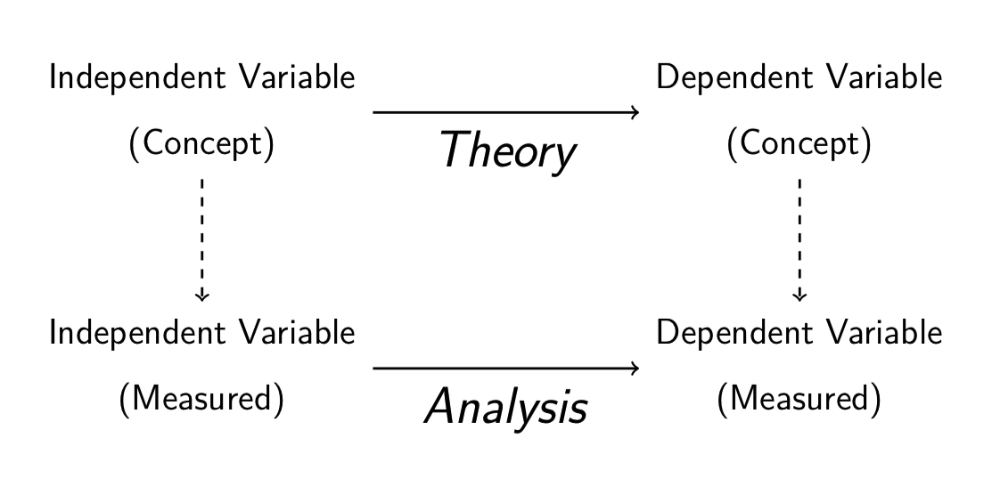

```{r setup, include=FALSE}
knitr::opts_chunk$set(echo = T,message=F,error=F,warning = F)
require(tidyverse)
```

layout: true

<div class="slide-footer"><span> 
PPOL561 | Accelerated Statistics for Public Policy II

&emsp;&emsp;&emsp;&emsp;&emsp;&emsp;&emsp;&emsp;&emsp;

Week 13 <!-- Week of the Footer Here -->

&emsp;&emsp;&emsp;&emsp;&emsp;&emsp;&emsp;&emsp;&emsp;&emsp;&emsp;&emsp;

Research & Review <!-- Title of the lecture here -->

</span></div> 

---
class: outline

# Outline for Today 

- Brief Discussion on **Research Design**

- Open **review** of concepts covered in this course

<br>

### Final

**Friday, May 10 (12:30-2:30pm)**	

**Healy 104** (This room)

**17-18 questions; exact same format as the midterm**


---

class: newsection

# Research Design

---

![:space 5]

.pull-left[
<br>
<br>
- **Inference**: a belief based on evidence _and_ rules for processing that evidence

<br>

- **Methodology**: tools for gathering and analyzing data to make valid inferences
]

.pull-right[

```{r,fig.align="center",fig.width=7,fig.height=7,echo=F}
DiagrammeR::mermaid("
graph TB
  A(Questions)-->B{Data}
  B-->C(Methodology)
  C-->D[Beliefs]
  D-->E[Claims]
  E-->A
  D-->A
", height=650)
```
]

---

###Two Types of Inference

![:space 5]

**Descriptive Inference** &rarr; What are the facts?

+ Is the climate changing?
+ Is the United States politically polarized? 
+ Is global terrorism increasing?
+ Is Azerbaijan a democracy?

--

**Causal Inference** &rarr; Why does something occur?

- _Why_ is the climate changing?
- _Why_ is the United States politically polarized?
- _Why_ is (or is not) global terrorism increasing?
- _Why_ is (or is not) Azerbaijan a democracy?

---

### A Causal Research Question

Typically start with either

- (1) an **outcome** (dependent variable)

  - If what, then $Y$?
  - What _causes_ $Y$?
  - Associated with a search for causes, e.g. what causes climate change?

--

- (2) a **cause** (independent variable)

  - If $X$, then what? 
  - What happens if $X$?
  - Associated with “Experimentation”; e.g. What happens if we release greenhouse gases into the air?
  
  
---

### Which of these is a causal research queston?

![:space 10]

- Will Democrats win the next U.S. presidential election?

- What factors increased the likelihood of Hillary Clinton's defeat in the 2016 election?

- How has electoral performance for the Republican party changed over the last three decades?

- What was the result of the last U.S. presidential election?

- What role did the economy have on the last U.S. presidential election?

---

### Which of these is a causal research queston?

![:space 10]

- 

- What factors increased the likelihood of Hillary Clinton's defeat in the 2016 election?

- 

- 

- What role did the economy have on the last U.S. presidential election?

---

### Falsifiability

One of the tenets behind the scientific method is that any scientific hypothesis and resultant experimental design must be inherently _falsifiable_.

--

**Falsifiability** is the assertion that for any hypothesis to have credence, it must be inherently disprovable before it can become accepted as a scientific hypothesis or theory.

--

.center[****]

.center[]

.center[****]

.center[]


---

### Falsifiability

One of the tenets behind the scientific method is that any scientific hypothesis and resultant experimental design must be inherently _falsifiable_.

**Falsifiability** is the assertion that for any hypothesis to have credence, it must be inherently disprovable before it can become accepted as a scientific hypothesis or theory.

.center[****]
> 

.center[****]
> 

---

# Good research questions

### 1. Start from political problem or puzzle 

- Something important

- Not obvious

--

### 2. Builds on an existing research literature/Knowledge

- "Stand on the shoulders of giants"

- Don't reinvent the wheel

--

### 3. Falsifiable


---

## Generating Questions

### Puzzle-driven 

- Given what we know, we expect A but observe B. How interesting!

--

### Theory-driven 

- Deduction

--

### Data/Method-driven 

- Induction

--

### "Should"-driven

- normative

---

## Generating Theories

![:space 10]



---

## Generating Theories

### Approach 1: Reason _Inductively_

- Induction works by drawing generalities from specific observations

- Sometimes called “bottom-up” theorizing

--

<br>

### Approach 2: Reason _Deductively_

- Deduction begins from general, assumed principles/axioms to reach more specific observable realities

- e.g. Rational choice theory

---

## Generating Theories


What makes for a **_good theory_**:

- **Truth**: Maps to reality

- **Relevance**: Matters

- **Coherence**: Is clear

- **Falsifiability**: Can be disproven 

- **Precision**: Captures the concepts of interest

- **Generality**: Theories that can explain more are preferred over theories that can explain less

- **Parsimony**: Simple theories are preferred over complex theories

---

## Generating Hypotheses

- What would evidence consistent/inconsistent with the theory be? 

- Think about **_observable_ implications** derived from the theory

- Use causal ("if-then") logic

- **_Falsifiable_**

- Avoid **_Observational Equivalence_**
  
  - All hypotheses for two (or more) theories are identical
  
  - Different drivers yield the same results
  
  - Get around this by estabilishing clear scope conditions; reformulating question/theory/concept

---

### (_Social_) Scientific Method

![:space 2]

.center[

**Research question(s)** 

**Clarify the core concepts** 

**Develop (causal) theory**

**Derive specific, testable hypotheses**

**Plan data collection**

**Gather data/evidence**

**Analyze data**

**Draw inferences**

]

---

class: newsection

## Review 

---

![:space 10]

.center[
```{r,echo=F,message=F,tidy=T}
readr::read_csv(here::here('Syllabus/spring-2019-timeline.csv')) %>% 
  {.[is.na(.)]="";.} %>% 
  select(`Topics Covered` = Topic) %>%
  slice(c(-1,-4,-7,-8,-15,-16)) %>% 
  kableExtra::kable(., "html",align = "center") %>% 
  kableExtra::kable_styling(font_size = 25,position = 'center')
```

]

---

![:space 15]
### Question 

The difference in means of the treated and control groups is not a good measure of the treatment effect when randomization fails to create balanced treatment and control groups.

--

<br>

### Answer

True

---

![:space 15]
### Question 

Pooled OLS models are biased when:

- (a) The fixed effects are correlated with the independent variable.
- (b) The fixed effects are correlated with the dependent variable.
- (c) The fixed effects model is used but in reality there are no fixed effects in the data.
- (d) We don't know the direction of the fixed effects.

--

<br>

### Answer

A

---

![:space 15]
### Question 

A key assumption for regression discontinuity is that the error term does not jump at the point of discontinuity.


--

<br>

### Answer

True

---

![:space 15]
### Question 

Describe how to asses if other variables act differently at the point of discontinuity, and explain the consequence of other variables jumping at the point of discontinuity.


--

<br>

### Answer

If other variables jump at the point of discontinuity, we may wonder if the people involved are somehow self-selecting (or being selected) based on some additional factors. If so, it could be that these other factors, not the treatment, are jumping at the discontinuity and causing a jump in $Y$.

---

### Question 

Suppose we wish to know if long prison sentences reduce the probability of recidivism. The basic model is $$Repeat crime_i = \beta_0 + \beta_1Sentence length_i + \epsilon_i$$ where $Repeatcrime$ is 1 for released prisoners who end up being sent back to jail after release. Which of the following is viable as an instrumental variable?

- (a) A variable indicating the severity of the initial crime.
- (b) A variable indicating that the person had been randomly assigned to a judge with a record of harsh sentencing.
- (c) A variable indicating that the person had been randomly assigned to an educational program while in prison.
- (d) A variable indicating whether the person was a high school dropout.


--

### Answer: B

---

![:space 15]
### Question 

Matching guarantees the identification of a causal relationship from observational data.

--

<br>

### Answer

False

---

![:space 15]
### Question 

A compliance problem can lead to endogeneity because non-compliance is generally not random.

--

<br>

### Answer

True


---

![:space 15]
### Question 

Explain why a fixed effects model is not necessary when fixed effects exist but are not correlated with the independent variable.

--

<br>

### Answer

In this case, the conditions for omitted variable bias are not satisfied, and omission of the fixed effects will therefore not cause bias.

---

![:space 15]
### Question 

If $Z$ is a weak instrument, explain how its use will influence the variance of $\beta_j$.

--

<br>

### Answer

A weak instrument is one that does a poor job of explaining $X_1$ when controlling for other factors. Its use in the model leads to a higher variance of $\beta_j$ because will completely depend on the other independent variables (meaning the $R^2$ of a regression predicting $X_1$ as a function of the non-instrumental variables will be high).


---

![:space 15]
### Question 

We employ binned graphs in order to:

- (a) Help us ignore the functional form of the model and allow us to use a liner model regardless of the true relationship.
- (b) Help us determine the functional form of the model.
- (c) Increase the statistical power of the model.
- (d) Deal with endogeneity.

--

<br>

### Answer

B


---

![:space 15]
### Question 

Which of the following is false?

- (a) Fitted values from probit models and logit models are very similar when they are based on the same data.
- (b) The coefficients in probit models and logit models are very similar when they are based on the same data.
- (c) Probit models are slightly more accurate than logit models.
- (d) Logit models make sense when using logged variables.

--

<br>

### Answer

B


---

![:space 15]
### Question 

When matching, every treated observation must be precisely matched with a complementary control observation?

--

<br>

### Answer

False

---

![:space 15]
### Question 

One way to check for balance between the treatment and control groups is to look for a statistically significant coefficient on the treatment dummy variable in a model in which variable $X_1$ is the dependent variable.

--

<br>

### Answer

True

---

<br>
<br>
<br>
<br>
.center[
### Good Luck with Finals and the End of the Semester!
]

<br><br><br><br>
> Remember: The Final is on May 10 from 12:30 to 2:30 in Healy 104. See you then!