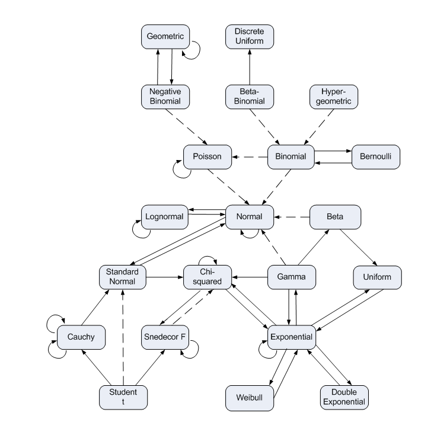

```{r setup, include=FALSE}
knitr::opts_chunk$set(echo = T,message=F,error=F,warning = F,cache = T,fig.align='center')

# Packages 
require(tidyverse)
library(dagitty)
library(ggdag)

theme_set(theme_dag())
```

layout: true

<div class="slide-footer"><span> 
PPOL561 | Accelerated Statistics for Public Policy II

&emsp;&emsp;&emsp;&emsp;&emsp;&emsp;&emsp;&emsp;&emsp;

Week 4 <!-- Week of the Footer Here -->

&emsp;&emsp;&emsp;&emsp;&emsp;&emsp;&emsp;&emsp;&emsp;&emsp;&emsp;&emsp;

OLS, Confounders, & Simulation <!-- Title of the lecture here -->

</span></div>

---
class: outline

# Outline for Today 

- Using **_simulation_** as a tool to better understand statistical concepts

- **_Precision_** of estimates

- Delve into different types of **_confounding_** and how to deal with it:

  - **_omitted variable bias_**
  
  - **_collider bias_**
  
  - **_measurement error_**
  
  - **_missingness_**

---

class: newsection

# Simulations

---

## Generating random distributions

.center[| Distribution | Function | Arguments |   
| ----- | ------ |  ---------- |
| Normal (Gaussian) | `rnorm()` | `n=`,`mean=`,`sd=`|
| Binomial | `rbinom()` | `n=`, `size=`, `prob=` |
| Uniform | `runif()` | `n=`, `min=`, `max=` |
| Poisson | `runif()` | `n=`, `lambda=` |
| Negative Binomial | `rnbinom()` | `n=`, `size=`,`prob=`, `mu=`|
| Beta | `rbeta()` | `n=`, `shape1=`, `shape2=` |
| Chi-Squared | `rchisq()` | `n=`, `df=` |
| Exponential | `rexp()` | `n=`, `rate=` |
| Gamma | `rgamma()` | `n=`, `rate=`,`scale=`|
]

And many more...

---

## Getting a feeling for the shape...

```{r,echo=FALSE}
set.seed(123)
N = 1000
bind_rows(tibble(x = rnorm(N,0,1),type="Normal"),
          tibble(x = runif(N,-2,2),type="Uniform"),
          tibble(x = rbinom(N,1,.7),type="Bernoulli"),
          tibble(x = rpois(N,1.5),type="Poisson"),
          tibble(x = rbeta(N,2,2),type="Beta"),
          tibble(x = rexp(N,2),type="Exponential"),
          tibble(x = rexp(N,100),type="Chi-Squared"),
          tibble(x = rgamma(N,2,3),type="Gamma"),
          tibble(x = rnbinom(N,2,prob=.5),type="Negative Binomial")) %>% 
  ggplot(aes(x,fill=type,color=type),alpha=.4) + 
  geom_histogram() +
  facet_wrap(~type,scales = "free") +
  ggthemes::theme_tufte() +
  ggthemes::scale_fill_gdocs() +
  ggthemes::scale_color_gdocs() +
  theme(legend.position = "none",
        strip.text = element_text(size = 14))
          
```

---

.center[]

.center[[Play around with it!](https://dunforde.shinyapps.io/distribution_intuition/)]

---

## Why simulate?

![:space 3]

- **We know the answer**: we can specify values for the slope and see if we can recover them. 

- **Viable testing ground**: 
  - we can break models on purpose; 
  - try to build the symptoms that cause a model to break down; do the proscribed corrections actually correct?
  - Simulation offers us a way to make sure we're actually solving the problem.

- **Use as a tool to gain an intuitive understanding of statistical concepts**

---

## The Aim

![:space 10]

The goal is to **mimic the properties of the model** that we're aiming to examine. 

![:space 5]

For example, to get a best linear unbiased estimator, OLS requires that:

- $E[\epsilon] = 0$

- $var(\epsilon)$ is constant. 

- $cor(\textbf{X},\epsilon) = 0$

---

## Simulating error 

We can easily simulate these assumptions using the following:

```{r,fig.height=4,fig.width=7}
error <- rnorm(n = 1000, mean = 0, sd = 1)
hist(error,col="grey30",border="white",binwidth = 10)
```

---

### "Ideal" error

![:space 10]

```{r}
mean(error) # expected value approx. 0
```

```{r}
var(error) # constant variance 
```

 

---

## Simulating an independent variable

This synthetic variable could be **normal**
```{r,fig.height=4,fig.width=7}
x <- rnorm(n = 1000, mean = 0, sd = 1)
hist(x,col="steelblue",border="white")
```


---

<br>
<br>
<br>

Or **uniform**
```{r,fig.height=4,fig.width=7}
x2 <- runif(n = 1000,min = 0,max = 100)
hist(x2,col="forestgreen",border="white")
```

---

Or **binomial**
```{r,fig.height=4,fig.width=7}
x3 <- rbinom(n = 1000,size = 1,prob = .3)
hist(x3,col="gold",border="white")
```

OLS makes no distributional assumptions about the independent variables. Only the dependent variable and the resulting errors.

---

## Simulating the dependent variable

![:space 5]

Recall that $y_i$, our continuous outcome, is thought to be a function (linearly related) to our independent variables. 

We want to simulate a $y$ that is a **function** of $x$, plus some error.

```{r,fig.height=2,fig.width=7}
intercept = 1
slope = 2

# Simulate y as a function of x1 + error
y = intercept + slope*x + error
```

---

![:space 5]

```{r,fig.height=5,fig.width=7}
# Plot
plot(x,y,pch = 16, col=scales::alpha('grey30',.5))
```


---

```{r,fig.height=5,fig.width=7}
# Estimate a linear model...
model = lm(y ~ x)
alpha = model$coefficients['(Intercept)']
beta = model$coefficients['x']

# Scatter Plot
plot(x,y,pch = 16, col=scales::alpha('grey30',.5))

# Plot the fitted line...
abline(alpha,beta,col="blue",lwd=4) # best linear unbiased estimator
```

---

## Breakout

Simulate the following model, 

$$y_i = 2.5 + -1.5x_i + 1.3z_i - s_i + \epsilon_i$$

Then do the following:

1. Run a Monte Carlo simulation. Rerun the sim 100 simulations and plot the coefficients as histograms. 

2. Try and make the model "wrong"?
  
  - Suggestions:
      - What happens if you changed the variance on the error?
      - What happens if you changed the mean of the error to something other than 0?


---

class: newsection

# Precision of Estimates

---

## Variance of Estimates

Variance of a coefficient estimate in a multivariate model:

$$var(\hat{\beta_j}) = \frac{\hat{\sigma}^2}{N\times var(x_j)(1-R^2_j)}$$

where $R^2_j$ is the $R^2$ for an "auxiliary regression",

and

$$\hat{\sigma}^2 = \frac{\sum_{i=1}^N(y_i - \hat{y_i})^2}{N-k}$$

where $k$ is the number of parameters in the model.

---

## Auxiliary Regressions

There is a different $R^2_j$ for each independent variable. If our model is

$$y_i = \beta_0 + \beta_1 x_{1i} + \beta_2 x_{2i} + \epsilon_i$$

<br>

there will be two different $R^2_j$s:

- $R^2_1$ is the $R^2$ from $x_{1i} = \gamma_1 x_2 + \tau_i$

- $R^2_2$ is the $R^2$ from $x_{2i} = \phi_1 x_1 + \omega_i$

<br>

These $R^2_j$s tell us how much the other variables explain $x_j$.

---

## Multicollinearity

<br>

Multicollinearity refers to the **strength of linear relationships among independent variables**

![:space 5]

1. Multicollinearity causes the variance of $\hat{\beta_1}$ to be higher than if there were no multicollinearity.

2. Multicollinearity does not cause the $\hat{\beta_1}$ estimates to be biased.

3. The standard $se(\hat{\beta_1})$ produced by OLS accounts for multicollinearity.


---

## Consistency

- Connection to the variance of the coefficient equation

- Connection to statistical power

<br>

```{r,echo=FALSE,fig.height=5,fig.width=10}
set.seed(123)
s = 1
m = 10
bind_rows(tibble(N="N = 10",x =rnorm(n = 10,m,s)),
         tibble(N="N = 100",x =rnorm(n = 100,m,s)),
         tibble(N="N = 1000",x =rnorm(n = 1000,m,s)),
         tibble(N="N = 100000",x =rnorm(n = 1e5,m,s))) %>%
  ggplot(aes(x,color=N)) +
  geom_histogram(lwd=1,alpha=.1) +
  ggthemes::scale_color_tableau() +
  ggthemes::theme_tufte() +
  facet_wrap(~N,scales="free_y") +
  theme(legend.position = "none",
        axis.text = element_text(size=16),
        axis.title = element_text(size=16),
        strip.text = element_text(size=16))
```


---

# Confidence Intervals

Interpreting a 95% confidence interval:

1. The lower bound of a 95% confidence interval will be a value of $\beta_1$ such that there is less than a 2.5% probability of observing a $\hat{\beta_1}$ as high as the $\hat{\beta_1}$ actually observed.

2. The upper bound of a 95% confidence interval will be a value of $\beta_1$ such that there is less than a 2.5% probability of observing a $\hat{\beta_1}$ as low as the $\hat{\beta_1}$ actually observed.

.center[
| Confidence Level | Critical Value | Confidence Interval |
| ----- | ------ | -------|
| 90% | 1.64 | $\hat{\beta_1} \pm 1.64 \times se(\hat{\beta_1})$ |
| 95% | 1.96 | $\hat{\beta_1} \pm 1.96 \times se(\hat{\beta_1})$ |
| 99% | 2.58 | $\hat{\beta_1} \pm 2.58 \times se(\hat{\beta_1})$ |
]

---

## Precision: summary

$$var(\hat{\beta_j}) = \frac{\hat{\sigma}^2}{N\times var(x_j)(1-R^2_j)}$$

**Four factors influence the variance of multivariate $\hat{\beta_j}$ estimates**:

1. **Model fit**: the better the model fits, the lower the $\hat{\sigma}^2$ and $var(\hat{\beta_j})$ will be.
2. **Variation in $x_j$**: the more $x_j$ varies, the lower the $var(\hat{\beta_j})$ will be.
3. **Sample size**: the more observations, the lower the $var(\hat{\beta_j})$ will be.
4. **Multicollinearity**: the less the other independent variables explain $x_j$, the lower the $R^2_j$ and $var(\hat{\beta_j})$ will be.

---

class: newsection

# Confounding

![:space 5]

****

---

## Omitted Variable Bias

![:space 5]

```{r,echo=F,fig.width=8.5,fig.height=4,fig.align='center',dpi=200}
coords <- 
  c("x",0,0,
    "u",1,1,
    "y",2,0) %>% 
  {data.frame(matrix(., nrow=length(.), ncol=3, byrow=T))} %>% 
  {colnames(.) <- c("name","x","y");.}


# Initialize the DAG.
dag <- dagify(x ~ u,
              y ~ x + u,
              exposure = "x",
              outcome = "y",
              coords=coords)


dag %>% 
  tidy_dagitty() %>% 
  mutate(observed = ifelse(name=="u",2,1)) %>% 
  mutate(observed_text = ifelse(name=="u","black","white")) %>% 
  ggplot(aes(x = x, y = y, xend = xend, yend = yend)) +
  geom_dag_edges(aes(edge_linetype=observed)) +
  geom_dag_point(aes(color=factor(observed)),show.legend = F) +
  scale_color_manual(values=c('1'="black",'2'="grey80")) +
  geom_dag_text(size = 8) +
  theme_dag()
```


---

## Collider Bias

![:space 5]

```{r,echo=F,fig.width=8,fig.height=4,fig.align='center',dpi=200}
coords <- data.frame(matrix(c("x",0,1,
                              "z",1,0,
                              "y",2,1), nrow=3, ncol=3, byrow=T))
colnames(coords) <- c("name","x","y")

dag <- dagify(z ~ x,
              z ~ y,
              exposure = "x",
              outcome = "y",
              coords=coords)
ggdag(dag,text_size = 8) 
```

---

## Collider Bias

Note that **_collider bias_** can occur even one controls on a **_collider's descendant!_**

```{r,echo=F,fig.width=8,fig.height=4,fig.align='center',dpi=200}
# Layout
coords <- data.frame(matrix(c("a",0,1,
                              "b",2,1,
                              "m",1,.5,
                              "x",0,0,
                              "y",2,0,
                              "z",1,0), nrow=6, ncol=3, byrow=T))
colnames(coords) <- c("name","x","y")


# Initialize the DAG.
dag <- dagify(x~ a, 
              m ~ a + b,
              z ~ m,
              y ~ b,
              exposure = "x",
              outcome = "y",
              coords=coords)

dag %>% ggdag()
```

---

## Backdoor Adjustment

```{r,echo=F,fig.width=7,fig.height=4,fig.align='center',dpi=200}
coords <- data.frame(matrix(c("X",0,0,
                              "Y",2,0,
                              "Q",1,1,
                              "G",0,1,
                              "V",0,2,
                              "H",2,2,
                              "Z",2,1), nrow=8, ncol=3, byrow=T))
colnames(coords) <- c("name","x","y")


# Initialize the DAG.
dag <- dagify(Y ~ Z, 
              Y ~ Q,
              Z ~ H,
              G ~ V,
              Q ~ H, Q ~ V,
              X ~ G, X ~ Q,
              Y ~ X,
              exposure = "X",
              outcome = "Y",
              coords=coords)

# Plot the DAG
ggdag(dag)
```

---

## Backdoor Adjustment

```{r,echo=F,fig.width=8,fig.height=5.5,fig.align='center',dpi=200}
ggdag_adjustment_set(dag) +
  labs(color="",shape="") +
  scale_color_manual(values=c("steelblue","black")) +
  theme(legend.position = "none")
```


---

## Breakout 

Simulate the following DAG. The effect size for each relationship should be set at 1. Locate the minimal control set to satisfy the backdoor criteria. (_Extra_: Run your simulation 1000 times for 500 observations and plot the distribution for the effect ( $\beta$ ) of X on Y.)


```{r,echo=F,fig.width=7,fig.height=3.5,fig.align='center',dpi=200}
coords <- data.frame(matrix(c("G",1,3,
                              "S",1,2,
                              "Z",1,0,
                              "X",0,1,
                              "Y",2,1), nrow=6, ncol=3, byrow=T))
colnames(coords) <- c("name","x","y")


# Initialize the DAG.
dag <- dagify(Y ~ Z + S + X,
              S ~ Z + G,
              X ~ S + G,
              exposure = "X",
              outcome = "Y",
              coords=coords)

# Plot the DAG
ggdag(dag)
```


---

## Frontdoor Adjustment

![:space 5]

```{r,echo=F,fig.width=9.5,fig.height=3.5,fig.align='center',dpi=200}

coords <- data.frame(matrix(c("X",0,0,
                              "Y",2,0,
                              "U",1,1,
                              "Z",1,0), nrow=4, ncol=3, byrow=T))
colnames(coords) <- c("name","x","y")


# Initialize the DAG.
dag <- dagify(Y ~ Z, 
              Y ~ U,
              X ~ U,
              Z ~ X,
              exposure = "X",
              outcome = "Y",
              coords=coords)

# Plot the DAG
dag %>% 
  tidy_dagitty() %>% 
  mutate(observed = ifelse(name=="U",2,1)) %>% 
  mutate(observed_text = ifelse(name=="U","black","white")) %>% 
  ggplot(aes(x = x, y = y, xend = xend, yend = yend)) +
  geom_dag_edges(aes(edge_linetype=observed)) +
  geom_dag_point(aes(color=factor(observed)),show.legend = F) +
  scale_color_manual(values=c('1'="black",'2'="grey80")) +
  geom_dag_text(size = 8) +
  theme_dag()
```

---

## Measurement Error 

![:space 5]

```{r,echo=F,fig.width=9.5,fig.height=5,fig.align='center',dpi=200}

coords <- data.frame(matrix(c("X",0,0,
                              "Xobs",0,1,
                              "U",0,2,
                              "Y",1,0,
                              "Yobs",1,1,
                              "Q",1,2), nrow=6, ncol=3, byrow=T))
colnames(coords) <- c("name","x","y")

# Initialize the DAG.
dag <- dagify(Xobs ~ X,
              Xobs ~ U,
              Yobs ~ Y,
              Yobs ~ Q,
              Y ~ X,
              exposure = "X",
              outcome = "Y",
              coords=coords)

# Plot the DAG
unobserved_set = c("U","Q","X","Y")
dag %>% 
  tidy_dagitty() %>% 
  mutate(observed = ifelse(name %in% unobserved_set,2,1)) %>%
  mutate(observed_text = ifelse(name %in% unobserved_set,
                                "black","white")) %>%
  ggplot(aes(x = x, y = y, xend = xend, yend = yend)) +
  geom_dag_edges(aes(edge_linetype=observed)) +
  geom_dag_point(aes(color=factor(observed)),size=20,show.legend = F) +
  scale_color_manual(values=c('1'="black",'2'="grey70")) +
  geom_dag_text(size = 6) +
  theme_dag()
```


---

## Missing Data

![:space 5]

- **Missing completely at random** (MCAR) - missing data is independent of the observed and unobserved data. (Essentially just a form of measurement error.) 
  + Data was randomly shuffled into training and test dataset. The test data fell off the truck. 

- **Missing at random** (MAR) - data are systematically missing but on an observable data. 

- **Missing not at random** (MNAR) - data are systematically missing due to an unobservable variable. 

---


## Missing at random

Example: _Female survey respondents are more likely to complete the survey than their male counterparts. We can observe everyone's gender._

![:space 2]

```{r,echo=F,fig.width=9.5,fig.height=5,fig.align='center',dpi=200}

coords <- data.frame(matrix(c("X",0,0,
                              "Xobs",0,1,
                              "U",.5,2,
                              "Y",1,0,
                              "Yobs",1,1), nrow=6, ncol=3, byrow=T))
colnames(coords) <- c("name","x","y")

# Initialize the DAG.
dag <- dagify(Xobs ~ X,
              Yobs ~ Y,
              Xobs ~ U,
              Yobs ~ U,
              Y ~ X,
              exposure = "X",
              outcome = "Y",
              coords=coords)

# Plot the DAG
unobserved_set = c("X","Y")
dag %>% 
  tidy_dagitty() %>% 
  mutate(observed = ifelse(name %in% unobserved_set,2,1)) %>%
  mutate(observed_text = ifelse(name %in% unobserved_set,
                                "black","white")) %>%
  ggplot(aes(x = x, y = y, xend = xend, yend = yend)) +
  geom_dag_edges(aes(edge_linetype=observed)) +
  geom_dag_point(aes(color=factor(observed)),size=20,show.legend = F) +
  scale_color_manual(values=c('1'="black",'2'="grey70")) +
  geom_dag_text(size = 6) +
  theme_dag()
```

---


## Missing not at random

Example: _Those more interested in politics are more likely to respond to a political survey than those who are less interested._ We cannot observe someone's latent interest in politics.

```{r,echo=F,fig.width=9.5,fig.height=5,fig.align='center',dpi=200}

coords <- data.frame(matrix(c("X",0,0,
                              "Xobs",0,1,
                              "U",.5,2,
                              "Y",1,0,
                              "Yobs",1,1), nrow=6, ncol=3, byrow=T))
colnames(coords) <- c("name","x","y")

# Initialize the DAG.
dag <- dagify(Xobs ~ X,
              Yobs ~ Y,
              Xobs ~ U,
              Yobs ~ U,
              Y ~ X,
              exposure = "X",
              outcome = "Y",
              coords=coords)

# Plot the DAG
unobserved_set = c("U","X","Y")
dag %>% 
  tidy_dagitty() %>% 
  mutate(observed = ifelse(name %in% unobserved_set,2,1)) %>%
  mutate(observed_text = ifelse(name %in% unobserved_set,
                                "black","white")) %>%
  ggplot(aes(x = x, y = y, xend = xend, yend = yend)) +
  geom_dag_edges(aes(edge_linetype=observed)) +
  geom_dag_point(aes(color=factor(observed)),size=20,show.legend = F) +
  scale_color_manual(values=c('1'="black",'2'="grey70")) +
  geom_dag_text(size = 6) +
  theme_dag()
```
