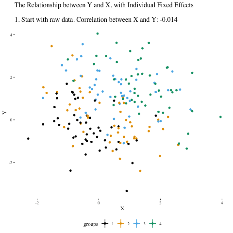
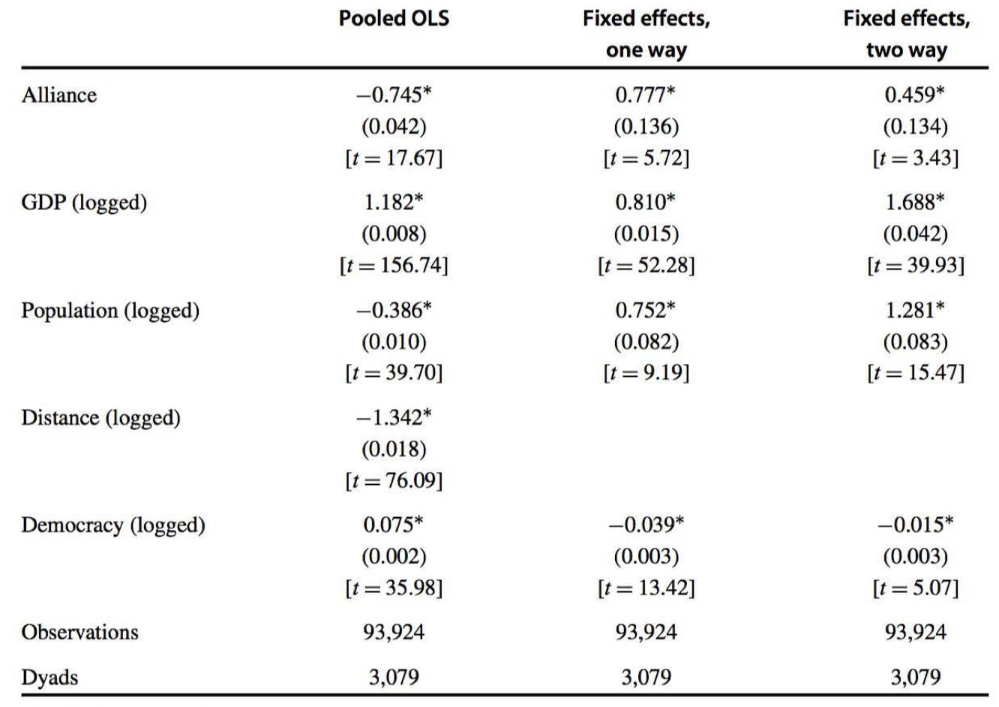
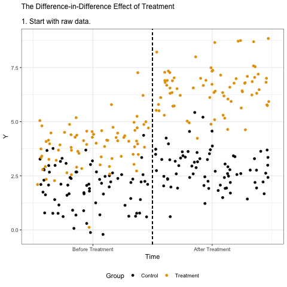
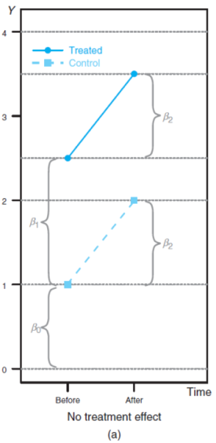
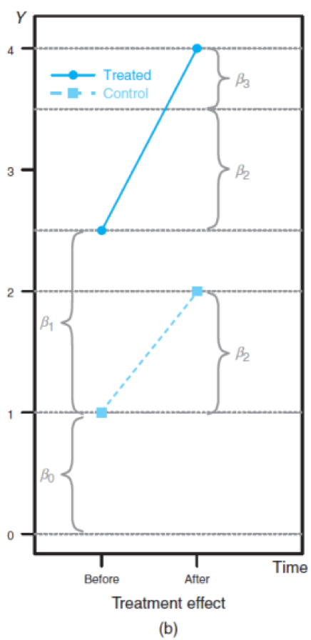
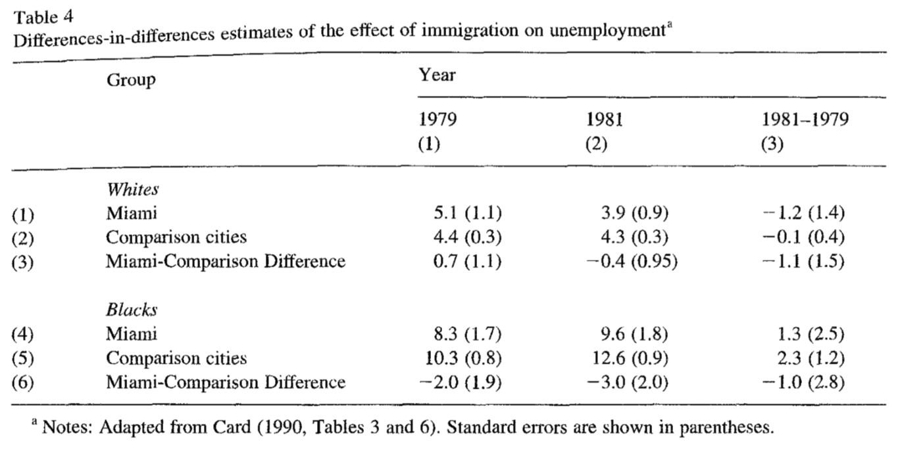

```{r setup, include=FALSE}
knitr::opts_chunk$set(echo = T,message=F,error=F,warning = F,cache=T)
require(tidyverse)
```

layout: true

<div class="slide-footer"><span> 
PPOL561 | Accelerated Statistics for Public Policy II

&emsp;&emsp;&emsp;&emsp;&emsp;&emsp;&emsp;&emsp;&emsp;

Week 5 <!-- Week of the Footer Here -->

&emsp;&emsp;&emsp;&emsp;&emsp;&emsp;&emsp;&emsp;&emsp;&emsp;&emsp;&emsp;

Panel Data & DID <!-- Title of the lecture here -->

</span></div> 

---
class: outline

# Outline for Today 

![:space 10 ]

- Discuss **Panel Data**

![:space 5 ]

- Delve into **Difference-in-Difference** models 


---

class: newsection

# Panel Data

---

## The problem

$$y_{it} = \beta_0 + \beta_1 x_{it} + \epsilon_{it}$$

OLS assumes $cor(x,\epsilon) =  0$, when violated we get biased results. This is known as **omitted variable bias** because some factor correlated with $y$ and $x$ is unaccounted for and distorting our estimates.

It can be difficult to account for _all_ potential confounders, especially when concepts are difficult or impossible to measure.

---

## The problem

$$crime_{it} = \beta_0 + \beta_1 police_{it} + \epsilon_{it}$$

OLS assumes $cor(x,\epsilon) =  0$, when violated we get biased results. This is known as **omitted variable bias** because some factor correlated with $y$ and $x$ is unaccounted for and distorting our estimates.

It can be difficult to account for _all_ potential confounders, especially when concepts are difficult or impossible to measure. 

- history of segregation in a city ( $hs$ )
- culture ( $cl$ )
- quality of life ( $ql$ )
- ...

$$crime_{it} = \beta_0 + \beta_1 police_{it} + ( hs_i + cl_i + ql_i + \dots + \nu_{it} )$$

---

## The problem

We might never be able to measure everything that makes a place or time what it is, but we _can_ control for them. 

We do this by putting in a **dummy variable** that soaks up all the unique features of a specific **unit** (e.g. a state, a time period, a dyad, a country, etc.). 

--

.center[
```{r,echo=F,fig.align="center"}
expand.grid(i = c('city1','city2','city3'),
            t = 1992:1994) %>% 
  arrange(i) %>% 
  mutate(history = c(1,1,1,4,4,4,2.3,2.3,2.3),
         culture = c(3.4,3.4,3.4,10.2,10.2,10.2,9.8,9.8,9.8)) %>% 
kableExtra::kable(align = 'c')
```
]


---

## The problem

We might never be able to measure everything that makes a place or time what it is, but we _can_ control for them. 

We do this by putting in a **dummy variable** that soaks up all the unique features of a specific **unit** (e.g. a state, a time period, a dyad, a country, etc.).

.center[
```{r,echo=F,fig.align="center"}
expand.grid(i = c('city1','city2','city3'),
            t = 1992:1994) %>% 
  arrange(i) %>% 
  mutate(city1 = c(1,1,1,0,0,0,0,0,0),
         city2 = c(0,0,0,1,1,1,0,0,0),
         city3 = c(0,0,0,0,0,0,1,1,1)) %>% 
  kableExtra::kable(align = 'c')
```
]


---

## The problem

We might never be able to measure everything that makes a place or time what it is, but we _can_ control for them. 

We do this by putting in a **dummy variable** that soaks up all the unique features of a specific **unit** (e.g. a state, a time period, a dyad, a country, etc.). 

$$crime_{it} = \beta_1 police_{it} + \\\alpha_1{city_1} + \alpha_2{city_2} + \dots + \alpha_i{city_i} + \nu_{it}$$
<br>
$$crime_{1t} = \beta_1 police_{1t} +\\ \alpha_1(1) + \alpha_2(0) + \dots + \alpha_i(0) + \nu_{1t}$$


---

## The problem

We might never be able to measure everything that makes a place or time what it is, but we _can_ control for them. 

We do this by putting in a **dummy variable** that soaks up all the unique features of a specific **unit** (e.g. a state, a time period, a dyad, a country, etc.). 

$$crime_{1t} = \alpha_1 + \beta_1 police_{1t} + \nu_{1t}$$
$$crime_{2t} = \alpha_2 + \beta_1 police_{2t} + \nu_{2t}$$
$$\vdots$$

$$crime_{it} = \alpha_i + \beta_1 police_{it} + \nu_{it}$$
---

## Let's simulate to see it in practice

```{r}
set.seed(1234)                            # set seed to replicate
N_cities = 50                             # No. of Fake cities
city = paste0("city",1:N_cities)          # City name ID
city_effect = rnorm(N_cities,             # Baseline mean for 
                    mean = 20,sd = 5)     # each city
year = 1990:2000                          # Fake year range
D = expand.grid(city=city,year=year)      # Combine city-years
D = left_join(D,tibble(city,city_effect)) # merge data
D
```

---

## Let's simulate to see it in practice

```{r,highlight=T}
set.seed(1234)                            # set seed to replicate
N_cities = 50                             # No. of Fake cities
city = paste0("city",1:N_cities)          # City name ID
city_effect = rnorm(N_cities,             # Baseline mean for 
                    mean = 20,sd = 5)     # each city
year = 1990:2000                          # Fake year range
D = expand.grid(city=city,year=year)      # Combine city-years
D = left_join(D,tibble(city,city_effect)) # merge data
D %>% arrange(city) #<<
```

---

## Let's simulate to see it in practice

```{r}
N = nrow(D) # N obs (city-year)
x = rnorm(N,mean=D$city_effect)  # mean of x conditional on city
error = rnorm(N,mean=D$city_effect,sd=3) # mean of y conditional 
                                         # on city
true_effect <- -.5 # population effect
y = 1 + true_effect*x + error # true model

D$crime <- y; D$police <- x # create variables 
head(D)
```

---

```{r,fig.align="center",fig.width=10,fig.height=6}
ggplot(D,aes(police,crime)) +
  geom_point(alpha=.4,size=4) + 
  geom_smooth(method="lm",se=F) +
  theme(legend.position = "none")
```


---

```{r,fig.align="center",fig.width=10,fig.height=6,highlight=T}
ggplot(D,aes(police,crime,color=factor(city))) + #<<
  geom_point(alpha=.4,size=4) + 
  geom_smooth(method="lm",se=F) +
  theme(legend.position = "none")
```

---

```{r,fig.align="center",fig.width=10,fig.height=5,highlight=T}
# Remove city specific effects
D$police_star <- resid(lm(police ~ factor(city),data=D)) #<<
D$crime_star <- resid(lm(crime ~ factor(city),data=D)) #<<

ggplot(D,aes(police_star,crime_star)) +
  geom_point(alpha=.4,size=4) + 
  geom_smooth(method="lm",se=F) +
  theme(legend.position = "none")
```


---

**true effect** of police on crime $= -.5$

```{r}
broom::tidy(lm(crime~police,data=D))
```

--

```{r}
broom::tidy(lm(crime~police + factor(city),data=D)) 
```

---

## Do the coefficients for the fixed effects themselves tell us anything?

--
<br><br>
**Not really**

- Recall that the intercept is meaningless when the independent variables cannot take on the value of $0$. (What does it mean to have 0 police in a city? State of nature?). 

- Fixed effects are treated as controls in the literature. The coefficients for the fixed effects are not reported explicitly (but usually denoted in the table reporting the results).

---

## Two approaches

- **Least Squares Dummy Variables** &rarr; add a dummy for each unit (this is what we just did)

--

- **De-meaning** &rarr; center $x$ and $y$ around their group mean
  
  + Recall from the simulation that $x$ and $y$ are centered around city-specific means? That, is each city has a different baseline for both $x$ and $y$.
  + We want to remove this city-specific baselines.
  + We can by group mean centering

--

$$\tilde{y_t} = y_{it} - \bar{y}_{i}$$
$$\tilde{x_t} = x_{it} - \bar{x}_{i}$$
$$\tilde{\nu_t} = \nu_{it} - \bar{\nu}_{i}$$

$$ \tilde{y_t} = \beta_1\tilde{x_t} + \tilde{\nu}_t $$
---

### The logic


$$y_{it} = \beta_0 + \beta_1 x_{it} + \epsilon_{it}$$

--

![:space 3]

$$y_{it} = \beta_1 x_{it} + (\alpha_i  + \nu_{it})$$

--

![:space 3]

$$\bar{y}_i = \beta_1 \bar{x}_i + \alpha_i  + \bar{\nu}_i$$

--

![:space 3]

** $$y_{it} -\bar{y}_i = \beta_1 (x_{it} - \bar{x}_i) + \alpha_i - \alpha_i  + (\nu_{it} - \bar{\nu}_i)$$ **


![:space 3]

** $$\tilde{y}_t = \beta_1 \tilde{x}_t + \tilde{\nu}_t$$ **

---

.center[

```{r,echo=F}
D %>% 
  select(city,year,crime) %>% 
  group_by(city) %>% 
  mutate(crime = round(crime,2),
         city_mean = round(mean(crime),2),
         crime_group_mean_centered = crime - mean(crime),
         crime_group_mean_centered = round(crime_group_mean_centered,2),
         crime_group_mean_centered = str_glue("{crime} - {city_mean} = {crime_group_mean_centered}")) %>% 
  kableExtra::kable(align = "c")
```
]

---

<br>
.center[]

---

```{r}
# Manually de-mean by transforming data
D <- 
  D %>% 
  group_by(city) %>% 
  mutate(crime_demeaned = crime - mean(crime),
          police_demeaned = police - mean(police)) %>% 
  ungroup

mod = lm(crime_demeaned~police_demeaned,data = D)
round(mod$coefficients,3)
```

--

```{r}
# Use a package to do it...
plm::plm(crime~police,data=D,index="city")
```

---

## Two-way fixed effects

A two-way fixed effect model accounts for both **unit** and **time** specific errors. 

- **unit**: e.g. baseline differences between cities
  + DC and Chicago are different for a whole number of reasons.
  
- **time**: e.g. baseline differences between years
  + 1999 and 2009 are different for a whole number of reasons.

<br>
> Since we can't possibly control for everything, we use fixed effects to remove the between year and between city differences. What is left is all the variation that is not explained by that time or location. 

---

## Two-way fixed effects (LSDV)

<br>
$$crime_{it} = \beta_1 police_{it} + \\\alpha_1{city_1} + \alpha_2{city_2} + \dots + \alpha_i{city_i} +\\ + \tau_1 year_1 + \tau_2 year_2 + \dots + \tau_t year_t + \nu_{it}$$
<br>
$$crime_{11} = \beta_1 police_{11} + \\\alpha_1(1) + \alpha_2(0) + \dots + \alpha_i(0) +\\ + \tau_1 (1) + \tau_2 (0) + \dots + \tau_t (0) + \nu_{11}$$

---

## Two-way fixed effects (LSDV)

$$crime_{11} = (\alpha_1 + \tau_1) + \beta_1 police_{11} + \nu_{11}$$
$$crime_{12} = (\alpha_1 + \tau_2) + \beta_1 police_{12} + \nu_{12}$$

$$\vdots$$

$$crime_{1t} = (\alpha_1 + \tau_t) + \beta_1 police_{1t} + \nu_{1t}$$

--
<br>

Generalized form


<strong>
$$y_{it} = \alpha_i + \tau_t + \beta_1 x_{it} + \nu_{it}$$
</strong>

---

## Two-way fixed effects (de-mean)

![:space 5]

$$y_i = \beta_0 +\beta_1 x_{it} + \epsilon_{it}$$

$$y_i = \beta_1 x_{it} + (\alpha_i   + \tau_t + \nu_{it})$$

--

![:space 5]


$$y_{it} -\bar{y}_i - \bar{y}_t + \bar{y} = \\ \beta_1 (x_{it} - \bar{x}_i - \bar{x}_t + \bar{x}) +\\ \alpha_i - \alpha_i + \tau_t - \tau_t  + \\(\nu_{it} - \bar{\nu}_i - \bar{\nu}_t + \bar{\nu})$$ 


$$\tilde{y} = \beta_1 \tilde{x} + \tilde{\nu}$$ 

---

## Two-way fixed effects (de-mean)

![:space 5]

.center[
| | $y_{t=1}$ | $y_{t=2}$ | $\dots$ | $y_{t}$
|----| ---- | -----| -----|
| $y_{i=1}$ | $y_{11}$ | $y_{12}$ | $\dots$ | $y_{1t}$ | 
| $y_{i=2}$ | $y_{21}$ | $y_{22}$ | $\dots$ | $y_{2t}$ | 
| $\vdots$ | $\vdots$ | $\vdots$ | $\vdots$ |  $\vdots$|
| $y_{i}$ | $y_{i1}$ | $y_{i2}$ | $\dots$ | $y_{it}$   | 
]

---

## Two-way fixed effects (de-mean)

![:space 5]

.center[
|    | $y_{t=1}$ | $y_{t=2}$ | $\dots$ | $y_{t}$ | 
|----| ---- | -----| -----| ----|
| $y_{i=1}$ | $y_{11}$ | $y_{12}$ | $\dots$ | $y_{1t}$ |  $\bar{y}_{i=1}$
| $y_{i=2}$ | $y_{21}$ | $y_{22}$ | $\dots$ | $y_{2t}$ | $\bar{y}_{i=1}$
| $\vdots$ | $\vdots$ | $\vdots$ | $\vdots$ |  $\vdots$| $\vdots$
| $y_{i}$ | $y_{i1}$ | $y_{i2}$ | $\dots$ | $y_{it}$   | $\bar{y}_{i=i}$
|         | $\bar{y}_{t=1}$ | $\bar{y}_{t=2}$ | $\dots$ | $\bar{y}_{t=t}$  |  ** $\bar{y}$ **  |
]

![:space 5]

$$\bar{y_t} = \frac{\sum^T_{t=1} y_{it}}{T} ~~~ \bar{y_i} = \frac{\sum^P_{i=1} y_{it}}{P} ~~~ \bar{y} = \frac{\sum^T_{t=1} \sum^P_{i=1} y_{it}}{PT}$$


---

## Two-way fixed effects (hybrid)


<br>

$$y_i = \beta_1 x_{it} + (\alpha_i   + \tau_t + \nu_{it})$$

<br>

$$(y_{it} - \bar{y}_i) = \beta_1 (x_{it} - \bar{x}_i) + \alpha_i - \alpha_i + \tau_t  + (\nu_{it} - \bar{\nu}_i)$$ 

<br>

$$\tilde{y_t} =  \tau_t + \beta_1 \tilde{x}_t + \tilde{\nu_t}$$ 

---

## Example: Trade and Alliances

$$\text{Bilateral Trade}_{it} = \beta_0 + \beta_1 Alliance_{it} + \alpha_i + \epsilon_{it}$$
.center[]

---

## Example: Trade and Alliances

$$\text{Bilateral Trade}_{it} = \beta_0 + \beta_1 Alliance_{it} + \alpha_i + \epsilon_{it}$$

- Does international trade flow more heavily between countries that are allies, _OR_ do economic factors alone determine trade?

- $i$ = dyad

  + A dyad is a unit that consists of two elements
  + e.g. node ties in a network, married couple, doctor-patient

.center[
|    |    |
|-----------|-----------|
| $state_A$ | $state_B$ |
| $state_B$ | $state_A$ |
]

- $t$ = year

---

## Example: Trade and Alliances

.center[]

---

## Limitations

<br>
- No fix for **autocorrelation**

<br>
- **Lose between unit variation** (may hold most of the story!)

<br>
- **Incidental parameter problem**


---

class:newsection

### <font size=25>Difference-in-Difference</font>


---


## The problem 

We want to know the effect of some policy in a state. Policy is implemented in some states (treated), but not others (control).

--

The idea is to compare the outcome for states where the policy was implemented to the states where it was not. 

$$y_{it} = \beta_0 + \beta_1 policy_{it} + \epsilon_{it}$$

--

<br>
Consider the "stand your ground" law on the resulting state homicide rate.

$$homicide_{it} = \beta_0 + \beta_1 SYG_{it} + \epsilon_{it}$$


--

Say $\beta_1 > 0$, is that enough to conclude the law resulted in an increase in the number of homicides in the state?

--

**Probably not**. Homicide rates could rise and fall for a bunch of reasons that have nothing to do with the policy. 


---

## A solution

- To get around this, we can compare states that passed the policy (treated) to those that did not (control). 

--

- Need to account for what life was like _before_ and _after_ the policy took effect in both groups. We can do this by taking the difference between the number of homicides in the treated and control states both before and after the policy took effect.

$$\Delta homicides^T = (State^{T}_{after} - State^{T}_{before})\\\Delta homicides^C =(State^{C}_{after} - State^{C}_{before})$$
--

- Then take the difference of those differences

$$(State^{T}_{after} - State^{T}_{before}) - (State^{C}_{after} - State^{C}_{before})\\\Delta homidices^T - \Delta homidices^C$$

---

### OLS to estimate diff-in-diff model

$$y_{it} = \beta_0 + \beta_1 treated_{it} + \beta_2 after_{it} + \beta_3 (treated_{it}\times after_{it}) + \epsilon_{it}$$

where
- $after$ is 1 if post-treatment observation (i.e. after the policy went into effect)
- $treated$ is 1 if unit $i$ is in treatment group (i.e. enacted the policy)

<br>
<br>
--

.center[
| | **Control** | **Treatment** |
|------|-------|-------|
| **Before** |  $\beta_0$   | $\beta_0 + \beta_1$   |
| **After** |  $\beta_0 + \beta_2$   |  $\beta_0 + \beta_1 + \beta_2 +$ ** $\beta_3$ **  |
]

---

<br>

.center[]


---

<br>
.center[
.left-column[] .right-column[]
]

---

$$homicide_{it} = \beta_0 + \beta_1 SYG_{it} + \beta_2 after_{it} +\\\beta_3 (SYG_{it}\times after_{it}) + \epsilon_{it}$$

.center[
|    |     |
|----|-----|
| $\beta_0$ | mean level of homicide in control states |
| $\beta_0 + \beta_1$ | mean level of homicide in the treatment states |
| $\beta_2$ | national trends that impacted both groups |
|** $\beta_3$ ** | **the effect of the policy (treatment effect)** |
]

--

<br>

- $\beta_1$ is the preexisting differences in the treated and untreated states. Analogous to a unit fixed effect (but only accounts for the treated and control groups). 

- $\beta_2$ is denotes the change over time, Analogous to a time fixed effect (but only accounts for the pre-treatment and post-treatment groups).

---

### Parallel Trends Assumption

The **_parallel trends assumption_** assumes that, in absence of treatment, the unobserved differences between treatment and control groups are the same overtime.

$$E[Y(0)_{t+1} - Y(0)_{t} | T = 1] = E[Y(0)_{t+1} - Y(0)_{t} | T = 0]$$

If violated, estimates of the causal effect will be biased. 

```{r,echo=F,fig.align="center",fig.width=10,fig.height=4,dpi=350}
tibble(time =   c(1,1,1,2,2,2),
       effect = c(1,1.5,1.5,1.5,2,2.5),
       group =  c("c","t_c","t","c","t_c","t"),
       obs = c("o","c","o","o","c","o")) %>% 
  ggplot(aes(time,effect,group=group)) +
  geom_line(aes(lty=obs,color=group)) +
  geom_point(size=3,aes(color=group)) +
  geom_vline(xintercept = 1.5,lty=2,size=1,color="grey20") +
  scale_linetype_manual(values=c(2,1)) +
  scale_color_manual(values=c("steelblue","darkred","grey50")) +
  theme_minimal() +
  geom_label(x=1.5,y=2.5,label = "Treatment Administered",color="grey20") +
  geom_label(x=.85,y=1.5,
             label = latex2exp::TeX("E\\[Y_{t=1}|T = 1\\]", output='character'),
             parse=TRUE,color="darkred") +
  geom_label(x=.85,y=1,
             label = latex2exp::TeX("E\\[Y_{t=1}|T = 0\\]", output='character'),
             parse=TRUE,color="steelblue") +
  geom_label(x=2.15,y=2,
             label = latex2exp::TeX("E\\[Y(0)_{t=2}|T = 1\\]", output='character'),
             parse=TRUE,color="grey50") +
  geom_label(x=2.15,y=2.5,
             label = latex2exp::TeX("E\\[Y_{t=2}|T = 1\\]", output='character'),
             parse=TRUE,color="darkred") +
  geom_label(x=2.15,y=1.5,
             label = latex2exp::TeX("E\\[Y_{t=2}|T = 0\\]", output='character'),
             parse=TRUE,color="steelblue") +
  xlim(.5,2.5) +
  labs(y="Outcome",x="Time") +
  theme(legend.position="none")
```

---

### No Pretreatment Effect Assumption

![:space 2]

The **_no pretreatment effect assumption_** assumes that there is no treatment effect in the period before the treatment is administered.

![:space 2]

$$E[Y(1)_{t} | T = 1] - E[Y(0)_{t} | T = 1] = 0$$

![:space 2]

This assumption is violated when soon-to-be treated units **_anticipate_** the treatment. 
![:space 2]

For example, say before an EPA policy goes into effect, companies that will be affected by the policy already begin to change their practices before the policy is enacted. 

---


## Example: Mariel Boatlift

![:space 5]

- How do inflows of immigrants affect the wages and employment of natives in local labor markets?

- Card (1990) uses the Mariel Boatlift of 1980 as a natural experiment to measure the effect of a sudden influx of immigrants on unemployment among less-skilled natives.

- The Mariel Boatlift increased the Miami labor force by 7%

- Individual-level data on unemployment from the Current Population Survey (CPS) for Miami and four comparison cities (Atlanta, Los Angeles, Houston and Tampa-St. Petersburg)

---

## Example: Mariel Boatlift

![:space 5]

.center[]

---

## Example: Mariel Boatlift

![:space 10]

- What is the DID assumption here?

![:space 5]

- Only the boatlift changed the trend of employment rates in
treated and control cities.

![:space 5]

- We must assume other economic factors that affect employment didn’t also change during this time period (parallel trends assumption).

---

## Diff-in-diff using panel model

The basic difference-in-difference model is

$$y_{it} = \beta_0 + \beta_1 treated_{it} + \beta_2 after_{it} + \beta_3 (treated_{it}\times after_{it}) + \epsilon_{it}$$

--

We can generalize this with a two-way fixed effects model:

$$y_{it} = \alpha_i + \tau_t + \beta_3 (treated_{it}\times after_{it}) + \epsilon_{it}$$

where fixed effects capture 

- ** $\alpha_i$ **: more focused differences between units that were treated/not treated
- ** $\tau_t$ **: more nuanced pre/post period definitions definitions

--

It is easy to add co-variates that vary within-unit to the two-way fixed effects model.

$$y_{it} = \alpha_i + \tau_t + \beta_3 (treated_{it}\times after_{it}) + \beta_4 x_{it} + \epsilon_{it}$$


