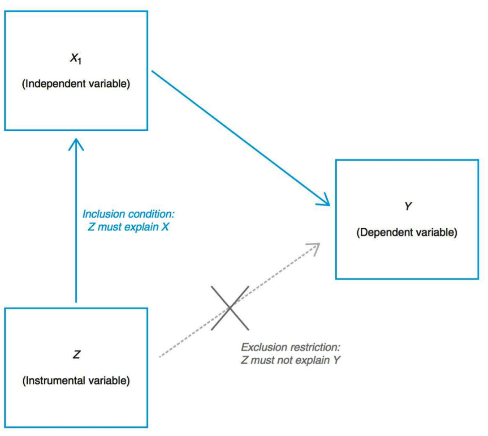
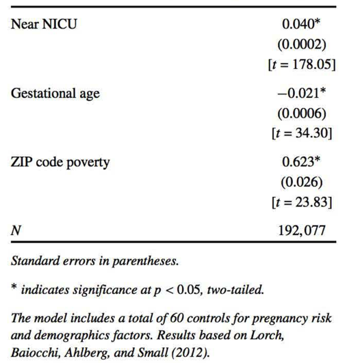
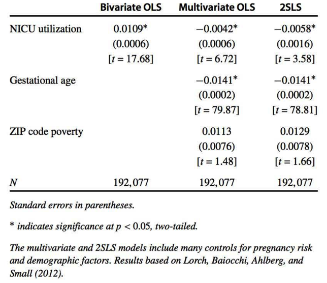

```{r setup, include=FALSE}
knitr::opts_chunk$set(echo = T,message=F,error=F,warning = F)
require(tidyverse)
library(dagitty)
require(patchwork)
library(ggdag)
```

layout: true

<div class="slide-footer"><span> 
PPOL561 | Accelerated Statistics for Public Policy II

&emsp;&emsp;&emsp;&emsp;&emsp;&emsp;&emsp;&emsp;&emsp;

Week 6 <!-- Week of the Footer Here -->

&emsp;&emsp;&emsp;&emsp;&emsp;&emsp;&emsp;&emsp;&emsp;&emsp;&emsp;&emsp;

Instrumental Variables <!-- Title of the lecture here -->

</span></div> 

---
class: outline

# Outline for Today

![:space 10]

- Using **Instruments** as a way of tackling endogeneity

- **Two-stage least squares** (2LS)

- **Multiple** instruments

- **Quasi** and **Weak** instruments

- **Precision** of 2SLS


---

class: newsection

# Instruments

---

### Police and Crime?

<br>
<br>

$$Crime_{it} = \beta_0 + \beta_1 Police_{i,t-1} + \tau_t + \epsilon_{it}$$

<br>

.center[
| | OLS with year FE|
|-----|:-----:|
| Lagged police officers per capita (logged)| $.562^*$ |
]

where 

- $i$ indexes the city 
- $t$ indexes the year
- $\tau_t$ captures the year fixed effects
- $\epsilon$ captures the random, unexplained variation (residual)

---

### The problem

<br> 

Recall the issue of **omitted variable bias** 

$$y_i = \beta_0 + \beta_1 x_{1i} + \beta_2 x_{2i} + \nu_i$$

$$y_i = \beta_0^{Omit~x_2} + \beta_1^{Omit~x_2} x_{1i} + \epsilon_i$$

$$\beta_1^{Omit~x_2} = (\beta_1 + \delta_1 \beta_2)$$
--

Sometimes we can locate a measurement for the omission and pull it out of the error term, other times we can't.

- lack data on the omitted variable 

- the omitted concept is inherently difficult to measure

---

### Police and Crime?

<br>

$$Crime_{it} = \beta_0 + \beta_1 Police_{i,t-1} + \tau_t + \delta_i + \epsilon_{it}$$

<br>

.center[
| | OLS (Year FE) | OLS (year/city FE)
|-----|:-----:|
| Lagged police officers per capita (logged)| $.562^*$ | $-.076$
]

--

<br>

But there still might be sources of endogeneity biasing our estimates.

- Some factor that increases both the number of police and the number of crimes.

- That is, $Police_{t-1}$ may still be correlated with the error term ( $e_{it}$ )

---

### Logic of Instrumental Variables


<br>

The aim is to locate a variable ( $z$ ) that explains the independent variable of interest ( $x$ ) but does not directly explain the dependent variable ( $y$ )

```{r,echo=F,fig.width=8.5,fig.height=4,fig.align='center',dpi=200}
coords <- 
  c("x",0,0,
    "z",0,1,
    "u",1.5,1,
    "y",2,0) %>% 
  {data.frame(matrix(., nrow=length(.), ncol=3, byrow=T))} %>% 
  {colnames(.) <- c("name","x","y");.}


# Initialize the DAG.
dag <- dagify(x ~ z,
              x ~ u,
              y ~ x + u,
              exposure = "x",
              outcome = "y",
              coords=coords)


dag %>% 
  tidy_dagitty() %>% 
  mutate(observed = ifelse(name=="u",2,1)) %>% 
  mutate(observed_text = ifelse(name=="u","black","white")) %>% 
  ggplot(aes(x = x, y = y, xend = xend, yend = yend)) +
  geom_dag_edges(aes(edge_linetype=observed)) +
  geom_dag_point(aes(color=factor(observed)),show.legend = F) +
  scale_color_manual(values=c('1'="black",'2'="grey80")) +
  geom_dag_text(size = 8) +
  theme_dag()
```


---

### Logic of Instrumental Variables


<br>

The aim is to locate a variable ( $z$ ) that explains the independent variable of interest ( $x$ ) but does not directly explain the dependent variable ( $y$ )

Isolate part of police that is related to an increase in the number of police but unrelated to crime.

$$cor(Police_{i,t-1},z) \ne 0$$
$$cor(Crime_{it},z) = 0$$

--

<br>

**What factors, unrelated to crime, can lead cities to spend more on police?**

---

### Logic of Instrumental Variables

<br>

In an election year, politicians like to spend money on government employees, such as police. 

--

- **_number of firefighters_** correlates with rise/fall in the number of police _but not_ the rise/fall in the number of crimes.

    - An increase in firefighters is associated with a bump in police spending 

    - This bump is _not_ associated with changes in the level of crime (i.e. changes in the error term)

--

- Use number of firefighters is an **_instrument_** to purge the endogenous relationship between the $Police$ variable and $\epsilon$.

---

### Logic of Instrumental Variables

<br>

```{r,echo=F,fig.width=8.5,fig.height=4,fig.align='center',dpi=200}
coords <- 
  c("x",0,0,
    "z",0,1,
    "u",1.5,1,
    "y",2,0) %>% 
  {data.frame(matrix(., nrow=length(.), ncol=3, byrow=T))} %>% 
  {colnames(.) <- c("name","x","y");.}


# Initialize the DAG.
dag <- dagify(x ~ z,
              x ~ u,
              y ~ x + u,
              exposure = "x",
              outcome = "y",
              coords=coords)


dag %>% 
  tidy_dagitty() %>% 
  mutate(observed = ifelse(name=="u",2,1)) %>%
  mutate(observed_text = ifelse(name=="u","black","white")) %>% 
  mutate(name = case_when(
    name == 'u' ~ 'Unobserved\nConfounder',
    name == 'z' ~ 'Fire\nFighters',
    name == 'x' ~ 'Police',
    name == 'y' ~ 'Crime',
  )) %>% 
  ggplot(aes(x = x, y = y, xend = xend, yend = yend)) +
  geom_dag_edges(aes(color=factor(observed),edge_linetype=observed)) +
  # geom_dag_point(aes(color=factor(observed)),show.legend = F) +
  scale_color_manual(values=c('1'="black",'2'="grey80")) +
  geom_dag_text(size = 4,color="black") +
  theme_dag()
```

---

### Logic of Instrumental Variables

<br>

$$Crime_{it} = \beta_0 + \beta_1 \hat{Police}_{i,t-1} + \tau_t + \delta_i + \epsilon_{it}$$

<br>

.center[
| | OLS (Year FE) | OLS (year/city FE) | 2SLS |
|-----|:-----:|
| Lagged police officers per capita (logged)| $.562^*$ | $-.076$ | $-0.435$
]

---

class: newsection

## Two Stage Least Squares

---

### Two Stage Least Squares model


Core Equation: 

<br>

$$y_i = \beta_0 + \beta_1 x_{1i} + \beta_2 x_{2i} + \epsilon_i$$

<br>

We'll treat ** $x_{1i}$ ** as an **endogenous** variable:

<br>

$$x_{1i} = \gamma_0 + \gamma_1z_i + \gamma_2x_{2i} + \nu_i$$

<br>
Where ** $z_i$ ** is the **instrumental variable** (or **instrument**)

---

### First Stage Regression

<br><br>
Generate fitted value of endogenous variable by estimating 

<br>

$$x_{1i} = \gamma_0 + \gamma_1z_i + \gamma_2x_{2i} + \nu_i$$

<br>

and then calculating 

<br>

** $$\hat{x}_{1i} = \hat{\gamma}_0 + \hat{\gamma}_1z_i + \hat{\gamma}_2x_{2i}$$ **

---

### Second Stage Regression

<br><br>

Estimate the outcome equation using fitted value ( $\hat{x}_1$ ) rather than actual value ( $x_1$ ).

<br> 

In other words, estimate:

<br><br>

$$y_i = \beta_0 + \beta_1 \hat{x}_{1i} + \beta_2 {x}_{2i} + \epsilon_i$$

---

### Two conditions for valid instruments

**Inclusion condition**: 

  - The instrument ( $z$ ) must be a _statistically significant_ determinant of $x_1$. 
  
  - It needs to be included in the first stage of the 2SLS estimation process.

<br> 

**Exclusion condition**: 

- The instrument ( $z$ ) must be uncorrelated with the error term in the main equation which means Z must not directly influence Y.  

- An instrument must be properly excluded from the second stage of the 2SLS estimation process. (This condition cannot be directly assessed statistically)

---

.center[

]

---

### Inclusion condition

** $Z$ explains $X$ **

- Regress $X$ on $Z$ and other predictor variables

- t-statistic bigger than 3 is rule of thumb

```{r,echo=F,fig.width=8.5,fig.height=4,fig.align='center',dpi=200}
coords <- 
  c("x",0,0,
    "z",0,1,
    "u",1.5,1,
    "y",2,0) %>% 
  {data.frame(matrix(., nrow=length(.), ncol=3, byrow=T))} %>% 
  {colnames(.) <- c("name","x","y");.}


# Initialize the DAG.
dag <- dagify(x ~ z,
              x ~ u,
              y ~ x + u,
              exposure = "x",
              outcome = "y",
              coords=coords)


dag %>% 
  tidy_dagitty() %>% 
  mutate(observed = ifelse(name=="u",2,1)) %>%
  mutate(trans = ifelse(name%in%c("u","y"),2,1)) %>% 
  mutate(observed_text = ifelse(name=="u","black","white")) %>% 
  ggplot(aes(x = x, y = y, xend = xend, yend = yend)) +
  geom_dag_edges(aes(alpha=factor(trans),edge_linetype=observed,color=factor(observed))) +
  geom_dag_point(aes(alpha=factor(trans)),show.legend = F) +
  scale_color_manual(values=c('1'="black",'2'="grey80")) +
  scale_alpha_manual(values = c('1'=1,'2'=.1)) +
  geom_dag_text(size = 8) +
  geom_rect(xmin = .9,xmax=1.1,ymin=0,ymax=2.5,inherit.aes = F,
            color="white",fill="steelblue",alpha=.05) +
  theme_dag()
```


---

### Inclusion condition

Consider:

$$BirthWeight_i = \beta_0 + \beta_1 MomSmokes_i + X_i\beta + \epsilon_i$$

<br>

--

**Potential instrument**: `cigarette price`

- Plausibly correlated with mother’s cigarette consumption
- Plausibly uncorrelated with $\epsilon$

--

<br> 

$$MomSmokes_i = \gamma_0 + \gamma_1 price_i + X_i\beta + \nu_i$$

<br>

$\gamma_1$ is not statistically significant ( $t$ < 1.96) &rarr; cannot use price as instrument

---

### Exclusion Condition

<br>

** $Z$ is "Exogenous"**

<br>

- $cov(Z,\epsilon) = 0$

- There is no test for this condition!

- It is difficult to find an instrument that incontrovertibly satisfies the exclusion restriction

- Satisfying this is hardest challenge in 2SLS models

---

### Exclusion Condition

<br><br>

**Intuition**: $Z$ only affects $Y$ through its effect on $X$. If $cov(Z,\epsilon)$ not 0, we would want $Z$ in outcome equation.

<br>

--

Practical reason we cannot include $Z$ in second stage: the fitted value of $X_1$ is a linear combination of $X_2$ and $Z$, inducing **perfect multicollinearity**

<br>

.center[
<font color = "red"> Wrong! </font>: $y_i = \beta_0 + \beta_1 \hat{x}_{1i} + \beta_2 {x}_{2i} + \beta_3 \textbf{Z}_i + \epsilon_i$
]


---

### Exclusion Condition

```{r,echo=F,fig.width=14,fig.height=10,fig.align='center',dpi=350}
# Exclusion condition satisfied
coords <- 
  c("x",0,0,
    "z",0,1,
    "u",1.5,1,
    "y",2,0) %>% 
  {data.frame(matrix(., nrow=length(.), ncol=3, byrow=T))} %>% 
  {colnames(.) <- c("name","x","y");.}
dag <- dagify(x ~ z,
              x ~ u,
              y ~ x + u,
              exposure = "x",
              outcome = "y",
              coords=coords)
dag %>% 
  tidy_dagitty() %>% 
  mutate(observed = case_when(
    name%in%c("u")~2,
    TRUE ~ 1
  ),
  focus = case_when(
    name %in% c('z', 'y') ~ '2',
    TRUE ~ '2'
  ),
  text = "(1) Condition Satisfied") %>% 
  as_tibble() -> d1 


# Violation: Z causes Y
coords <- 
  c("x",0,0,
    "z",0,1,
    "u",1.5,1,
    "y",2,0) %>% 
  {data.frame(matrix(., nrow=length(.), ncol=3, byrow=T))} %>% 
  {colnames(.) <- c("name","x","y");.}
dag <- dagify(x ~ z,
              x ~ u,
              y ~ x + u + z,
              exposure = "x",
              outcome = "y",
              coords=coords)
dag %>% 
  tidy_dagitty() %>% 
  mutate(observed = case_when(
    name%in%c("u")~2,
    TRUE ~ 1
  ),
  focus = case_when(
    name %in% c('z', 'y') ~ '1',
    TRUE ~ '2'
  ),
  text = "(2) Violation:\nZ causes Y") %>% 
  as_tibble() -> d2 


# Violation: Z causes unobserved (U)
coords <- 
  c("x",0,0,
    "z",0,1,
    "u",1.5,1,
    "y",2,0) %>% 
  {data.frame(matrix(., nrow=length(.), ncol=3, byrow=T))} %>% 
  {colnames(.) <- c("name","x","y");.}
dag <- dagify(x ~ z,
              u ~ z,
              x ~ u,
              y ~ x + u,
              exposure = "x",
              outcome = "y",
              coords=coords)
dag %>% 
  tidy_dagitty() %>% 
  mutate(observed = case_when(
    name%in%c("u")~2,
    TRUE ~ 1
  ),
  focus = case_when(
    name %in% c('z', 'y','u') ~ '1',
    TRUE ~ '2'
  ),
  text = "(3) Violation:\nZ causes unobserved (U)") %>% 
  as_tibble() -> d3


# Violation: Z causes unobserved (U)
coords <- 
  c("x",0,0,
    "z",0,1,
    "q",1.25,1.25,
    "u",1.5,1,
    "y",2,0) %>% 
  {data.frame(matrix(., nrow=length(.), ncol=3, byrow=T))} %>% 
  {colnames(.) <- c("name","x","y");.}
dag <- dagify(x ~ z,
              z ~ q,
              u ~ q,
              x ~ u,
              y ~ x + u,
              exposure = "x",
              outcome = "y",
              coords=coords)
dag %>% 
  tidy_dagitty() %>% 
  mutate(observed = case_when(
    name%in%c("u")~2,
    TRUE ~ 1
  ),
  focus = case_when(
    name %in% c('z', 'y','u','q') ~ '1',
    TRUE ~ '2'
  ),
  text = "(4) Violation:\nU and Z are descendants of Q") %>% 
  as_tibble() -> d4


# Violation: Z and Y collides on P
coords <- 
  c("x",0,0,
    "z",0,1,
    "u",1.5,1,
    "p",1.5,-.5,
    "y",2,0) %>% 
  {data.frame(matrix(., nrow=length(.), ncol=3, byrow=T))} %>% 
  {colnames(.) <- c("name","x","y");.}
dag <- dagify(x ~ z,
              p ~ z + y,
              x ~ u,
              y ~ x + u,
              exposure = "x",
              outcome = "y",
              coords=coords)
dag %>% 
  tidy_dagitty() %>% 
  mutate(observed = case_when(
    name%in%c("u")~2,
    TRUE ~ 1
  ),
  focus = case_when(
    name %in% c('z', 'y','p') ~ '1',
    TRUE ~ '2'
  ),
  text = "(5) Violation (when controlling for P):\nZ and Y collides on P") %>% 
  as_tibble() -> d5

# Violation: Z and Y collides on P
coords <- 
  c("x",0,0,
    "z",0,1,
    "u",1.5,1,
    "p",1.5,-.5,
    "y",2,0) %>% 
  {data.frame(matrix(., nrow=length(.), ncol=3, byrow=T))} %>% 
  {colnames(.) <- c("name","x","y");.}
dag <- dagify(x ~ z,
              p ~ z,
              x ~ u,
              y ~ x + u + p,
              exposure = "x",
              outcome = "y",
              coords=coords)
dag %>% 
  tidy_dagitty() %>% 
  mutate(observed = case_when(
    name%in%c("u")~2,
    TRUE ~ 1
  ),
  focus = case_when(
    name %in% c('z', 'y','p') ~ '1',
    TRUE ~ '2'
  ),
  text = "(6) Violation (when not controlling for P):\nZ causes P which causes Y") %>% 
  as_tibble() -> d6

 

bind_rows(d1,d2,d3,d4,d5,d6) %>% 
  ggplot(aes(x = x, y = y, xend = xend, yend = yend)) +
  geom_dag_point(aes(color=focus),show.legend = F) +
  geom_dag_edges(aes(fill=focus,edge_linetype=observed)) +
  scale_color_manual(values=c('1'="darkred",'2'="grey40")) +
  geom_dag_text(size = 4) +
  facet_wrap(~text,scales="free",ncol=3,nrow=2) +
  xlim(-1,4.5) +
  ylim(-1,4) +
  theme_dag() +
  theme(text = element_text(face="bold",size=16))

```


---

# Simulation 

<br>

```{r,seed=123}
set.seed(123) # to reproduce the simulation 

N = 1000 # Sample size

# Endogeneity 
something <- rnorm(N)

# Error in our outcome model
e <- 2*something + rnorm(N)

# Error in our variable of interest
v <- 2*something + rnorm(N)
```

<br>
Both error terms share that special "something" that we can't fully account for.

---

### Simulation

```{r,fig.align="center",fig.width=7,fig.height=6}
tibble(v,e) %>% ggplot(aes(v,e)) + geom_point(size=3,alpha=.3) 
```

---

### Simulation

<br>
```{r,highlight=T}
# instrument
z <- rnorm(N) 

# Other random variable (control of some sorts)
x2 <- rnorm(N) 

# Underlying model for the variable we care about
x1 <- 1 + 1*z + v #<<

# "TRUE" Outcome model
y <- 1 + -2*x1 + .5*x2 + e #<<

# Save as data 
D = tibble(y,x1,x2,z)
```

---

### Standard OLS Model

```{r}
summary(lm(y ~ x1 + x2,data=D))
```

---

### Stage 1 Model

```{r}
# Estimate the first stage Equation
mod_s1 <- lm(x1 ~ z + x2,data=D)
summary(mod_s1)
```

---

### Stage 2 Model

<br><br>
```{r}
# Get the predictions from the first stage model
x1_hat <- mod_s1$fitted.values

# Estimate the second stage model
mod_s2 <- lm(y ~ x1_hat + x2,data=D)
broom::tidy(mod_s2)
```

---

### Include Z?

```{r}
mod_s2 <- lm(y ~ x1_hat + x2 + z,data=D)
summary(mod_s2)
```

---

### `ivreg()`

Note that we can run these models all at once using the `ivreg()` function in the `AER` package.

```{r}
mod_2sls <- AER::ivreg(y ~ x1 + x2 | z + x2,data=D)
summary(mod_2sls)
```

---

### When the inclusion condition isn't satisfied

<br><br>
```{r,highlight=TRUE}
z <- rnorm(N) # instrument
x2 <- rnorm(N) # control
x1 <- 1 + .0001*z + v # Key Endogenous Indep. Var #<<
y <- 1 + -2*x1 + .5*x2 + e # "TRUE" Outcome model
D = tibble(y,x1,x2,z) # Save as data 
mod <- AER::ivreg(y ~ x1 + x2 | z + x2,data=D)
broom::tidy(mod)
```

---

### When the exclusion condition isn't satisfied

<br><br>
```{r,highlight=TRUE}
z <- rnorm(N) # instrument
x2 <- rnorm(N) # control
x1 <- 1 + 1*z + v # Key Endogenous Indep. Var
y <- 1 + -2*x1 + .5*x2 + 2*z + e # "TRUE" Outcome model #<<
D = tibble(y,x1,x2,z) # Save as data 
mod <- AER::ivreg(y ~ x1 + x2 | z + x2,data=D)
broom::tidy(mod)
```

---

## Example 1: 
### Emergency care for New Borns

<br> 

**Question**: Are neonatal intensive care unit (NICU) facilities effective?

<br>

$$Death_i =\beta_0 + \beta_1 NICU_i + \epsilon_i$$

<br><br>

Naive model estimates 

$$ \beta_1 > 0 $$

---

### Stage 1

.center[

]

---

### Stage 2

.center[

]


---


## Example 2

<br> 

Some people believe cell phones and platforms like Twitter, which use related technology have increased social unrest by making it easier to organize protests or acts of violence. Pierskalla and Hollenbach (2013) used data from Africa to test this view. In its most basic form, the model was

$$violence_i = \beta_0 + \beta_1 cellCoverage_i + \epsilon_i$$
where 

- $violence$ = organized violent in city $i$

- $cellCoverage$ = measures availability of mobile coverage in city $i$

---

### $$violence_i = \beta_0 + \beta_1 cellCoverage_i + \epsilon_i$$

<br>

- (a) Are their concerns regarding endogeneity? If so, what are they?

--

- (b) Consider a measure of `regulatory_quality` as an instrument for cell phone coverage. This proposed variable is based on a separate study of telecommunications policy in African countries that found that regulatory quality increased cell phone availability. 

  - How do we know if `regulatory_quality` satisfies the inclusion condition?
  
  - Does the regulatory quality variable satisfy the exclusion condition? 
  
---

## Example 3

Do economies grow more when their political institutions are better? Consider the following simple model:

<br>

$$EconomicGrowth_i = \beta_0 + \beta_1 InstitionalQuality_i + \epsilon_i$$
<br>

where 

- $EconomicGrowth$ is the growth in GDP in country $i$

- $InstitionalQuality$ is a measure of the quality of governance in country $i$

---

#### $$EconomicGrowth_i = \beta_0 + \beta_1 InstitionalQuality_i + \epsilon_i$$


- (a) Are their concerns regarding endogeneity? If so, what are they?

--

- (b) Acemoglu, Johnson, and Robinson (2001) proposed country-specific mortality rates faced by European soldiers, bishops, and sailors in their countries' colonies in the seventeenth, eighteenth, and nineteenth centuries as an instrument for current institutions. The logic is that European powers were more likely to set up worse institutions in places where the people they sent over kept dying. In these places, the institutions were oriented more toward extracting resources than toward creating a stable, prosperous society. 

  - How do we know if `settler_mortality` satisfies the inclusion condition?
  
  - Does the `settler_mortality` variable satisfy the exclusion condition? 

---


class: newsection

# Multiple Instruments

---

### Multiple Instruments

<br><br>

We might have multiple available instruments, or variables that we think predict $X$ but not $Y$

<br>

For example, say we have three instruments, then the first stage equation will look like

<br>

$$x_{1i} = \gamma_0 + \gamma_1 z_{1i} + \gamma_2 z_{2i} + \gamma_3 z_{3i} + \gamma_4 x_{2i} + \nu_i$$

---

### Overidentification 

<br><br>

An instrumental variable model is **identified** if we have an instrument that can explain $X$ without directly influencing $Y$.

<br><br>

An instrumental variable model is **overidentified** if we have multiple instruments for a single endogenous variable.

---

### Overidentification

<br><br>

- When we have multiple instruments, the best way to assess whether the instruments adequately predict the endogenous variable is to use an $F$ test 

<br>

- The null hypothesis that the coefficients on all instruments in the first stage are zero. 
<br>

- For our example, the F test would test $H_0$ : 

$$\gamma_1 = \gamma_2 = \gamma_3 = 0$$

---

### Overidentification 

<br>

To use overidentification tests to assess instruments:

1. Run 2SLS models separately with each instrumental variable.

2. If the second stage coefficients on the endogenous variable in question are similar across models, this is evidence that all the instruments are valid. 

3. If the second stage coefficients on the endogenous variable in question differ across models, this is evidence that at least one instrument fails the exclusion condition.

--

**If estimates are inconsistent, it's difficult to know which one is wrong**

---

class: newsection

# Weak Instruments

---

### Quasi-Instrument

A **_quasi-instrument_** is one that does not (quite) satisfy the exclusion condition.

--

We can still use 2SLS when there is _some_ correlation between $Z$ and $\epsilon$ 

To see this, compare the bias equation for OLS to bias for 2SLS when $Z$ is not fully uncorrelated with 

<br>

$$plim \hat{\beta}_1^{OLS} = \beta_1 + cor(x_1,\epsilon)\frac{\sigma_\epsilon}{\sigma_{x_1}}$$

$$plim \hat{\beta}_1^{2SLS} = \beta_1 + \frac{cor(z,\epsilon)}{cor(z,x_1)}\frac{\sigma_\epsilon}{\sigma_{x_1}}$$

---

### Weak instruments

A weak instrument is an instrument that adds little explanatory power to the first stage regression.

<br>

When we have a weak instrument, a small amount of correlation of the instrument and error term can lead to a large amount of variance or 2SLS can perform very poorly in small samples.  

<br>
<br>

$$plim \hat{\beta}_1^{2SLS} = \beta_1 + \frac{cor(z,\epsilon)}{cor(z,x_1)}\frac{\sigma_\epsilon}{\sigma_{x_1}}$$

---

### Guidelines
  
<br>

- **_Always report first stage regression results_**

  - $t$ test greater than 3 if one instrument

  - $F$ test greater than 10 if multiple instruments

--

- **_Be wary of adding weak instruments_**

--

- When we have multiple instruments, we **_only want to add an instrument when it adds sufficient explanatory power._**
  
--

- **_Finite sample bias_** 
  
  - 2SLS is biased toward OLS results in small samples.


---

class: newsection

## Precision of 2SLS

---

## Precision and 2SLS

![:space 5]

Recall the formula for the variance of a coefficient estimate in OLS:

$$var(\hat{\beta_j}) = \frac{\hat{\sigma}^2}{N\times var(x_j)(1-R^2_j)}$$

where

- $\hat{\sigma}^2 = \frac{\sum (y_i - \hat{y}_i)^2}{N-k}$

- $R^2_j$ is the $R^2$ for an "auxiliary regression"

---

## Precision and 2SLS

![:space 5]

For a 2SLS estimate, the variance of the coefficient on the instrumented variable is:

$$var(\hat{\beta_j}^{2SLS}) = \frac{\hat{\sigma}^2}{N\times var(\hat{x}_1)(1-R^2_{\hat{x}_1^{No~z}})}$$
where

- $\hat{\sigma}^2 = \frac{\sum (y_i - \hat{y}_i)^2}{N-k}$ using fitted values from the 2SLS estimation.

- $R^2_{\hat{x}_1^{No~z}}$ is the $R^2$ for a regression of $\hat{x}_1$ on all the other independent variables ( $\hat{x}_1 = \gamma_0 + \gamma_2 X_2 + ...$ )


---

### Four Factors that influence precision

<br>

**(1) Model fit of the first stage equation**

- If the variance of the fitted value $\hat{x}_1$ does not vary much, then $var(\hat{x}_1)$ will be small.

  - Meaning standard errors will be bigger
  
  - A poor fit in the first-stage regression can lead the fitted values to vary little; where as a good fit will lead to the opposite. 
  
**(2) Sample Size**

- The more observations, the lower the $var(\hat{\beta_j}^{2SLS})$

---

### Four Factors that influence precision

<br> 

**(3) Model fit of the second stage equation**

- The better the model fits, the lower $\hat{\sigma}^2$

**(4) Explanatory power of the instrument in explaining $x_1$**

- If $z$ is a weak instrument, then $R^2_{\hat{x}_1^{No~z}}$ will be high because $\hat{x}_1$ will depend almost entirely on the other independent variables. This will result in a high $var(\hat{\beta_j}^{2SLS})$.

- If $z$ explains $x_1$ well, then $R^2_{\hat{x}_1^{No~z}}$ will be low.
