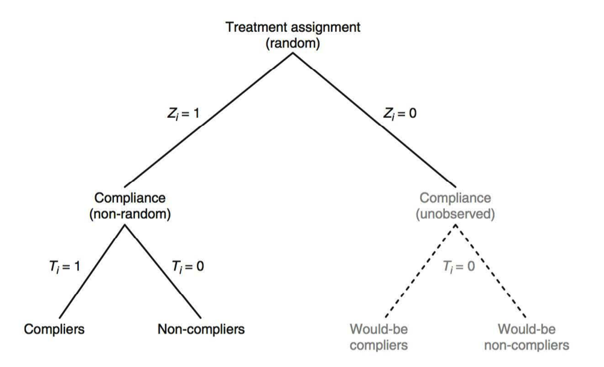
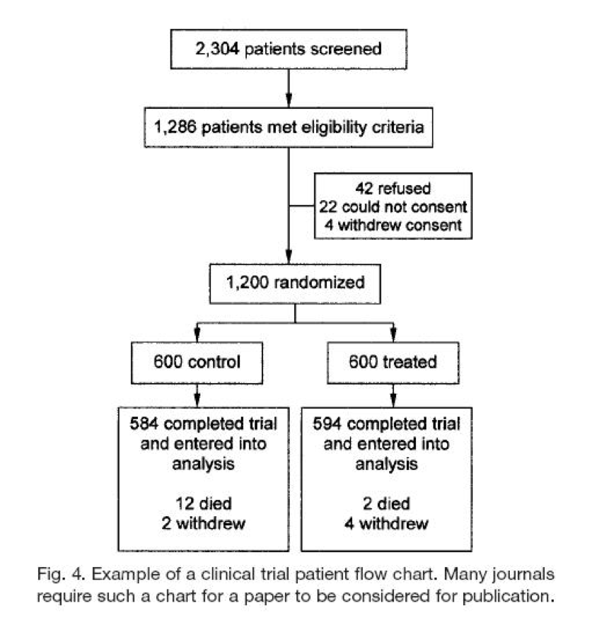
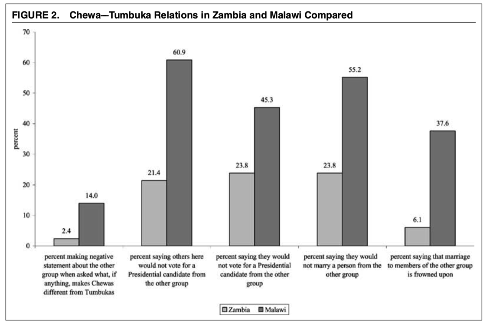
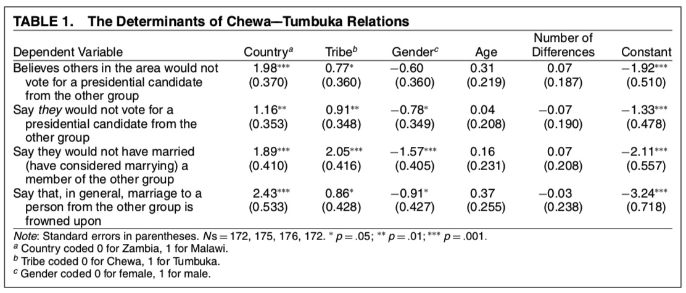

```{r setup, include=FALSE}
knitr::opts_chunk$set(echo = T,message=F,error=F,warning = F)
```

layout: true

<div class="slide-footer"><span> 
PPOL561 | Accelerated Statistics for Public Policy II

&emsp;&emsp;&emsp;&emsp;&emsp;&emsp;&emsp;&emsp;&emsp;

Week 11 <!-- Week of the Footer Here -->

&emsp;&emsp;&emsp;&emsp;&emsp;&emsp;&emsp;&emsp;&emsp;&emsp;&emsp;&emsp;

Experiments <!-- Title of the lecture here -->

</span></div> 

---
class: outline

# Outline for Today 

- **Randomization and balance**

<br> 

- **Compliance and intention-to-treat models**

<br> 

- **Using 2SLS to deal with non-compliance**

<br> 

- **Attrition**

<br> 

- **Natural experiments**

---

class: newsection

# Randomization <br> and Balance

---

### Experiments

<br><br>

$$Y_i = \beta_0 + \beta_1 Treament_i + \epsilon_i$$
<br>

- If $Treatment_i$ is randomly assigned, there is no correlation with the error term. 

- Difference of means is sufficient to assess treatment effect

  - Control group: $\beta_0$
  
  - Treatment group: $\beta_0 + \beta_1$
  
  - Treament Effect: $\beta_1$

---

### Experiments

<br><br>

$$Y_i = \beta_0 + \beta_1 Treament_i + \epsilon_i$$


<br>
- **Randomization may fail**:
  
  - Treatment and Control groups may differ in systematic ways.
  
  - Due to chance, imbalance in the treatment and control groups can creep in.
  
  - E.g. what should we do if there are more men in the treatment group? 

---

### Diagnosing Balance

**Balance checks** involve assessing whether the treatment and control groups are similar. 

--

$$Y_i = \beta_0 + \beta_1 Treament_i + \beta X_i+ \epsilon_i$$

where 

$$\{age_i, female_i, educ_i, \dots\} \in X_i$$
--

<br>

$$age_i = \gamma_0 + \gamma_1 Treament_i + \nu_i$$

$$female_i = \delta_0 + \delta_1 Treament_i + \phi_i$$
$$educ_i = \tau_0 + \tau_1 Treament_i + \omega_i$$

$$\vdots$$


---

### Diagnosing Balance

**Balance checks** involve assessing whether the treatment and control groups are similar. 

<br>

$$X_i =  \gamma_0 + \gamma_1 Treament_i + \nu_i$$

<br>

- The aim is ** $\hat{\gamma_1}$ is _not_ statistically significant**.

--

-  If $\hat{\gamma_1}$ _is_ statistically significant, we **_do not have balance_** in the experimentally assigned groups. 

- Suggests **_systematic interference_** with the random allocation of the treatment.

---

### Diagnosing Balance

<br>
- Balance checks are **_sensitive to statistical power_**: 
  
  - power is low when $N$ is small: may assume no issues, when there are some. 
  
  - power is high when $N$ is big: may assume issues, when there are not any. 

<br>
- If balance has been achieved for everything we _can_ observe, we can cautiously speculate that the treatment and control groups are also balanced along unobservable factors

---

### Imbalance

<br>
When there are **imbalances**, use multivariate OLS including the variable dimensions where there is imbalance.

--

<br>

Assuming $\hat{\gamma_1}$ is statistically significant (p < .05) for

<br>

$$age_i = \gamma_0 + \gamma_1 Treament_i + \nu_i$$
--

then

<br>
$$Y_i = \beta_0 + \beta_1 Treament_i + \beta_2 age_i+ \epsilon_i$$

---

### Post-treatment bias


<br>

- Careful to only control for variables measured **<u> before treatment</u>**  that do not vary over time. 

<br> 

- Concern over **post-treatment bias** 

  - Control for variable measured _after_ treatment
  
  - Treatment may effect its value
  
  - Make it difficult to untangle the actual treatment effect
  
  - The effect of the treatment may be captured by the post-treatment variables.
  
  
---

class: newsection

# Compliance <br> &  <br> Intention-to-Treat

---

### Non-Compliance


<br><br> 
- **Non-compliance** occurs in an experimental setting when an individual selected for treatment does not actually receive the treatment.

--

- _Simple example_: Survey experiment administered over the phone. Individual in the treatment group is called and doesn't answer. We say he/she didn't 
"comply".

--

  - The reasons he/she didn't comply (age, employment, land-line, etc.) might be correlated with the error term

--

- Non-compliance can be due to **non-random** factors (a source of endogeneity)

---

<br>
.center[
 
]

---

### Educational Vouchers

The **setup**:

- Random assignment of vouchers to students in NYC to attend private school.

- After a year, everyone (treatment and control groups) take a test.

- See who did better.

--

The **Issue**: Not everyone who received the voucher used it.

.center[
| Student | Voucher |  Went |
|---------|---------|-------|
| Student 1 |   1   |  1  |
| Student 2 |   0   |  0  |
| Student 3 |   1   |  0  |
]
  

**Solutions?**

---

### Intention-to-Treat (ITT)

- Compare means of all assigned to the treatment group
  
  - $Z_i = 1$ for both $T_i = 1$ and $T_i = 0$
  
- To those not assigned (control group)

  - $Z_i = 0$
  
--
  
- The **_idea behind ITT approach_** is to look for differences between the whole treatment group (whether they complied or not) and the whole control group

$$Y_i = \delta_0 + \delta_1 Z_i + \nu_i$$
 
- Recall $Z_i$ is uncorrelated with the error term (it's randomly assigned)

- Compliance issues are not at play
  
---

### Intention-to-Treat (ITT)

<br>

- Approach sidesteps concerns regarding endogeneity at the cost of being statistically conservative. 

- When there is non-compliance, ITT will **_underestimate the treatment effect_**

--

- The ITT estimate ( $\hat{\delta_1}$ ) is a **lower-bound estimate** of $\beta_1$ (the actual treatment effect)
  
  - If everyone complied, then $\hat{\delta_1} = \beta_1$
  
  - If no one complies $\hat{\delta_1} = 0$
  
  - So estimate lives between $0$ and $\beta_1$


---

### Intention-to-Treat (ITT)


<br>

- Sometimes **ITT is a cop-out**... but a good one that's being careful to not overstating or misinterpreting the effect.

--

<br>

- Sometimes whether someone did or didn't comply with a treatment is **not known**.

  - e.g. mailed advertisements as treatment

--

<br>

- Sometimes ITT effect is **most relevant quantity** of interest

  - e.g. kids missing school on the day of the treatment

---

# Questions

- **(1)** Will there be balance problems if there is non-compliance? Why or why not?

--

- **(2)** Suppose there is non-compliance but no signs of balance problems. Does this mean the non-compliance must be harmless? Why or why not?

--

- **(3)** Suppose an international aid group working in a country with low literacy rates randomly assigned children to a treatment group that received one hour of extra reading help each day. The outcome is a reading test score after one year. Is non-compliance an issue?

--

- **(4)** Suppose an airline randomly upgraded some economy class passengers to business class. The outcome is flight satisfaction. Is non-compliance an issue?

---

class: newsection

# Assignment as Instrument
  
---

## Instruments

<br><br><br>
Last time we discussed instrumental variables and established two conditions for a **good instrument**

- **_Inclusion condition_**: the instrument must be a _statistically significant_ determinant of the independent variable of interests

- **_Exclusion condition_**: the instrument must be uncorrelated with the error term in the main equation.

---

## Instruments

<br><br><br>

A randomized **_treatment assignment_** works as a **_great instrument_**

  - Being RTC is uncorrelated with the error in the outcome model (exclusion condition)
  
  - Being RTC is correlated with getting the treatment (inclusion condition)
  
---

### Does "Get-Out-the-Vote" work?

<br> 

$$turnout_i = \beta_0 + \beta_1 contact_i + \epsilon_i$$
where 

- $turnout_i$ is whether (1) or not (0) individual $i$ turned out to vote
- $contact_i$ is whether (1) or not (0) individual $i$ was contacted by the campaign

<br> 

**What lives in the error term?**

--

- political interest

- campaigns only contacting people who will actually vote

- Whether you're outgoing and answer the door

---

### Does "Get-Out-the-Vote" work?

<br>


.center[
**Stage 1** 

|   | DV: `Personal Visit` $= 1$ |
|---|--|
|`Personal visit assigned` ( $Z=1$ ) |  $.279^*$
| |  $t = 95.47$
|`Intercept` |  $0$
| |  $t = 0$
]

- 27.9% of those assigned to be visited were actually visited (complied)

- Intercept is 0 implying that no _non_-assigned individuals were contacted 

- Inclusion condition satisfied 

---

### Does "Get-Out-the-Vote" work?

<br>

.center[

**Stage 2** 

|   | DV: `Turnout` $= 1$ |
|---|--|
|`Personal visit` ( $\hat{T}$ ) |  $.087^*$
| |  $t = 3.34$
|`Intercept` |  $.448$
| |  $t = 138.38$
]

<br>

- The effect of a personal visit increases the probability of turning out to vote by 8.7%

---

class: newsection 

# Attrition

---

### Attrition

<br><br>

- **_Attrition_** is when participants **_drop out_** of an experiment.

<br> <br> 

- Factors that drive individuals to leave the experiment can potentially be correlated with the error term 

<br> <br> 

- when non-random, attrition can lead to **_endogeneity_**
 
---

### Attrition

.center[

]
 
---
 
### Detecting Attrition

<br>

Assess if attrition is related to the treatment

$$Attrition_i = \delta_0 + \delta_1 Treatment_1 + \nu_i$$

If $\hat{\delta_1}$ is statistically significant, then there is differential attrition across the treatment and control groups.

--

<br> 

We can add some nuance to our evaluation by exploring potential interactions between attrition patterns in the treatment and control groups. 

<br> 

$$Attrition_i = \delta_0 + \delta_1 T_1 + \delta_2 age_i + \delta_3 T_i \times age_i + \nu_i$$

---
 
### Dealing with Attrition

<br><br><br>

**Method 1**: Multivariate OLS

- If we have covariates on the factors that are driving attrition, we can control for them. 

- No guarantee that controls will resolve endogeneity

---
 
### Dealing with Attrition

<br><br><br>

**Method 2**: Trimmed data set

- Make the attrition rates in the treatment and control groups comparable by dropping ("trimming") observations. 

- This practice is statistically conservative: how we trim might reduce the size of the treatment effect. 


---
 
### Dealing with Attrition

<br><br><br>

**Method 3**: Selection Models

- Model attrition as a selection process (i.e. whether we observe the participants or not)

- Requires that we have covariates for those who attrited.

  + When observations exit the sample, they may take their data with them

---

### Health Insurance 

**_Are healthcare outcomes the same or better when costs to the consumer are higher?_**

--

<br>

$$Health_i = \beta_0 + \beta_1 DeductiblePlan_i + \epsilon_i$$

- Rand study **research design**

  - Randomly assigned people to various health plans
      
      + **_Free plan_** – all medical care covered at no cost
      
      + **_Cost sharing plans_** - participant must pay for the small stuff
      
  - Compare health outcomes across plan types.

---

### Health Insurance 

**_Are healthcare outcomes the same or better when costs to the consumer are higher?_**

<br>

$$Health_i = \beta_0 + \beta_1 DeductiblePlan_i + \epsilon_i$$

<br>
- **Findings**
  
  - Higher co-pays did not degrade health outcomes
  
  - Higher co-pay led to less use of medical services

---

### Health Insurance 

**_Are healthcare outcomes the same or better when costs to the consumer are higher?_**

<br>

$$Health_i = \beta_0 + \beta_1 DeductiblePlan_i + \epsilon_i$$
- The **Issues**
  - Not everyone continued in program (attrition!)
  
    - 5 of 1,294 (0.4 percent) in free plan left the experiment voluntarily
  
    - 179 of 2,664 (6.7 percent) in cost-sharing plans left the experiment voluntarily

- **_Implications?_** What kind of individuals would drop out?


---

class: newsection

## Natural Experiments

---

### Natural Experiment

<br>

- **"Nature"** creates some randomized condition that we can exploit. 

  + e.g. How did Alvin Greene get elected in South Carolina? 
  
  + The random ordering of the candidates in NYC election

--

- Condition need not be "random" _per se_ but needs to be **_exogenously_** determined. 

  + The treatment is not correlated with our key explanatory factors
  
  + No endogeneity bias.
  
--

- The difficult part is **_finding one_**.
  


---

### Cultural differences &rarr; political cleavages?

**_When do cultural cleavages become politically salient?_**

--

<br>

.center[

]


---

.center[

]

---

<br>
.center[

]


---

<br><br><br><br>
.center[

]

