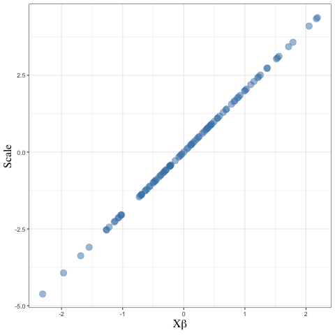

```{r setup, include=FALSE}
knitr::opts_chunk$set(echo = T,message=F,error=F,warning = F,cache=T)
require(tidyverse)
```

layout: true

<div class="slide-footer"><span> 
PPOL561 | Accelerated Statistics for Public Policy II

&emsp;&emsp;&emsp;&emsp;&emsp;&emsp;&emsp;&emsp;&emsp;

Week 12 <!-- Week of the Footer Here -->

&emsp;&emsp;&emsp;&emsp;&emsp;&emsp;&emsp;&emsp;&emsp;&emsp;&emsp;&emsp;

GLMs <!-- Title of the lecture here -->

</span></div> 

---
class: outline

# Outline for Today 

<br>

- **_Linear Probability Models_** and their discontents

<br>

- **_Maximum Likelihood Estimation_** for binary responses

<br>

- It's all about the **_Substantive Effects_** and generating estimates of **_Uncertainty_** around substantive predictions.

---

# Limited dependent variables

![:space 5]

- **Binary** – vote or not; go to war or not

- **Multinomial** – voted for Clinton, Trump, Johnson, or Stein

- **Ordinal** – strongly oppose war, somewhat oppose war, somewhat support war, strongly support war

- **Counts** – number of bills passed; number of conflicts; number of organizations joined; number of puppies hugged

- **Duration** – time to adopt full suffrage; time to bill passage; time to end of regime

---

class: newsection

# Binary Dependent Variables

---

## The problem

When we have a binary outcome (0/1), we can use OLS to estimate the relationship. This is known as a **linear probability model** (LPM).  

--

We start with the usual equation: 

$$y_i = \beta_0 + \beta_1 x_i + \epsilon_i$$
Here $y \in [0,1]$
   
- The probability of "success": $pr(y_i = 1) = p_i$
- The probability of "failure": $pr(y_i = 0) = 1 - p_i$ 

--

$y$ follows a **Bernoulli** distribution

$$ E(y_i) = 0 \times (1-p_i) + 1 \times p_i = p_i$$
$$ E(y_i | x_i) = \beta_0 + \beta_1 x_i = p_i $$


---

## The problem

```{r,echo=F,fig.align='center',fig.width=7,fig.height=5}
set.seed(123)
N = 100
x <- rnorm(N)
z =  pnorm(1 + 2*x)
y = rbinom(N,1,z)
D = tibble(y,x)

tt = element_text(family='serif',face='bold',size = 20)
ggplot(D,aes(x,y)) +
  geom_point(size=4,alpha=.5) +
  geom_smooth(method="lm",se=F,color="darkred",size=1.5) +
  theme_bw() +
  theme(axis.title = tt,
        axis.text = tt ) 
  # ylim(-.5,2)
```

--

.center[
```{r,echo=F}
broom::tidy(lm(y~x,data=D)) %>% 
  mutate_if(is.numeric,function(x) round(x,3)) %>% 
  kableExtra::kable(.)
```
]

---

## The problem

```{r,echo=F,fig.align='center',fig.width=7,fig.height=5}
set.seed(123)
N = 100
x <- rnorm(N)
pr =  pnorm(1 + 2*x)
y = rbinom(N,1,pr)
D = tibble(y,x)

tt = element_text(family='serif',face='bold',size = 20)
ggplot(D,aes(x,y)) +
  geom_point(size=4,alpha=.5) +
  geom_smooth(method="lm",se=F,color="darkred",size=1.5) +
  theme_bw() +
  theme(axis.title = tt,
        axis.text = tt ) 
  # ylim(-.5,2)
```


.center[
```{r,echo=F}
mod = lm(y~x,data=D)
broom::tidy(mod) %>% 
  mutate_if(is.numeric,function(x) round(x,3)) %>% 
  mutate(estimate = str_glue("{estimate*100}%")) %>% 
  kableExtra::kable(.)
```
]

---

## The problem

- OLS may produce **non-sense predictions** (recall that OLS assumes continuous interval level data)

--

  + But we can **recode**
  
```{r,echo=F,fig.align="center",fig.width=7,fig.height=5}
x2 = seq(-4,34,.01)
p = predict(mod,tibble(x=x2))
p[p>1] = 1; p[p<0] = 0
D2 = tibble(p,x2) 
ggplot(D,aes(x,y)) +
  geom_point(size=4,alpha=.2) +
  geom_line(data=D2,aes(x2,p),inherit.aes = F,color="darkred",size=3) +
  theme_bw() +
  xlim(-3,3) +
  theme(axis.title = tt,
        axis.text = tt ) 
```


---

## The problem

- OLS may produce **non-sense predictions** (recall that OLS assumes continuous interval level data)

- Disturbances are <u>_not_</u> normally distributed; they follow the Bernoulli distribution.

--

```{r,echo=F,fig.align="center",fig.width=7,fig.height=5}
D$resid = resid(mod)
D$pred = predict(mod)
ggplot(D,aes(x,y)) +
  geom_segment(aes(xend=x,x=x,yend=y,y=pred),
               color="steelblue",size=1,alpha=.5) +
  geom_point(size=4,alpha=.5) +
  geom_smooth(method="lm",se=F,color="darkred",size=3) +
  theme_bw() +
  theme(axis.title = tt,
        axis.text = tt ) 
```


---

## The problem

- OLS may produce **non-sense predictions** (recall that OLS assumes continuous interval level data)

- Disturbances are <u>_not_</u> normally distributed, they follow the Bernoulli distribution.

```{r,echo=F,fig.align="center",fig.width=7,fig.height=5}
ggplot(D,aes(x,resid)) +
  geom_point(size=4,alpha=.5,color="steelblue") +
  theme_bw() +
  labs(y="Residuals") +
  theme(axis.title = tt,
        axis.text = tt ) 
```

---

## The problem

- OLS may produce **non-sense predictions** (recall that OLS assumes continuous interval level data)

- Disturbances are <u>_not_</u> normally distributed, they follow the Bernoulli distribution.

- $y_i$ is distributed with mean $p_i$ and variance 
	$p_i(1-p_i)$. $p_i$ is a function of $x$, so we have **heteroscedasticity** with variance related to the $x$.

	 + But can use weighted least squares to adjust for this. 

--

- Linear assumption is suspect

- Goodness-of-fit measures are even less helpful

---

## The solution

![:space 5]

**_Use a model that fits the functional form of the outcome variable_**!

![:space 5]

Two ways of thinking about doing this (both point to the same modeling strategy):

![:space 3]

- **_Latent variables_**

- **_Generalized linear models_**

---

### Latent variable way of thinking

- Recall we only observe $y = 1$ (success) and $y = 0$ (failure).

--

- But assume there is some underlying process with a continuous distribution $y^*$, such that

$$y_i^* = \beta_0 + \beta_1 x_i + \epsilon_i$$

--

- where $y_i = 1$ (success) if $y_i^* > \tau$ (some threshold) and $y_i = 0$ otherwise (failure)

$$y_i = \begin{cases}1~~~\text{if}~y^* > \tau \\ 0~~~\text{if}~y^* \le \tau \end{cases}$$

- The threshold ( $\tau$ ) is some point on the latent distribution. For simplicity, we can set $\tau = 0$. 

---

```{r,echo=F,fig.align="center",fig.width=10,fig.height=8,cache=T,dpi=300}
set.seed(123)
tibble(x = rnorm(500)) %>% 
  mutate(ystar = 1*x + rnorm(500),
         color = ifelse(ystar>0,"steelblue","grey30")) %>% 
  ggplot(aes(x,ystar,color=color)) +
  geom_point(size=3,alpha=.7) +
  geom_hline(yintercept = 0,color="darkred",size=1,alpha=.5) +
  geom_label(inherit.aes = F,x=-2.5,y=3,label="y = 1",
            size=8,color="steelblue") +
  geom_label(inherit.aes = F,x=-2.5,y=-3,label="y = 0",
            size=8,color="grey30") +
  geom_label(inherit.aes = F,x=-2.5,y=0,label="cutoff",
             size=8,color="darkred") +
  scale_color_identity() +
  xlim(-3,3) +
  labs(y=latex2exp::TeX("$y^*$")) +
  theme_bw() +
  theme(axis.text = tt,
        axis.title = element_text(family="serif",face="bold",size=24)) 
```

---


- $y^*$ is continuous, so we avoid the problems encountered using LPM. However, $y^*$ is unobserved, so we cannot estimate it using OLS. 

- Instead we use Maximum Likelihood Estimations, which requires assumptions about the **distribution of the errors**. 

--

- Can write the probability of success $p_i$ as (recall $\tau = 0$)

$$p_i = pr(\beta_0 + \beta_1 x_i + \epsilon_i > 0)$$

$$p_i = pr(\epsilon_i > -\beta_0 - \beta_1 x_i)$$
$$p_i = pr(\epsilon_i < \beta_0 + \beta_1 x_i)$$

$$p_i = F(\beta_0 + \beta_1 x_i)$$ 

--

- Where $F(.)$ is the cumulative density function (CDF) of $\epsilon$. We can evaluate the CDF of $\epsilon_i$ at $\beta_0 + \beta_1 x_i$ to get the probability of success. But we need to pick a form for $F(.)$. 

---

```{r,echo=F,fig.align="center",fig.width=10,fig.height=8,dpi=300}
tibble(x=seq(-3,3,.1),pr=dnorm(seq(-3,3,.1))) %>% 
  mutate(pr2 = ifelse(x>=0,pr,0),
         x2 = ifelse(x>=0,x,0)) %>% 
ggplot(aes(x,pr)) +
  geom_area(alpha=.5,fill="grey60") +
  geom_area(aes(y=pr2,x2),alpha=.5,fill="steelblue") +
  geom_vline(xintercept = 0,color="darkred",size=1.5) +
  geom_label(x=0,y=.45,label=latex2exp::TeX("$\\tau$"),size=10) +
  geom_label(x=2,y=.4,label="y = 1",size=7,color="steelblue") +
  geom_label(x=2,y=.3,
             label=latex2exp::TeX("$\\epsilon < \\beta_0 + \\beta_1 x_i$"),
             size=7,color="steelblue") +
  geom_label(x=-2,y=.4,label="y = 0",size=7,color="grey20") +
  geom_label(x=-2,y=.3,
             label=latex2exp::TeX("$\\epsilon > \\beta_0 + \\beta_1 x_i$"),
             size=7,color="grey20") +
  ylim(0,.45) +
  labs(x = latex2exp::TeX("$\\epsilon$"),
       y="Density") +
  theme_bw() +
  theme(axis.title = tt,
        axis.text = tt ) 
```

---


The **logistic (logit)** and **Normal (probit)** distributions are used frequently.
<br><br><br><br>
.center[
|   | CDF | PDF  |
|---|-----|---|---|
| **Normal** | $\Phi(\epsilon) = \int^\epsilon_{-\infty} \frac{1}{(\sqrt{2 \pi})} e^{-\frac{t^2}{2}} dt~~$ | $\phi(\epsilon) = \frac{1}{(\sqrt{2 \pi})} e^{-\frac{\epsilon^2}{2}}$ | 
| **Logistic** | $\Lambda(\epsilon) = \frac{e^\epsilon}{1 + e^\epsilon}$ | $\lambda(\epsilon) = \frac{e^\epsilon}{(1 + e^\epsilon)^2}$ |
]


---

```{r,echo=F,fig.align="center",fig.width=10,fig.height=8,dpi=300}
bind_rows(
  tibble(x=seq(-5,5,.1),
         `CDF\nPr(y = 1)`=pnorm(seq(-5,5,.1)),
         `PDF\nDensity`=dnorm(seq(-5,5,.1)),type="Normal"),
  tibble(x=seq(-5,5,.1),
         `CDF\nPr(y = 1)`=plogis(seq(-5,5,.1),location = 0,scale=1),
         `PDF\nDensity` = dlogis(seq(-5,5,.1),location = 0,scale=1),
         type="Logistic")
) %>% 
  gather(key,val,-x,-type) %>% 
ggplot(aes(x,val,color=type)) +
  geom_line(size=2,alpha=.75) +
  labs(y='',color="",pch="",x= latex2exp::TeX("$\\beta_0 + \\beta_1 x_i$")) +
  scale_color_manual(values=c("#410B9E", "#FF791F"))+
  theme_bw() +
  theme(axis.title = tt,
        axis.text = tt,
        legend.text = tt,
        legend.position = "top",
        strip.text = tt,strip.background = element_blank()) +
  facet_wrap(~key,scales="free",strip.position = "right",ncol=1)
```

---

### Generalized Linear Model way of thinking

- Rather than thinking in terms of a latent variable, let's specify a relationship between $x$ and the probability of an event such that $pr(y_i = 1 | x)$ is a function that ranges from $-\infty$ to $\infty$. 

--

- First, we transform the outcome into the **odds**

$$\frac{pr(y_i = 1 | x)}{pr(y_i = 0 | x)} = \frac{pr(y_i = 1 | x)}{1 - pr(y_i = 1 | x)}$$

- **Odds** indicate how often something happens relative to how often it doesn't happen. 

--

- The **log of the odds** which ranges from $-\infty$ to $\infty$.

$$ln\begin{bmatrix}\frac{pr(y_i = 1 | x)}{1 - pr(y_i = 1 | x)}\end{bmatrix}  = X \beta$$

---

### Generalized Linear Model way of thinking

- This is equivalent to the logit model we've already discussed.

$$pr(y_i = 1|X) = \frac{e^{X\beta}}{1+e^{X\beta}} = \frac{1}{1+e^{-X\beta}}$$

--

- Other probability models can be constructed by choosing functions of $X\beta$ that range from 0 to 1. As we've seen, CDFs have this property.

- The CDF of the standard normal distribution results in the probit model.

$$pr(y_i = 1|X) = \int^{X\beta}_{-\infty} \frac{1}{(\sqrt{2 \pi})} e^{-\frac{t^2}{2}} dt = \Phi(X\beta)$$

---

In essence, our function $F(\cdot)$ (which is known as a **link function**) maps our linear combination of independent variables ( $X\beta$ ) onto a probability space (ranging from 0 to 1).

$$ F(X\beta) \mapsto [0,1]$$

.center[]

---

Recall that the outcome $y_i$ follows a **Bernoulli distribution**.

$$y_i \sim bernoulli(p_i)$$
$$y_i \sim p_i^{y_i}(1-p_i)^{1-y_i}$$

--

<br>

We can plug in our linear combination of predictors into this probability distribution. All we need to make sure is that our predictors map to a probablity space (this is our "probability model") 

$$ \pi_i =\Phi(\beta_0 + \beta_1 x_i)  $$
<br>
$$y_i \sim bernoulli(\pi_i)$$

$$y_i \sim \pi_i^{y_i}(1-\pi_i)^{1-y_i}$$

---

```{r,highlight=T,cache=F,dpi=300}
set.seed(123)
N = 100
x <- rnorm(N)            # random variable
y_star <- -1 + .5*x       # latent variable as a linear combination

# convert to a probability space
pr <- pnorm(y_star)   #<<

# Drop the probability into a bernoulli dist. (0 or 1)
y <- rbinom(N, size=1, prob = pr) #<< 

# Gather as dataset
dat1 <- tibble(x,y_star,pr,y)
head(dat1)
```


---

```{r,fig.align="center",fig.width=10,fig.height=4,cache=F,dpi=300}
pairs(dat1,col="steelblue")
```

--

```{r,cache=F}
mod = glm(y~x,data=dat1,family=binomial(link = "probit"))
broom::tidy(mod)
```

---

class:newsection

## Maximum Likelihood Estimation

---

### The Steps

- (1) Construct a probability model 

$$ \pi = \Phi(X\beta)$$

--

- (2) Find the probability of the data given the parameters by constructing the likelihood function. 

$$pr(y|\beta) = \mathcal{L}(\beta|y) = \prod^n_{i=1}\pi_i^{y_i}(1-\pi_i)^{1-y_i}$$

--

- (3) Take the log of the likelihood and simplify

$$\log \mathcal{L}(\beta | y) = \sum_{i = 1}^n y_i \log \pi_i + \sum_{i = 1}^n (1 - y_i)\log(1 - \pi_i)$$

- (4) Maximize the log likelihood function 

---

### Optimize

$$\log \mathcal{L}(\beta | y) = \sum_{i = 1}^n y_i \log [\Phi(X_i\beta)] + \sum_{i = 1}^n (1 - y_i)\log\left[1 - \Phi(X_i\beta)\right]$$

Let's construct a log likelihood function for a probit model.

```{r}
ll.probit <- function(beta, y, X) {
  
  # Convert to a probability sapce
  pr <- pnorm(X%*%beta)
  
  # Caluculate the log-likelihood for every observation
  loglik <- sum(y*log(pr)) + sum((1 - y)*log(1 - pr))
  
  # Return the log-likelihood
  return(loglik)
}
```

--

How might we change this to a logit function?

---

### Optimize

<br>

- Many ways to **optimize an objective function**:

  + Nelder and Mead (default for `optim()`)
  + Newton-Raphson
  + BFGS (quasi-Newton-Raphson)
  + Gradient Descent
  + BFGS 
  + SANN (simulated annealing)
  + And many more...
  
<br>
  
- `R` holds an `optim()` function has many common optimization algorithms contained within it. 

---

```{r}
# optimization function to calculate maximum likelihood 
probit <- function(y, X) {
  
  # Starting values
  init.par <- rep(0, ncol(X))
  
  # optimizer
  est <- optim(par = init.par,  # starting points
               fn = ll.probit,   # function to optimize
               y = y, X = X,    # Data values
               control = list(fnscale = -1), # -1 == maximize
               hessian = TRUE)  # return the hessian
  
  beta.hat <- est$par # Estimates for beta
  cov <- solve(-est$hessian) # inverse hess == vcov matrix
  
  # Return as list
  res <- list(beta.hat = beta.hat,
              cov = cov)
  return(res)
}
```

---

```{r}
# Recall our simulated model
mod <- glm(y~x,data=dat1,family=binomial('probit'))
broom::tidy(mod)
```

--

```{r,highlight=T}
y <- dat1$y
X <- cbind(1,dat1$x) # 1s for the constant
mod2 <- probit(y,X) # Our homemade MLE optimizer #<<

# Estimates
mod2$beta.hat
```

```{r}
# Standard Errors
sqrt(diag(mod2$cov))
```

---

class:newsection

### Substantive Effects

---

### What is the effect of `x` on `y`?

- In OLS, calculating the marginal effect is easy. 

$$y = \beta_0 + \beta_1 x$$

$$\frac{dy}{dx} = \beta_1$$

--

- In MLE, less so... 

$$pr(y=1|x) = \Phi(\beta_0 + \beta_1 x)$$
$$\frac{dy}{dx} pr(y=1|x) = \phi(\beta_0 + \beta_1 x)\beta_1$$

where $\phi(\cdot)$ (the Normal PDF) denotes the first derivative of Normal CDF.

--

> Recall the **chain rule**: $F(x) = f(g(x)) \to F'(x) = f'(g(x))g'(x)$ 

---

### What is the effect of `x` on `y`?

- The effect depends on $\Phi(\cdot)$, the coefficient on $x$ (i.e. $\beta$), and the values of <u>**_all the other variables and their respective coefficients_**</u>.

--

- In other words the **_model is inherently interactive in all of the variables_**. The effect of a unit change in $x$ is not constant. It depends where we are on the curve.

--

- The output from the model merely tells us:
  + The **sign** of the effect of $x$ on the probability of success
  + Overall **statistical significance** of the effect
  
- We need to **transform** them in order to determine **_substantive significance_**.
  
---
  
```{r,echo=F,fig.align="center",fig.width=8,fig.height=8}
color = "black"
tibble(x = seq(-4,4,.1),y = pnorm(x)) %>% 
ggplot(aes(x,y)) +
  geom_line(color="steelblue") +
  geom_point(color="steelblue") +
  geom_segment(x=-2,y=pnorm(-2),xend=-1,yend=pnorm(-2),
               color=color,size=1,alpha=.7) +
  geom_segment(x=-1,y=pnorm(-2),xend=-1,yend=pnorm(-1),
               color=color,size=1,alpha=.7) +
  geom_label(x = -.5, y=pnorm(-2),
             label=str_glue("{round(pnorm(-1)-pnorm(-2),2)*100}%"),
             color=color) +
  geom_segment(x=-1,y=pnorm(-1),xend=0,yend=pnorm(-1),
               color=color,size=1,alpha=.7) +
  geom_segment(x=0,y=pnorm(-1),xend=0,yend=pnorm(0),
               color=color,size=1,alpha=.7) +
  geom_label(x = 0 + .5, y=pnorm(-1),
             label=str_glue("{round(pnorm(0)-pnorm(-1),2)*100}%"),
             color=color) +
  geom_segment(x=0,y=pnorm(0),xend=1,yend=pnorm(0),
               color=color,size=1,alpha=.7) +
  geom_segment(x=1,y=pnorm(0),xend=1,yend=pnorm(1),
               color=color,size=1,alpha=.7) +
  geom_label(x = 1 + .5, y=pnorm(0),
             label=str_glue("{round(pnorm(1)-pnorm(0),2)*100}%"),
             color=color) +
  geom_segment(x=1,y=pnorm(1),xend=2,yend=pnorm(1),
               color=color,size=1,alpha=.7) +
  geom_segment(x=2,y=pnorm(1),xend=2,yend=pnorm(2),
               color=color,size=1,alpha=.7) +
  geom_label(x = 2 + .5, y=pnorm(1),
             label=str_glue("{round(pnorm(2)-pnorm(1),2)*100}%"),
             color=color) +
  geom_segment(x=2,y=pnorm(2),xend=3,yend=pnorm(2),
               color=color,size=1,alpha=.7) +
  geom_segment(x=3,y=pnorm(2),xend=3,yend=pnorm(3),
               color=color,size=1,alpha=.7) +
  geom_label(x = 3 + .5, y=pnorm(3),
             label=str_glue("{round(pnorm(3)-pnorm(2),2)*100}%"),
             color=color) +
  theme_bw() 
```

---

### Marginal Effects

We can easily calculate and plot the first derivative to get a sense of the marginal effects.

```{r}
b = coefficients(mod)
X = model.matrix(mod)
head(X)
```


```{r}
me = dnorm(X%*%b)*b[2] #<<
```

---

```{r,fig.align="center",fig.width=7,fig.height=5,highlight=T}
dat1 %>% 
  mutate(me=me) %>%
ggplot(aes(x,me)) +
  geom_line() +
  labs(y="dy/dx")
```

--

But marginal effects don't always offer an intuitive interpretation of the results. 

---

### Predicted probabilities

- Interest is in the **_substantive significance of the effect_** 

  + Coefficients reveal little
  
  + Probabilities are easier to understand than log-odds
  
  + The effects depend on where you start on the curve and on the values of all of the other independent variables in the model
  
--

- Approaches for substantive interpretation using predicted probabilities

  + **_Average Case Approach_**: set all other values to means (modes for dummies)
  
  + **_Observed Value Approach_**: set all other values to their observed values

---

### Predicted probabilities

- Interest is in the **_substantive significance of the effect_** 

  + Coefficients reveal little
  
  + Probabilities are easier to understand than log-odds
  
  + The effects depend on where you start on the curve and on the values of all of the other independent variables in the model
 
<br>
 
- **Observed Value Approach** provides a closer connection between the results and the theory and research design (_Hanmer and Kalkan 2013_)

- The goal is to estimate the **_average effect_**, _NOT_ the **_effect for the average case._** 

---

### Example Data 

```{r, echo=F,cache=F}
elect = read_csv(here::here('Lectures/week_12/R-code/election-2000-survey-data.csv')) %>% drop_na()
```

- Post-election survey taken after the 2000 presidential election (roughly 2188 responses in this data. Non-response on the voting outcome are dropped.).

- Question: does how many days out voter registration closes impact an individual's propensity to vote?


```{r,cache=FALSE}
head(elect)
```


---

### Example Data

- Post-election survey taken after the 2000 presidential election (roughly 2188 responses in this data. Non-response on the voting outcome are dropped.).

- Question: does how many days out voter registration closes impact an individual's propensity to vote?

```{r}
mod2 <- glm(vote~close+male+age,
            data=elect,family=binomial('probit'))
broom::tidy(mod2) %>% 
  mutate_if(is.numeric,function(x) round(x,3))
```

---

Who are we trying to predict?

```{r}
b <- coefficients(mod2)

z <- b[1]    + # intercept
     b[2]*15 + # close
     b[3]*1  + # male
     b[4]*35   # age

pnorm(z) # probability of voting
```


--

```{r}
z <- b[1]    + # intercept
     b[2]*0  + # close
     b[3]*0  + # male
     b[4]*76   # age

pnorm(z) # probability of voting
```


---

### Predicted probabilities


<br>
<br>

**The Recipe**:

1. Isolate a single (discrete or continuous) variable.

2. Manipulate only that value.

3. Calculate the prediction and average across the observations.

4. Compare to some other condition.

---

```{r}
X = model.matrix(mod2)
head(X)
```

```{r}
# Alter a condition (Register at the poll)
X[,2] = 0
```


```{r}
# Predict
prob_sameday = pnorm(X%*%b)
```


```{r}
# average
mean(prob_sameday)
```


---

```{r}
X = model.matrix(mod2)
head(X)
```

```{r}
# Alter a condition (Registration closes 30 days out)
X[,2] = 30
```


```{r}
# Predict
prob_30days = pnorm(X%*%b)
```


```{r}
# average
mean(prob_30days)
```

---

## Discrete Difference 

We can compare two predictions (where only one data value is altered) by differencing the predictions.

--

```{r}
mean(prob_30days) - mean(prob_sameday)
```

--

<br>
When the polls close 30 days prior to election day the likelihood of one voting decreases by 6.5%!

--

<br>
What's one issue with this conclusion?

--

![:space 5]

.center[**_No estimate of uncertainty!_**]

---

## Monte Carlo Simulation

- We need to calculate uncertainty around our predictions. _But_ we can’t directly calculate our confidence for any one prediction, so we need to simulate it.

--

- The aim is to:

  + **simulate** all the possible configurations of the **coefficients**, 
  + **compute** the resulting **predictions** for each simulated beta, and then 
  + **calculate** the 95% **confidence interval** using the resulting distribution.

--

- To do this, we can:
  + take repeated random draws from a simulated distribution of the model coefficient
  + use information from the model regarding the bounds of this distribution (central tendancy, covariance) 


---

```{r}
# Simulate the coefficents
betas = coefficients(mod2) # coeficient estimates
sigma = vcov(mod2) # variance-covariance matrix
sigma 
```

--

Simulate the beta coefficents using a multinormal distribution. We can use the `mvrnorm()` function to take random draws from this distribution using the `MASS` package.

```{r,highlight = T}
set.seed(1234) # Set a seed for reproducibility
sim_betas = MASS::mvrnorm(n=1000,mu=betas,Sigma = sigma) #<<
```

```{r}
dim(sim_betas)
```

---

```{r}
betas
```


```{r,fig.align="center",fig.height=4,fig.width=10,dpi=600}
as_tibble(sim_betas) %>% 
  gather(param,betas) %>% 
  ggplot(aes(betas)) +
  geom_histogram(color="white",alpha=.5,fill="darkred") +
  facet_wrap(~param,ncol=4,scales="free")
```

---

```{r,cache=F}
X = model.matrix(mod2)
head(X,3)
```

--

```{r,cache=F}
X[,2] = 0 # same day voting
```

--

Calculate the average predicted value for every combination of the coefficents

```{r,highlight=T,cache=F}
n_sims = nrow(sim_betas)
probs_sameday <- rep(0,n_sims)
for ( i in 1:n_sims){
  probs_sameday[i] <- mean(pnorm(X%*%sim_betas[i,]))
}
quantile(probs_sameday,probs = c(.025,.975)) #<<
```

---

```{r,cache=F}
X = model.matrix(mod2)
head(X,3)
```


```{r,cache=F}
X[,2] = 30 # closes 30 days out
```


Calculate the average predicted value for every combination of the coefficents

```{r,highlight=T,cache=F}
n_sims = nrow(sim_betas)
probs_30days <- rep(0,n_sims)
for ( i in 1:n_sims){
  probs_30days[i] <- mean(pnorm(X%*%sim_betas[i,]))
}
quantile(probs_30days,probs = c(.025,.975)) #<<
```

---

```{r,fig.align="center",fig.width=10,fig.height=6,cache=F,dpi=300}
bind_rows(
  tibble(pred = probs_30days, cond = "30 Days"),
  tibble(pred = probs_sameday, cond = "Same Day")
) %>% 
  ggplot(aes(pred,fill=cond)) +
  geom_density(alpha=.6,color="white")
```

---

```{r}
difference = probs_30days-probs_sameday
```

Is the difference between the two predictions statistically signficant?

```{r}
bounds = quantile(difference,probs = c(.025,.975))
tibble(
  lower = bounds[1],
  prob = mean(difference),
  higher = bounds[2],
)
```

--
<br><br>

**Just barely!**

---

```{r,echo=F,fig.align="center",fig.width=10,fig.height=8,dpi=300}
enframe(difference) %>% 
  ggplot(aes(value)) +
  geom_density(fill="steelblue",alpha=.7,color='white') +
  geom_segment(x=bounds[1],xend=bounds[2],y=0,yend=0,
               size=5,color="grey30") +
  geom_vline(xintercept=0,color="darkred",size=1.5) +
  labs(title="Discrete difference between 30 day close and registration at the poll")
```

---

### `obsval`

That's pretty involved! Is there a package? 

--

Of course...

```{r,eval=F}
# Install package from Github (makes calculating sim values easy)
devtools::install_github("chrismeserole/obsval")
require(obsval)
```

--

```{r}
mod4 <- obsval::obsval(vote~close+male+age,
               data=elect,
               reg.model = "probit",
               effect.var = "close",
               effect.vals = c(0,10,15,30,60,90))
apply(mod4$preds,2,mean)
```

---

```{r,fig.align="center",fig.width=10,fig.height=5,dpi=300}
as_tibble(mod4$preds) %>% 
  gather(var,val) %>% 
  ggplot(aes(var,val)) +
  geom_boxplot(size=1) +
  labs(y="Probability of Voting",
       x = "Close of Voter Registration") +
  theme(axis.text=element_text(size=16),
        axis.title=element_text(size=16))
```

---


```{r,fig.align="center",fig.width=10,fig.height=5.5,dpi=300}
elect %>% 
  ggplot(aes(factor(close))) +
  geom_bar() +
  labs(x = "Close of Voter Registration",y="Count")
```

---

## Note on the `obsval` output

```{r}
# stored as a list
class(mod4)
```

```{r}
# many different features of the prediction
names(mod4)
```

```{r}
# The N simulated probabilites for each manipulation
dim(mod4$preds)
```

---

## Note on the `obsval` output

```{r}
# Holds all the relevant summary values
tibble(cond = colnames(mod4$means),
       est = as.numeric(mod4$means),
       low = as.numeric(mod4$low.ci),
       high = as.numeric(mod4$high.ci)) 
```


