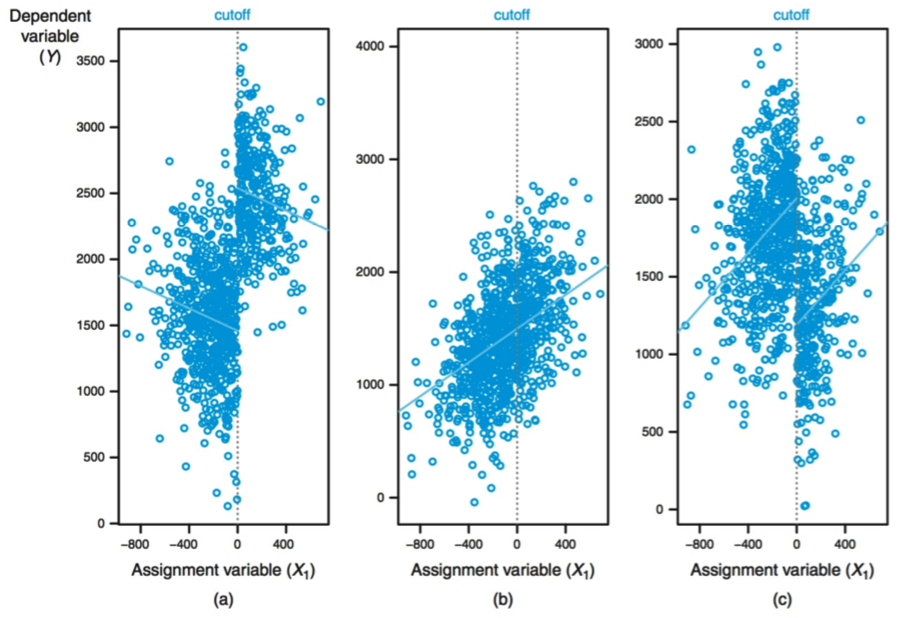
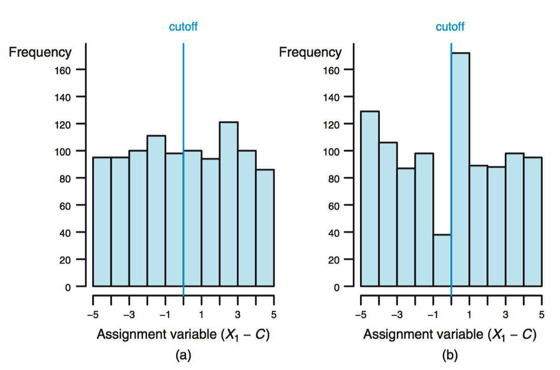
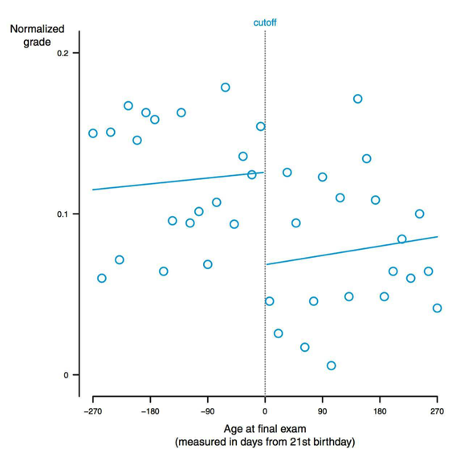
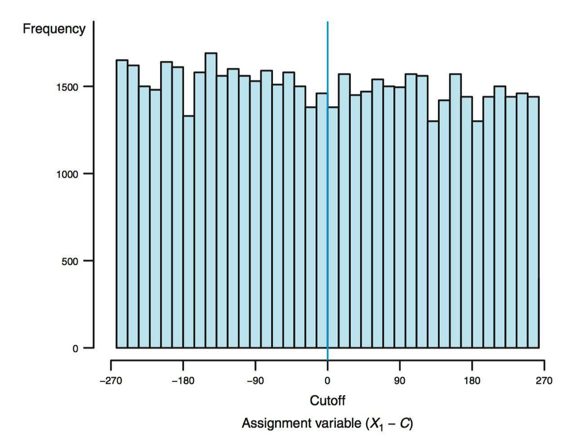
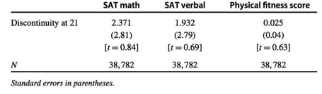
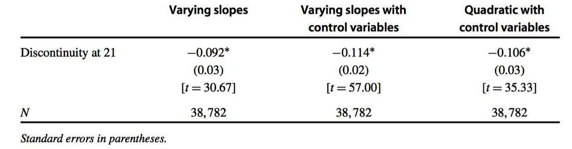

```{r setup, include=FALSE}
knitr::opts_chunk$set(echo = T,message=F,error=F,warning = F,cache=T)
require(tidyverse)
require(ggthemes)
```

layout: true

<div class="slide-footer"><span> 
PPOL561 | Accelerated Statistics for Public Policy II

&emsp;&emsp;&emsp;&emsp;&emsp;&emsp;&emsp;&emsp;&emsp;

Week 12 <!-- Week of the Footer Here -->

&emsp;&emsp;&emsp;&emsp;&emsp;&emsp;&emsp;&emsp;&emsp;&emsp;&emsp;&emsp;

Regression Discontinuity <!-- Title of the lecture here -->

</span></div> 

---
class: outline

# Outline for Today 

![:space 10]

- **Basic Regression Discontinuity model**

- **More flexible Regression Discontinuity models**

- **Windows and bins**

- **Limitations and diagnostics**


---

class: newsection

# Regression Discontinuity

---

![:space 25]

$$Y_i = \beta_0 + \beta_1T_i + \epsilon_i$$

![:space 5]

- $T_i$ is the **Treatment** variable. We seek to understand the effect of the treatment.

- Concern is that allocation of the treatment $T_i$ is correlated with unobserved features in $\epsilon_i$

---

![:space 10]

We've learned a number of solutions for overcoming **_endogeneity_**

![:space 5]

 

<br>

 

<br>

 
 
---

![:space 10]

We've learned a number of solutions for overcoming **_endogeneity_**

![:space 5]

 &rarr; 

<br>

 &rarr; 

<br>

 &rarr; 
 
---

### Regression Discontinuit (RD)

![:space 5]

- Treatment ( $T_i$ ) is assigned according to a **rule**

--

- An **assignmnet variable** determines whether someone receives the treatment.

  - People with values above some **_cutoff_** receive the treatment;
  
  - People with values of the assignment variable below the **_cutoff_** do not receive the treatment. 
  
--

- Any bump up/down in the dependent variable around the cutoff will **_reflect the causal effect of the treatment_**. 

---

### Regression Discontinuit (RD)


![:space 5]

$C$ is the value of the **_cutoff_**

![:space 5]

$$Y_i = \beta_0 + \beta_1T_i + \beta_2 (X_{1i} - C) + \epsilon_i$$
![:space 5]

$$T_i = 1~\text{if}~ X_{i1} \ge C$$
$$T_i = 0~\text{if}~X_{i1} < C$$

---

### Example

![:space 5]

Examine the effect of drinking on academic performance (grades) at a school where the drinking age is rigorously enforced. 

![:space 5]

$$Y_i = \beta_0 + \beta_1T_i + \beta_2 (X_{1i} - C) + \epsilon_i$$

![:space 5]

$$Grades_i = \beta_0 + \beta_1Legal_i + \beta_2 (Age_{1i} - 21) + \epsilon_i$$

---

![:space 5]

```{r,echo=F,fig.align="center",fig.width=10,fig.height=7,dpi=300}
set.seed(123)
N = 1000
x <- rnorm(N)
t <- as.numeric(x>0)
y = 1 + 3*t + 2*x + rnorm(N)
D = tibble(y,x,t)
D %>% 
  ggplot(aes(x,y,color=factor(t))) +
  geom_point(show.legend = F,alpha=.5,size=2) +
  geom_vline(xintercept=0,color="grey30",size=1.5,lty=2) +
  geom_smooth(method = "lm",se = F,show.legend = F,size=2) +
  theme_fivethirtyeight() + 
  theme(text=element_text(size=20))
```

---

### How is this helpful?

![:space 3]

- Usually $X$ ("Age") is correlated with $Y$ ("Grades"), so we can't simply compare treated and control. 

- But students near the cutoff ( $X = C$ ) might be similar 

--

![:space 1]

**Key Idea**

> Use discontinuity in $E[Y|X]$ at the cutoff value $X = C$ to estimate the effect ot $T$ on $Y$ for units near $X = C$

--

![:space 1]

As long as there is no discontinuity in relationship between error (omitted variables) and the outcome at the discontinuity, then we can attribute any bump in the dependent variable as the effect of the treatment.


---

$$Y_i = \beta_0 + \beta_1T_i + \beta_2 (X_{1i} - C) + \epsilon_i$$
  
```{r,echo=F,fig.align="center",fig.width=10,fig.height=7,dpi=300}
D %>% 
  ggplot(aes(x,y,color=factor(t))) +
  
  geom_point(show.legend = F,alpha=.5,size=2) +
  
  geom_vline(xintercept=0,color="grey30",size=1.5,lty=2) +
  
  geom_abline(intercept = 1,slope=2,lty=2,color="grey40") +
  
  geom_smooth(method = "lm",se = F,show.legend = F,size=2) +
  
  theme_fivethirtyeight() + 
  
  theme(text=element_text(size=20)) + 
  
  geom_segment(x=0,xend=-2,y=4,yend=4,inherit.aes = F) +
  geom_label(label="B0 + B1",x=-2,y=4,inherit.aes = F,size=6) +
  
  geom_segment(x=0,xend=-2,y=1,yend=1,inherit.aes = F) +
  geom_label(label="B0",x=-2,y=1,inherit.aes = F,size=6) +
  
  geom_segment(x=2,xend=2,y=5,yend=8,inherit.aes = F) +
  
  geom_label(label="B2 (the slope)",x=2,y=6.5,inherit.aes = F,size=6) +
  
  geom_segment(x=0,xend=0,y=1,yend=4,inherit.aes = F) +
  
  geom_label(label='B1 "bump"',x=0,y=2.5,inherit.aes = F,size=6) +
  
  geom_label(label="Cutoff",x=0,y=12,inherit.aes = F,size=6)

```

---

![:space 10]


---

### Assumptions

![:space 5]

- The key assumption for RD to work is that the error term itself does not jump at the point of the discontinuity. 

--

- Even if the error term is correlated with the assignment variable, the estimated effect of the treatment is still valid. 

--

- Model error as a function of assignment variable

$$\epsilon_i = \rho X_{1i} + \nu_i$$

- _Example_: in grades and alcohol model, consider something in error term (such as maturity) as a function of assignment variable (in this case age)

---

### Assumptions

If we estimate model with only treatment variable, we will have endogeneity (because Treatment (able to drink legally) is correlated with X (age) and X is correlated with error)


$$Y_i = \beta_0 + \beta_1T_i + \epsilon_i$$

--

<br>

If include the assignment variable (let's assume $C = 0$ for simplicity) and use the fact that $\epsilon_i = \rho X_{1i} + \nu_i$

<br>

$$Y_i = \beta_0 + \beta_1T_i + \beta_2X_{1i} + \epsilon_i$$
$$Y_i = \beta_0 + \beta_1T_i + \beta_2X_{1i} + \rho X_{1i} + \nu_i$$
$$Y_i = \beta_0 + \beta_1T_i + (\beta_2 + \rho)X_{1i} + \nu_i$$

---

### Assumptions

$$Y_i = \beta_0 + \beta_1T_i + (\beta_2 + \rho)X_{1i} + \nu_i$$

![:space 3]

This means: 

- The **_treatment variable is uncorrelated with the error term_**, even though the assignment variable is correlated with the error term.

- OLS will provide an **_unbaised estimate_** of $\beta_1$ <u> as long as there is no "jump" in the error term at the cutoff.</u> (i.e. there is some other factor driving the discontinuity.)

- Given that the assignment variable is correlated with the error, so it'll be biased. This is okay because our main interest lies in correctly estimating $\beta_1$

---

### Simulation

```{r}
set.seed(123) # Seed (for replication)

N = 1000 # Sample Size

something = rnorm(N) # Endogeneity

error = 4*something + rnorm(N) # Error + Endogeneity

x <- -4*something + rnorm(N) # Assignment Var (Corr w/ Error)

t <- as.numeric(x>0) # Treatment Var

y = 1 + 3*t + 2*x + error # Outcome Model ("Truth") 

D = tibble(y,x,t) # As Data Frame 

D
```

---

### Simulation

.center[
```{r,results="asis"}
# Normal Difference in Means Biased
m1 <- lm(y~t,data=D)
stargazer::stargazer(m1,type = 'html')
```

]

---

### Simulation

.center[
```{r,results="asis"}
# Regression Discontinuity Model
m2 <- lm(y ~ t + x,data=D)
stargazer::stargazer(m2,type = 'html')
```

]

---

### Simulation

```{r,fig.align="center",fig.width=8,fig.height=3.75,dpi=300}
D %>% 
  ggplot(aes(x,y,color=factor(t))) +
  geom_point(show.legend = F,alpha=.5) +
  geom_vline(xintercept=0,color="grey30",lty=2) +
  geom_smooth(method = "lm",se = F,show.legend = F,size=2) +
  theme(text=element_text(size=20))
```


---

### Questions 

![:space 10]

Many school districts pay for new school buildings with bond issues that must be approved by voters. Supporters of these bond issues typically argue that new buildings improve schools and thereby boost housing values. Cellini, Ferreira, and Rothstein (2010) used RD to test whether passage of school bonds caused housing values to rise.

- **(A)** What is the assignment variable?

- **(B)** Explain how to use a basic RD approach to estimate the effect of school bond passage on housing values?

---

### Questions 

![:space 10]

U.S. citizens are eligible for Medicare the day they turn 65 years old. Many believe that people with health insurance are less likely to die prematurely because they will be more likely to seek treatment and doctors will be more willing to conduct tests and procedures for them. Card, Dobkin, and Maestas (2009) used RD to address this question.

- **(A)** What is the assignment variable?

- **(B)** Explain how to use a basic RD approach to estimate the effect of Medicare coverage on the probability of dying prematurely.

---

class: newsection

### More Flexible <br> RD Models

---

![:space 10]

$$Y_i = \beta_0 + \beta_1T_i + \beta_2 (X_{1i} - C) + \epsilon_i$$
![:space 5]

.pull-left[

```{r,echo=F,fig.align="center",fig.width=10,fig.height=7,dpi=300}
set.seed(123)
N = 1000
x <- rnorm(N)
t <- as.numeric(x>0)
y = 1 + 3*t + 2*x + rnorm(N)
D = tibble(y,x,t)
D %>% 
  ggplot(aes(x,y,color=factor(t))) +
  geom_point(show.legend = F,alpha=.5,size=2) +
  geom_vline(xintercept=0,color="grey30",size=1.5,lty=2) +
  geom_smooth(method = "lm",se = F,show.legend = F,size=2) +
  theme_fivethirtyeight() + 
  theme(text=element_text(size=20))
```

]

.pull-right[
<br>
In basic version of RD, the relationship between $X$ and $Y$ is 
- **_linear_**, and 

- the **_same on both sides of the treatment_** in this model 
]

---

$$Y_i = \beta_0 + \beta_1T_i + \beta_2 (X_{1i} - C) + \beta_3 (X_{1i} - C) T_i+ \epsilon_i$$

```{r,echo=F,fig.align="center",fig.width=10,fig.height=7,dpi=300}
set.seed(123)
N = 1000
x <- rnorm(N)
t <- as.numeric(x>0)
y = 1 + 3*t + 2*x + 4*t*x + rnorm(N)
D = tibble(y,x,t)
D %>% 
  ggplot(aes(x,y,color=factor(t))) +
  geom_point(show.legend = F,alpha=.5,size=2) +
  geom_vline(xintercept=0,color="grey30",size=1.5,lty=2) +
  geom_smooth(method = "lm",se = F,show.legend = F,size=2) +
  theme_fivethirtyeight() + 
  theme(text=element_text(size=20))
```

---

### Varying Slopes Model

$$Y_i = \beta_0 + \beta_1T_i + \beta_2 (X_{1i} - C) + \beta_3 (X_{1i} - C) T_i+ \epsilon_i$$
$$T_i = 1~\text{if}~ X_{i1} \ge C$$
$$T_i = 0~\text{if}~X_{i1} < C$$

![:space 3]

- Interation between $T_i$ and the assignment variable 

- $\beta_3$ captures how different the slope is for observations where $X_1$ is greater than $C$

- By using $X_{1i} - C$ instead of $X_{1i}$ for the assignment variable, we ensure that $\hat{\beta_1}$ indicates the difference between the treated and control when $X_{1i} - C = 0$

---

<br>
```{r,echo=F,fig.align="center",fig.width=12,fig.height=8,dpi=300}
set.seed(123)
N = 1000
x <- rnorm(N)
t <- as.numeric(x>0)
y = 1 + 3*t + 2*x + 2*t*x + rnorm(N)
D1 = tibble(y,x,t,type = "Scenario 1")

x <- rnorm(N)
t <- as.numeric(x>0)
y = 1 + -3*t + 2*x + -4*t*x + rnorm(N)
D2 = tibble(y,x,t,type = "Scenario 2")

x <- rnorm(N)
t <- as.numeric(x>0)
y = 1 + 3*t + 2*x + 0*t*x + rnorm(N)
D3 = tibble(y,x,t,type = "Scenario 3")

bind_rows(D1,D2,D3) %>% 
  ggplot(aes(x,y,color=factor(t))) +
  geom_point(show.legend = F,alpha=.5,size=1) +
  geom_vline(xintercept=0,color="grey30",size=1,lty=2) +
  geom_smooth(method = "lm",se = F,show.legend = F,size=2) +
  theme_fivethirtyeight() + 
  theme(text=element_text(size=20)) +
  facet_wrap(~type,ncol=3)
```

---

### Polynomial Models

![:space .5]

$$Y_i = \beta_0 + \beta_1T_i + \beta_2 (X_{1i} - C) + \beta_3 (X_{1i} - C)^2 + \beta_4 (X_{1i} - C)^3  +\\ \beta_5 (X_{1i} - C)T_i+  \beta_6 (X_{1i} - C)^2T_i +  \beta_7 (X_{1i} - C)^3T_i + \epsilon_i$$

$$T_i = 1~\text{if}~ X_{i1} \ge C$$
$$T_i = 0~\text{if}~X_{i1} < C$$

![:space .5]

- The goal is to find a functional form for the relashionship between $X_{1i} - C$ and $Y$ that best models the data on either side of the treatment. 

- Aim is to ensure that any bump at the cutoff reflects only the causal effect of the treatment. 

- Rarely have a "theory" for these functional sepecifications and that's okay (again all we care about is $\beta_1$)


---

```{r,echo=F,fig.align="center",fig.width=10,fig.height=8,dpi=300}
set.seed(123)
N = 1000
x <- rnorm(N)
t <- as.numeric(x>0)
y = 1 + 3*t + 2*x + 0*x^2 + .0*x^3 + 2*t*x + -2*t*x^2 + 0*t*x^3 + rnorm(N)
D = tibble(y,x,t)
D %>% 
  ggplot(aes(x,y,color=factor(t))) +
  geom_point(show.legend = F,alpha=.5,size=2) +
  geom_vline(xintercept=0,color="grey30",size=1.5,lty=2) +
  geom_smooth(method = "loess",se = F,show.legend = F,size=2) +
  theme_fivethirtyeight() + 
  theme(text=element_text(size=20))
```

---

class: newsection

### Windows and Bins

---

### Window Size 

![:space 5]

- The **_window_** (or "bandwidth") is the range of $X$ to which we limit our analysis.

- In theory, we want to compare values right next to the boundary (on each side). 

- In practice, always need fairly big windows in order to get sufficient sample size (i.e. concerns over power)

- Reducing window size is a great way to deal with non-linearities.
  
  - With smaller windows, linear models should do better and better. 

---

```{r,echo=F,fig.align="center",fig.width=10,fig.height=8,dpi=300}
set.seed(123)
N = 1000
x <- rnorm(N)
t <- as.numeric(x>0)
y = 1 + 3*t + 2*x + 0*x^2 + .0*x^3 + 2*t*x + -2*t*x^2 + 0*t*x^3 + rnorm(N)
D = tibble(y,x,t)
window = 1
D %>% 
  ggplot(aes(x,y,color=factor(t))) +
  geom_point(show.legend = F,alpha=.2,size=2) +
  geom_smooth(method = "loess",se = F,show.legend = F,size=2) +
  gghighlight::gghighlight(abs(x) < window,unhighlighted_colour = "grey60") +
  geom_vline(xintercept=0,color="grey30",size=.5,lty=2) +
  geom_vline(xintercept=window,color="grey30",size=1,lty=2) +
  geom_vline(xintercept=-window,color="grey30",size=1,lty=2) +
  geom_segment(x=-window,xend=window,y=9,yend=9,color="grey10",
               size=1) +
  geom_label(label="Bandwidth",x=0,y=9,color="grey10",size=6) +
  theme_fivethirtyeight() + 
  theme(text=element_text(size=20)) 
```


---

### Binned Graphs

Often it can be difficult to observe a discontinuity. 

```{r,echo=F,fig.align="center",fig.width=10,fig.height=6,dpi=300}
set.seed(12345)
N = 1000
x <- rnorm(N)
t <- as.numeric(x>0)
y = 1 + .5*t + .2*x + -.5*x*t + rnorm(N)
D = tibble(y,x,t) %>% 
  mutate(bin = cut_interval(x, 25))
D %>% 
  # group_by(bin) %>%
  # summarize(y = mean(y),x = mean(x)) %>%
  ggplot(aes(x,y)) +
  geom_vline(xintercept=0,color="grey30",size=.5,lty=2) +
  geom_point(size=3) + 
  theme_fivethirtyeight() + 
  theme(text=element_text(size=20)) 
```

---

### Binned Graphs

We can bin observations to see the average effect.


```{r,echo=F,fig.align="center",fig.width=10,fig.height=6,dpi=300}
D %>% 
  group_by(bin) %>%
  summarize(y = mean(y),x = mean(x)) %>%
  ggplot(aes(x,y)) +
  geom_vline(xintercept=0,color="grey30",size=.5,lty=2) +
  geom_point(size=5) + 
  theme_fivethirtyeight() + 
  theme(text=element_text(size=20)) 
```

---

### Virtues of Bin Graphs

![:space 3]

- **To construct a bin plot**, 

  - divide the $X_1$ variable into multiple regions (or "bins") above and below the cutoff; 
  
  - calculate the average value of $Y$ within each of those regions.

--

- If there is an effect, will almost always be **_able to “see” the discontinuity_** it with a simple graph

--

- **_Diagnostics_**: assess if there are _non-linearities_ or _discontinuities_ at other points.

--

- **** always run analysis on _unbinned_ data. The bins are solely for visualization purposes.

---

### In-Practice

```{r,echo=F}
dat = tibble(y,x,t)
```

```{r}
dat
```

---

### In-Practice

```{r}
dat  %>%  
  mutate(bin = cut_interval(x, 25))
```


---

### In-Practice

```{r}
dat  %>%  
  mutate(bin = cut_interval(x, 25)) %>% 
  group_by(bin) %>%
  summarize(y = mean(y),
            x = mean(x)) 
```

---

class: newsection 

### Limitations <br> & <br> Diagnostics

---

### Limitations of RD

- Recall, the key assumption of RD is that there is no “bump” (discontinuity) in the error term at the discontinuity

- This can **** when:

--

  -  
    
--

      + _Example_: suppose a test score above “100” allows you to get a scholarship and that students are allowed to re-take test.  More motivated students (where motivation is in error term) may re-take the test until they get a 100.
   
--

      + _Example_: financial aid officer may score financial need knowing applicant and score needed to get aid

---

### Limitations of RD

- Recall, the key assumption of RD is that there is no “bump” (discontinuity) in the error term at the discontinuity

- This can **** when:

  -  
  
  -  
  
--

      +  _Example_: Suppose people save up visits to doctor until
	 after they are 65 (for the medicare to kick in)

    
---

### Limitations of RD

- Recall, the key assumption of RD is that there is no “bump” (discontinuity) in the error term at the discontinuity

- This can **** when:

  -  
  
  -  
  
- **Generalizability**

--

  - Estimating the effect of the treament on the _subpopulation_ where $X_i = C$
  
  - Also known as **_"Local Average Treatment Effect"_** (LATE)

--
  
  - Treatment effect may no generalize to the broader population in the same (i.e. for those $X_i$s further away from $C$)

---

### Diagnostics: _Clustering_

- Assess whether there is clustering on one side of the cutoff

- Can use a histogram to assess.

- There should be no bump in assignment variable.

--




---

### Diagnostics: _Isolated Discontinuity_

- Assess if other variables "act weird" at the discontinuity.

- At discontinuity, there should be **_no discontinuity in other covariates_**.  

--

- For some “other” covariate $W$:

$$W_i = \gamma_0 + \gamma_1 T_i + \gamma_2(X_{1i} – C) + \epsilon_i$$

$$T_i = 1~\text{if}~ X_{i1} \ge C$$
$$T_i = 0~\text{if}~X_{i1} < C$$

$\gamma_1$ should equal zero.

--

- If some other variable jumps at the discontinuity, we may wonder if people are somehow self-selecting (or being selected) based on unknown additional factors.

---

### Diagnostics: _Placebo Test_

![:space 7]

- **Dependent variable shouldn’t “jump” at other cutoffs**

--

<br>

- Conduct **placebo tests** at the discontinuity

  - Set different cutoff points 
  
  - See if there is another discontinuity
  
--

<br>
  
- For example, in the drinking and grades study, see if there are any observed effects when we alter the age from 21 to 25 to 18, etc. 

---

### Example: Alcohol and Drinking



---

### Example: Alcohol and Drinking



---

### Example: Alcohol and Drinking


![:space 20]


---

### Example: Alcohol and Drinking

![:space 20]


---


### RD Steps

![:space 5]

- **Step 1**: Assess appropriateness of RD

    - Basic RD (assignment variable perfectly predicts treatment)
    
    - Qualitatively assess whether agents have control over assignment variable
    
    - Conduct balancing tests
    
--

- **Step 2**: Plot data – typically with binned graph

--

- **Step 3**: Estimate linear model using different window sizes

--

- **Step 4**: Estimate non-linear models using different window sizes

