```{r setup, include=FALSE}
knitr::opts_chunk$set(echo = T,message=F,error=F,warning = F,cache=T)
require(tidyverse)
require(ggthemes)
require(MatchIt)
```

layout: true

<div class="slide-footer"><span> 
PPOL561 | Accelerated Statistics for Public Policy II

&emsp;&emsp;&emsp;&emsp;&emsp;&emsp;&emsp;&emsp;&emsp;

Week 13 <!-- Week of the Footer Here -->

&emsp;&emsp;&emsp;&emsp;&emsp;&emsp;&emsp;&emsp;&emsp;&emsp;&emsp;&emsp;

Matching <!-- Title of the lecture here -->

</span></div> 

---
class: outline

# Outline for Today 


- Refresh on the  definition of a **Causal Effect**

![:space 2]

- **Model Dependency**

![:space 2]

- **Matching**

![:space 2]

- **Matching Methods**

![:space 2]

- **Simulation** Example

---

class: newsection

.center[**_Refresh on_**]
# Causal Effects

---


### Potential Outcomes

![:space 4]

```{r,echo=F,fig.align="center",fig.width=9,fig.height=6.5}
bind_rows(
  tibble(y=5,x=3,candidate = "You",size=75,alpha=1,color="grey30"),
  # tibble(y=1,x=1,candidate = "Grad School",size=75,alpha=1,color="steelblue"),
  # tibble(y=1,x=5,candidate = "No\nGrad School",size=75,alpha=1,color="darkred"),
  # tibble(y=-3,x=3,candidate = "$$$",size=75,alpha=1,color="grey60"),
) %>% 
  
  ggplot(aes(x,y,size=size,color=color,alpha=alpha)) +
  # geom_segment(x=3,xend=1,y=5,yend=1,size=.5,alpha=.2,color="grey40") +
  # geom_segment(x=3,xend=5,y=5,yend=1,size=.5,alpha=.2,color="grey40") +
  # geom_segment(x=1,xend=3,y=1,yend=-3,size=.5,alpha=.2,color="grey40") +
  # geom_segment(x=5,xend=3,y=1,yend=-3,size=.5,alpha=.2,color="grey40") +
  # geom_segment(x=3,xend=3,y=5,yend=-3,size=.5,alpha=.2,color="grey40") +
  geom_point() +
  scale_color_identity() +
  scale_alpha_identity() +
  scale_size_identity() +
  geom_text(color="white",aes(label=candidate),size=8) +
  ylim(-5,7) + xlim(0,6) +
  theme_void() +
  theme(legend.position = "none")
```

---

### Potential Outcomes

![:space 4]

```{r,echo=F,fig.align="center",fig.width=9,fig.height=6.5}
bind_rows(
  tibble(y=5,x=3,candidate = "You",size=75,alpha=1,color="grey30"),
  # tibble(y=1,x=1,candidate = "Grad School",size=75,alpha=1,color="steelblue"),
  # tibble(y=1,x=5,candidate = "No\nGrad School",size=75,alpha=1,color="darkred"),
  tibble(y=-3,x=3,candidate = "$$$",size=75,alpha=1,color="grey60"),
) %>% 
  
  ggplot(aes(x,y,size=size,color=color,alpha=alpha)) +
  # geom_segment(x=3,xend=1,y=5,yend=1,size=.5,alpha=.2,color="grey40") +
  # geom_segment(x=3,xend=5,y=5,yend=1,size=.5,alpha=.2,color="grey40") +
  # geom_segment(x=1,xend=3,y=1,yend=-3,size=.5,alpha=.2,color="grey40") +
  # geom_segment(x=5,xend=3,y=1,yend=-3,size=.5,alpha=.2,color="grey40") +
  geom_segment(x=3,xend=3,y=5,yend=-3,size=.5,alpha=.2,color="grey40") +
  geom_point() +
  scale_color_identity() +
  scale_alpha_identity() +
  scale_size_identity() +
  geom_text(color="white",aes(label=candidate),size=8) +
  ylim(-5,7) + xlim(0,6) +
  theme_void() +
  theme(legend.position = "none")
```

---

### Potential Outcomes

Considering school (and intervention/treatment)

```{r,echo=F,fig.align="center",fig.width=9,fig.height=6.5}
bind_rows(
  tibble(y=5,x=3,candidate = "You",size=75,alpha=1,color="grey30"),
  tibble(y=1,x=1,candidate = "Grad School",size=75,alpha=1,color="steelblue"),
  tibble(y=1,x=5,candidate = "No\nGrad School",size=75,alpha=1,color="darkred"),
  tibble(y=-3,x=3,candidate = "$$$",size=75,alpha=1,color="grey60"),
) %>% 
  
  ggplot(aes(x,y,size=size,color=color,alpha=alpha)) +
  geom_segment(x=3,xend=1,y=5,yend=1,size=.5,alpha=.2,color="grey40") +
  geom_segment(x=3,xend=5,y=5,yend=1,size=.5,alpha=.2,color="grey40") +
  # geom_segment(x=1,xend=3,y=1,yend=-3,size=.5,alpha=.2,color="grey40") +
  # geom_segment(x=5,xend=3,y=1,yend=-3,size=.5,alpha=.2,color="grey40") +
  # geom_segment(x=3,xend=3,y=5,yend=-3,size=.5,alpha=.2,color="grey40") +
  geom_point() +
  scale_color_identity() +
  scale_alpha_identity() +
  scale_size_identity() +
  geom_text(color="white",aes(label=candidate),size=8) +
  ylim(-5,7) + xlim(0,6) +
  theme_void() +
  theme(legend.position = "none")
```


---


### Potential Outcomes

Can only observe _one outcome_

```{r,echo=F,fig.align="center",fig.width=9,fig.height=6.5}
bind_rows(
  tibble(y=5,x=3,candidate = "You",size=75,alpha=1,color="grey30"),
  tibble(y=1,x=1,candidate = "Grad School",size=75,alpha=1,color="steelblue"),
  # tibble(y=1,x=5,candidate = "No\nGrad School",size=75,alpha=1,color="darkred"),
  tibble(y=-3,x=3,candidate = "$$$",size=75,alpha=1,color="grey60"),
) %>% 
  
  ggplot(aes(x,y,size=size,color=color,alpha=alpha)) +
  geom_segment(x=3,xend=1,y=5,yend=1,size=.5,alpha=.2,color="grey40") +
  geom_segment(x=1,xend=3,y=1,yend=-3,size=.5,alpha=.2,color="grey40") +
  # geom_segment(x=3,xend=5,y=5,yend=1,size=.5,alpha=.2,color="grey40") +
  # geom_segment(x=5,xend=3,y=1,yend=-3,size=.5,alpha=.2,color="grey40") +
  # geom_segment(x=3,xend=3,y=5,yend=-3,size=.5,alpha=.2,color="grey40") +
  geom_point() +
  scale_color_identity() +
  scale_alpha_identity() +
  scale_size_identity() +
  geom_text(color="white",aes(label=candidate),size=8) +
  ylim(-5,7) + xlim(0,6) +
  theme_void() +
  theme(legend.position = "none")
```

---


### Potential Outcomes

Cannot observe the _counter-factual_

```{r,echo=F,fig.align="center",fig.width=9,fig.height=6.5}
bind_rows(
  tibble(y=5,x=3,candidate = "You",size=75,alpha=1,color="grey30"),
  # tibble(y=1,x=1,candidate = "Grad School",size=75,alpha=1,color="steelblue"),
  tibble(y=1,x=5,candidate = "No\nGrad School",size=75,alpha=1,color="darkred"),
  tibble(y=-3,x=3,candidate = "$$$",size=75,alpha=1,color="grey60"),
) %>% 
  
  ggplot(aes(x,y,size=size,color=color,alpha=alpha)) +
  # geom_segment(x=3,xend=1,y=5,yend=1,size=.5,alpha=.2,color="grey40") +
  # geom_segment(x=1,xend=3,y=1,yend=-3,size=.5,alpha=.2,color="grey40") +
  geom_segment(x=3,xend=5,y=5,yend=1,size=.5,alpha=.2,color="grey40") +
  geom_segment(x=5,xend=3,y=1,yend=-3,size=.5,alpha=.2,color="grey40") +
  # geom_segment(x=3,xend=3,y=5,yend=-3,size=.5,alpha=.2,color="grey40") +
  geom_point() +
  scale_color_identity() +
  scale_alpha_identity() +
  scale_size_identity() +
  geom_text(color="white",aes(label=candidate),size=8) +
  ylim(-5,7) + xlim(0,6) +
  theme_void() +
  theme(legend.position = "none")
```

---

### Potential Outcomes

.center[
**The Fundamental Problem of Causal Inference**
]

```{r,echo=F,fig.align="center",fig.width=9,fig.height=6.5}
bind_rows(
  tibble(y=5,x=3,candidate = "You",size=75,alpha=1,color="grey30"),
  tibble(y=1,x=1,candidate = "Grad School",size=75,alpha=1,color="steelblue"),
  tibble(y=1,x=5,candidate = "No\nGrad School",size=75,alpha=1,color="darkred"),
  tibble(y=-3,x=3,candidate = "$$$",size=75,alpha=1,color="grey60"),
) %>% 
  
  ggplot(aes(x,y,size=size,color=color,alpha=alpha)) +
  geom_segment(x=3,xend=1,y=5,yend=1,size=.5,alpha=.2,color="grey40") +
  geom_segment(x=1,xend=3,y=1,yend=-3,size=.5,alpha=.2,color="grey40") +
  geom_segment(x=3,xend=5,y=5,yend=1,size=.5,alpha=.2,color="grey40") +
  geom_segment(x=5,xend=3,y=1,yend=-3,size=.5,alpha=.2,color="grey40") +
  # geom_segment(x=3,xend=3,y=5,yend=-3,size=.5,alpha=.2,color="grey40") +
  geom_point() +
  scale_color_identity() +
  scale_alpha_identity() +
  scale_size_identity() +
  geom_text(color="white",aes(label=candidate),size=8) +
  ylim(-5,7) + xlim(0,6) +
  theme_void() +
  theme(legend.position = "none")
```

---

### Causal Effect

![:space 2]

**Potential Outcomes**

![:space 2]

$$y_i(1) \equiv  y_i(T=1)$$

$$y_i(0) \equiv  y_i(T=0)$$


![:space 2]

**Causal Treatment Effect** for unit $i$ 

![:space 2]

$$ TE_i = y_i(1) - y_i(0)$$

---

### Assumptions

![:space 2]

**Common Support ("Overlap")**

$$pr(T_i = 1 |X_i) < 1$$

- It must be conceivable that a treated unit _could have been assigned_ to the control group.

- If this doesn't hold, then $y_i(0)$ doesn't even logically exist.

--

![:space 3]

**Stable Unit Treatment Value (SUTV)**

- Each potential value ( e.g. $y_i(1)$ or $y_i(0)$ ) is _fixed_.

- No hidden versions of the treatment.

---

### Definition of Causal Effects 

![:space 3]

**Key point**

> Causal effect is a _theoretical quantity_ defined independently of any empirical method that might be used to estimate it from real data.


![:space 2]

>Identifying the causal process is separate from the parametric models that we use to estimate a causal effect.


![:space 2]

> Through a clear research design and modeling strategy we aim to **_infer_** the causal relationship between treatment and outcome. 


---

class: newsection

### Model Dependency


---

### Experiments

![:space 1]

Valid and relatively straightforward causal inferences can be achieved via classical randomized experiments. 

--

![:space 1]

A good experiment requires 3 components:

- **(1)** __ of units to be observed from a given population,

- **(2)** __ of values of the treatment to each observed unit

- **(3)** __ size ( $N$ )

---

### Experiments

![:space 1]

Valid and relatively straightforward causal inferences can be achieved via classical randomized experiments. 


![:space 1]

A good experiment requires 3 components:

- **(1)** __ by identifying a given population and guaranteeing that the probability of selection from this population is related to the potential outcomes only by random chance.

- **(2)** __ even without any control variables included.

- **(3)** __, i.e. imbalance.

--
<br>
>This is the  of causal inference

---

### Observational Research

- Any data collection that  to meet the 3 experimental criteria.

- Researchers analyzing observational data are instead **_forced to make assumptions_** that, if correct, help them avoid various threats to the validity of their causal inferences.

--

- ****:

  - _Selection Bias_;
  
  - _Sufficient information on pre-treatment control variables $X_i$_; 
  
  - _Pre-treatment variables are, in fact, pre-treatment_ (i.e. not influenced by the treatment);
  
  - _Independence of units_ (i.e. in time and space);
  
  - _Treatment administered to each unit is the same_
  
---

### Experimental Data

In experiments, **_random assignment breaks the link_** between $T_i$ and $X_i$ eliminating the problem of model dependence.

![:space 5]

$$E[y_i(1) | T_i = 1] = \beta_0 + \beta_1 T_i$$
$$E[y_i(0) | T_i = 0] = \beta_0$$
![:space 5]
$$ \beta_0 + \beta_1 T_i - \beta_0$$
$$ \beta_1$$

  
---

### Observational Data

With observational data, we are less fortunate. 

We have to model the **_full functional relationship_** that connects the mean as it varies as a function of $T_i$ and $X_i$ over observations.

![:space 2]

$$E[y_i(1) | T_i = 1, X_i] = g(\beta_0 + \beta_1 T_i + \beta X_i)$$
$$E[y_i(0) | T_i = 0, X_i] = g(\beta_0 + \beta X_i)$$

where 

- $g(\cdot)$ is the assumed functional form (e.g. linear relationship)

- $\beta_1$ is the average treatment effect


---

### Observational Data

With observational data, we are less fortunate. 

We have to model the **_full functional relationship_** that connects the mean as it varies as a function of $T_i$ and $X_i$ over observations.

![:space 5]

Since $X_i$ is multidimensional, this is surprisingly difficult.

![:space 5]

The problem is the **_curse of dimensionality_** and the consequence in practice is **__**.

---

### Model Dependence

In parametric causal inference of observational data, **_many assumptions about many parameters_** are frequently necessary.

--

![:space 3]

**_Only rarely_** do we have sufficient external information to make these assumptions based on genuine knowledge. 

--

![:space 3]

The frequent, unavoidable consequence is **_high levels of model dependence_**.

--

![:space 3]

.center[
****.
]

---

![:space 9]

```{r,fig.align = "center",fig.width = 10,fig.height=7.3,echo=F}
# Simulate data
set.seed(123)
N = 100
x <- rnorm(N)
tr = rbinom(N,1,.3)
y <- -1*tr + -1*x + rnorm(N,sd=2)
match = rep(1,N)

# Make noisy control variables
N2 = 25
x2 <- runif(N2,-5,-2)
y2 <- runif(N2,-10,-0)
tr2 = rep(0,N2)
match2 = rep(0,N2)

N3 = 25
x3 <- runif(N3,3,5)
y3 <- runif(N3,-10,-0)
tr3 = rep(0,N3)
match3 = rep(0,N3)

# Compile
D = 
  tibble(y = c(y,y2,y3),
         x = c(x,x2,x3),
         tr = c(tr,tr2,tr3),
         match = c(match,match2,match3)) %>% 
  mutate(type = ifelse(tr==1,"T","C"))


gen_dat <- 
  function(mod,D){
    # Function to quickly run the predictions of the models
    bind_rows(
      tibble(type = 'T',
             x = D$x,
             yhat = predict(mod,D %>% mutate(tr=1))),
      tibble(type = 'C',
             x = D$x,
             yhat = predict(mod,D %>% mutate(tr=0)))
    )  
  }

# parametric models
m1 = lm(y~tr+x,D)
m2 = lm(y~tr+x+I(x^2),D)


D %>% 
  ggplot(aes(x,y,color=type)) +
  geom_text(aes(label=type),
            size=7,alpha=.8,
            show.legend = F) +
  # geom_line(data=gen_dat(m1,D),aes(x,yhat,color=type),
            # size=1.5,inherit.aes = F,show.legend = F) +
  # geom_line(data=gen_dat(m2,D),aes(x,yhat,color=type),
            # size=1.5,inherit.aes = F,show.legend = F) +
  theme_fivethirtyeight() +
  scale_color_manual(values=c("orangered","steelblue"))
```

---

$$ \hat{y}_i = \hat{\beta}_0 +  \hat{\beta}_1 T_i + \hat{\beta}_2 x_i $$
```{r,fig.align = "center",fig.width = 10,fig.height=7.3,echo=F}
D %>% 
  ggplot(aes(x,y,color=type)) +
  geom_text(aes(label=type),
            size=7,alpha=.8,
            show.legend = F) +
  geom_line(data=gen_dat(m1,D),aes(x,yhat,color=type),
            size=1.5,inherit.aes = F,show.legend = F) +
  # geom_line(data=gen_dat(m2,D),aes(x,yhat,color=type),
            # size=1.5,inherit.aes = F,show.legend = F) +
  theme_fivethirtyeight() +
  scale_color_manual(values=c("orangered","steelblue"))
```


---

$$ \hat{y}_i = \hat{\beta}_0 +  \hat{\beta}_1 T_i + \hat{\beta}_2 x_i + \hat{\beta}_3 x^2_i $$

```{r,fig.align = "center",fig.width = 10,fig.height=7.3,echo=F}
D %>% 
  ggplot(aes(x,y,color=type)) +
  geom_text(aes(label=type),
            size=7,alpha=.8,
            show.legend = F) +
  # geom_line(data=gen_dat(m1,D),aes(x,yhat,color=type),
            # size=1.5,inherit.aes = F,show.legend = F) +
  geom_line(data=gen_dat(m2,D),aes(x,yhat,color=type),
            size=1.5,inherit.aes = F,show.legend = F) +
  theme_fivethirtyeight() +
  scale_color_manual(values=c("orangered","steelblue"))
```


---

### Model Dependence

![:space 2]

.center[
**Imbalance<br><br>&darr;<br>**
]

--

.center[
****
]

--

.center[
****
]

--

.center[
**__**
]

---

class: newsection

### Matching

---

![:space 3]

.center[
**Imbalance  <br><br>&darr;<br><br>    __ **

]

---

![:space 3]

.center[
**~~Im~~balance    __ **

]

--

.center[

**_Central aim of statistics (and most methodologies) is to remove (or minimize) human discretion in the analytic process_**
]


---

### Matching as Nonparametric Preprocessing

![:space 3]

The idea is to **adjust the data _prior_ to any parametric analysis**.

--

![:space 1]

- **(1)** Eliminate or reduce the relationship between $T_i$ and $X_i$

--

- **(2)** Minimizes various forms of bias and inefficiency

--

- **(3)** Reduces model dependencies

  - No longer need to model the full parametric relationship between the outcome and $X_i$
  
  - model dependence is not eliminated but will normally be greatly reduced

---

### What is Matching?

![:space 3]

$$ TE_i =  y_i(1) - y_i(0)$$

--

$$ TE_i =  y_i(1) - \color{lightgrey}{y_i(0)}$$

--

$$ TE_i =  \text{observed} - \color{lightgrey}{\text{unobserved}}$$

--

![:space 2]

We need to **_locate a suitable proxy_** for the counter-factual $y_i(0)$

We can estimate $y_i(0)$ by finding a suitable "match" (some $y_j$ ) that can function as a control. 

--

We do this by **_finding observations that are "close" in the covariate space_**.

$$ X_i \approx X_j $$

---

### What is Matching?

![:space 3]

$$\widetilde {p}(X| T = 1) = \widetilde {p}(X| T = 0)$$

--

![:space 2]

The fundamental rule is to avoid **selection bias** when matching.

--

- **** ("Selection on the Dependent Variable")

--

- Select observations using the ****

--

- Can ****, ****, or selectively **** observations from an existing sample without bias

--

- If all treated units are matched, this procedure **_eliminates all dependence on the functional form_** in the parametric analysis.


---

### What is Matching?

![:space 3]

$$\widetilde {p}(X| T = 1) = \widetilde {p}(X| T = 0)$$

![:space 3]

The equation only requires that the **_distributions_ be equivalent.**

--

- Matching does not require **_pairing observations_** (e.g. one-for-one exact match). More appropriate to call the method **_"pruning"_**

--

- Pruning nonmatches makes **_control variables matter less_**

--

- Finding matches is often most severe if $X_i$ is **_high dimensional_** ("curse of dimensionality")

--

.center[
> ****
]


---

```{r,fig.align = "center",fig.width = 10,fig.height=8,echo=F}
D %>% 
  ggplot(aes(x,y,color=type)) +
  geom_text(aes(label=type),
            size=5,alpha=.8,
            show.legend = F) +
  geom_line(data=gen_dat(m1,D),aes(x,yhat,color=type),
            size=1.5,
            inherit.aes = F,show.legend = F) +
  geom_line(data=gen_dat(m2,D),aes(x,yhat,color=type),
            size=1,
            inherit.aes = F,show.legend = F) +
  theme_fivethirtyeight() +
  scale_color_manual(values=c("orangered","steelblue"))
```


---

```{r,fig.align = "center",fig.width = 10,fig.height=8,echo=F}
# Matching example
D %>% 
  ggplot(aes(x,y,color=type)) +
  geom_text(aes(label=type),
            size=5,alpha=.8,
            show.legend = F) +
  gghighlight::gghighlight(match==1) +
  geom_smooth(method="lm",se=F,show.legend = F) +
  theme_fivethirtyeight() +
  scale_color_manual(values=c("orangered","steelblue")) 
```


---

### Paradoxical Advantages of Discarding Data

Consider a simple linear regression with one treatment variable, $T_i$ , and one covariate, $X_i$.

![:space 3]

$$var(\hat{\beta}_T) = \frac{\hat{\sigma}^2}{N(1-R^2_T) var(T_i)}$$

--

![:space 3]

If matching improves balance, then the dependence between $T_i$ and $X_i$ will drop

- $R^2_T$ will be smaller (reducing variance)

--

- $N$ might be smaller too (increasing variance)


---

### Paradoxical Advantages of Discarding Data

![:space 3]

- Variance of the causal effect is mostly a function of the number of treated units, dropping control units (to approximate the number of treated units) 

--

- Even if $N$ is reduced, the variance increases (even as $R^2_T$ decreases), matching will still be advantageous in terms of mean squared error (unless $N$ drops really low).


--

- Can increase the efficiency of estimates

  - "More data are better" only when the estimator is based on the correct model. 
  
  - When this isn't the case, estimators can have variance reductions when discarding data.
  
  
---

### The Aim of Matching


- Immediate goal of matching is to **_improve balance_**

--

![:space 3]

- Assessing balance is the **_main diagnostic of success_**... 

- ...as well as the **_number of observations_** remaining after matching

![:space 3]

--

- One should **_try as many matching solutions as possible_** and choose the one with the best balance as the final preprocessed data set. 

- Then use the matched data set in your analysis **_using the parametric model of preference_**.

---

class: newsection

### Matching Methods

---

### Matching Methods


![:space 3]

There are many ways to match data. Here we'll cover a few (common) ways to do this. 

![:space 3]

- Exact Match

- Coarsened Exact Match

- Mahalanobis Distance Matching

- Propensity Score Matching (Most Common)

![:space 3]

Consults the Ho. et al. JSS article (suggested reading) for an overview of all matching implementations using `MatchIt`.

---

.center[
### Exact Match
]

```{r,fig.align = "center",fig.width = 10,fig.height=7,echo=F}
set.seed(123)
N = 25
x1 <- rnorm(N) 
x2 <- rnorm(N) 

matches <- 
bind_rows(
  tibble(x1,x2,type = "T",m=1),
  tibble(x1,x2,type = "C",m=1)
)

N = 100
x1 <- rnorm(N) 
x2 <- rnorm(N)
nonmatch = tibble(x1,x2,type = sample(c("T","C"),replace = T,size=N),m=0)
dat_matches = bind_rows(nonmatch,matches)

 dat_matches %>% 
  ggplot(aes(x1,x2,color=type)) +
  geom_text(aes(label=type),
            size=10,alpha=.9,
            show.legend = F) +
  theme_fivethirtyeight() +
   ylim(-1,3.5) + xlim(-3,2.5) +
  # gghighlight::gghighlight(m==1) +
   scale_color_manual(values=c("orangered","steelblue"))+
   theme(axis.title = element_text(size=20))
```

---

.center[
### Exact Match
]

```{r,fig.align = "center",fig.width = 10,fig.height=7,echo=F}
dat_matches %>% 
  ggplot(aes(x1,x2,color=type)) +
  geom_text(aes(label=type),
            size=10,alpha=.9,
            show.legend = F) +
  theme_fivethirtyeight() +
  ylim(-1,3.5) + xlim(-3,2.5) +
  gghighlight::gghighlight(m==1) +
  scale_color_manual(values=c("orangered","steelblue")) +
  theme(axis.title = element_text(size=20))
```


---

### Coarsened Exact Match

![:space 5 ]
- **_Temporarily "coursen"_** (bin) $X$ as much as possible (or willing)

--

- **_Apply exact matching_** to coarsened $X, C(X)$

  - Sort observations into strata, each with unique values of $C(X)$
  
  - Prune any stratum with 0 treated or 0 control units
  
--
  
- **_Pass on original (uncoarsened) units_** except those pruned

--

- When estimating model, **weight** each treated to each control.

--

- The approach approximates Fully Blocked Experiment. Very Powerful!

---

.center[
### Coarsened Exact Match
]


```{r,fig.align = "center",fig.width = 10,fig.height=7,echo=F}
dat_matches %>% 
  ggplot(aes(x1,x2,color=type)) +
  geom_text(aes(label=type),
            size=10,alpha=.9,
            show.legend = F) +
  theme_fivethirtyeight() +
  ylim(-1,3.5) + xlim(-3,2.5) +
   scale_color_manual(values=c("orangered","steelblue"))+
   theme(axis.title = element_text(size=20))
```


---

.center[
### Coarsened Exact Match
]

```{r,fig.align = "center",fig.width = 10,fig.height=7,echo=F}
dat_matches %>% 
  ggplot(aes(x1,x2,color=type)) +
  geom_text(aes(label=type),
            size=10,alpha=.9,
            show.legend = F) +
  theme_fivethirtyeight() +
   scale_color_manual(values=c("orangered","steelblue"))+
    ylim(-1,3.5) + xlim(-3,2.5) +
   theme(axis.title = element_text(size=20),
         panel.grid.major = element_line(color="black"))
```

![:space 25]

```{r,echo=F}
mm <- 
  dat_matches %>% 
  mutate(tr = as.numeric(type=="T")) %>% 
  MatchIt::matchit(tr ~ x1 + x2,data=.,method = "cem")
```


---

.center[
### Coarsened Exact Match
]

```{r,fig.align = "center",fig.width = 10,fig.height=7,echo=F,message=F,warning=F}
MatchIt::match.data(mm) %>% 
  ggplot(aes(x1,x2,color=type)) +
  geom_text(aes(label=type,size=weights),alpha=.9,
            show.legend = F) +
  theme_fivethirtyeight() +
  scale_color_manual(values=c("orangered","steelblue"))+
  scale_size(range=c(5,20)) +
  ylim(-1,3.5) + xlim(-3,2.5) +
  theme(axis.title = element_text(size=20),
        panel.grid.major = element_line(color="black"))
```

---

### Mahalanobis Distance Matching

![:space 2]

**Mahalanobis distance** is a measure of the distance between a point and a distribution.

It is a **_multi-dimensional generalization_** of the idea of measuring how many standard deviations away a point is from the mean of a distribution.

$$ D(X_i, X_j) = \sqrt{(X_i - X_j)S^{-1}(X_i - X_j)} $$

- More generally, we use Euclidean (or other distance metrics). 

- The idea is to **_match each treated unit to the "closest" control unit_**. 

- **_Prune matches_** if Distance > caliper (threshold cutoff).


---

.center[
### Mahalanobis Distance Matching
]

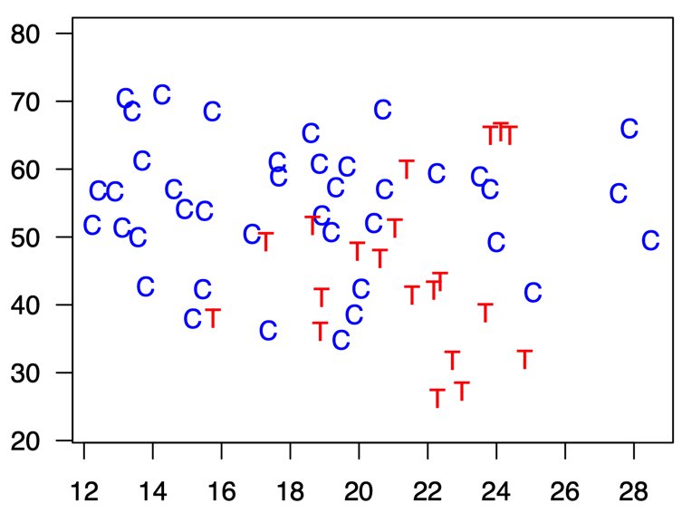

---

.center[
### Mahalanobis Distance Matching
]

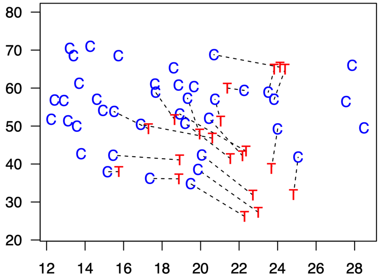

---

.center[
### Mahalanobis Distance Matching
]

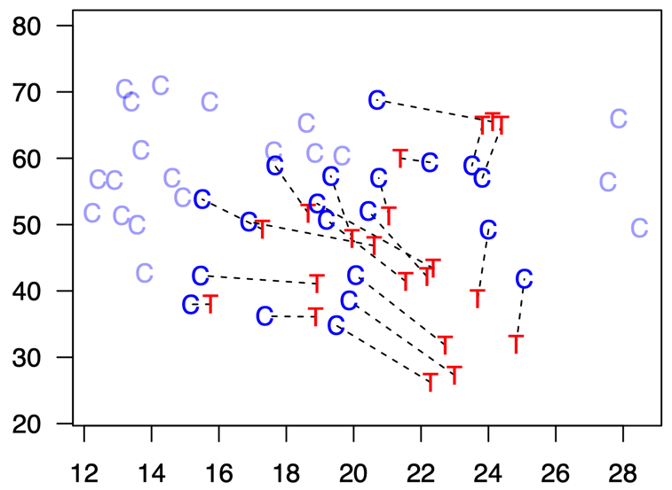

---

.center[
### Mahalanobis Distance Matching
]

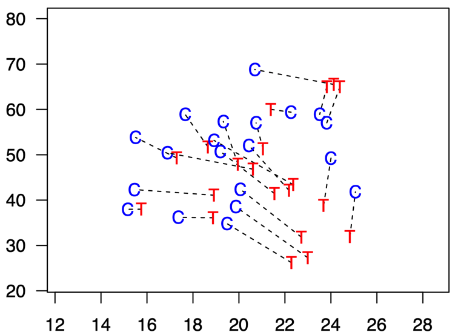

---

.center[
### Mahalanobis Distance Matching
]

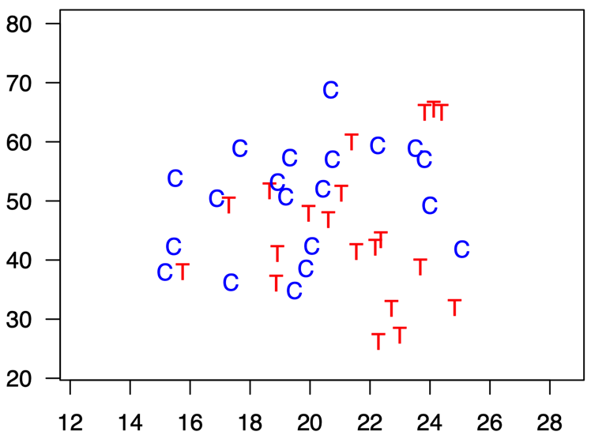


---

### Propensity Score Matching

![:space 2]

Reduce the $p$ variables of $X$ to a **_scalar_**

$$ \pi_i = pr(T_i = 1| X) = \frac{1}{1+e^{-X_i\beta}} $$

--

- The idea is to **_model the randomization process_** (the probability of being randomly assigned to the treatment and/or control)

--

- Match each treated unit to the nearest control unit

$$ D(X_i,X_j) = |\pi_i - \pi_j| $$

--

- Prune matches if Distance > caliper

--

- By far the most commonly used matching method

---

.center[
### Propensity Score Matching
]

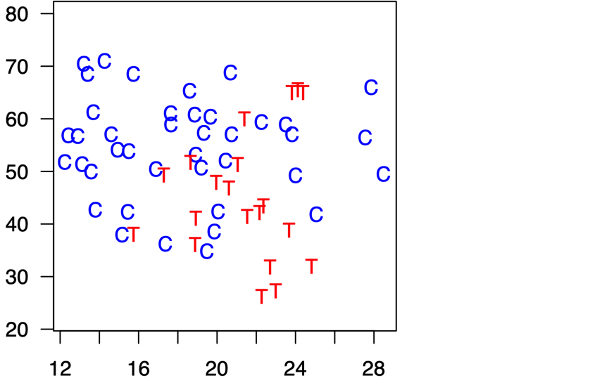


---

.center[
### Propensity Score Matching
]

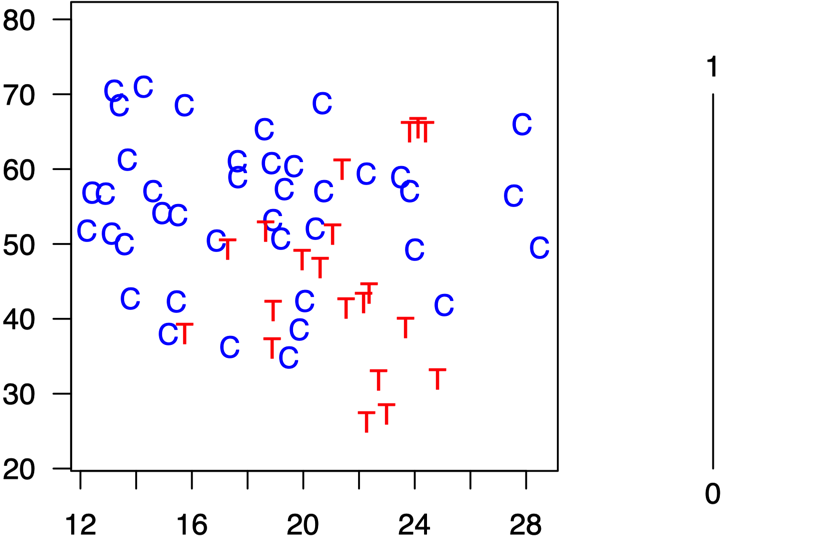

---

.center[
### Propensity Score Matching
]

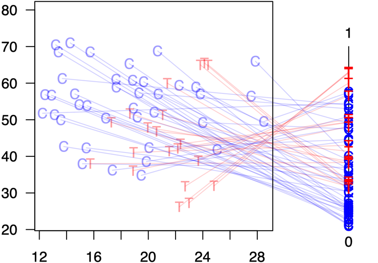

---

.center[
### Propensity Score Matching
]

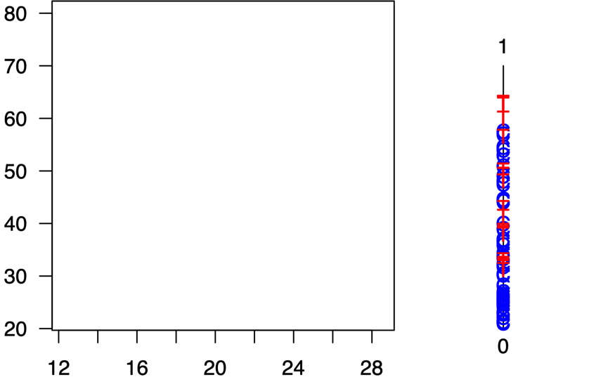

---

.center[
### Propensity Score Matching
]

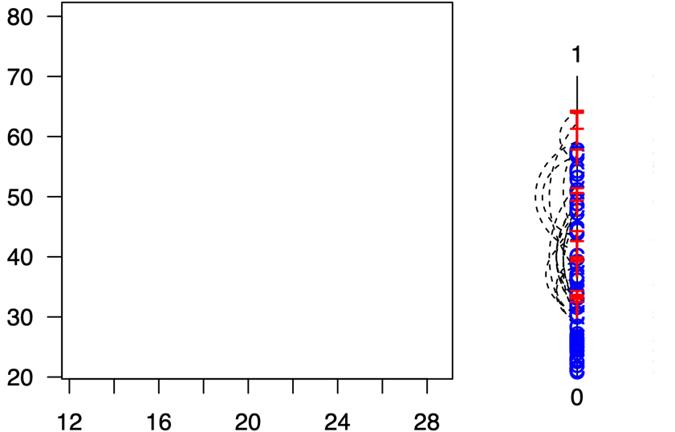

---

.center[
### Propensity Score Matching
]

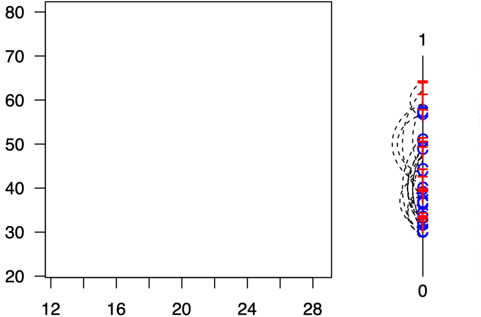

---

.center[
### Propensity Score Matching
]

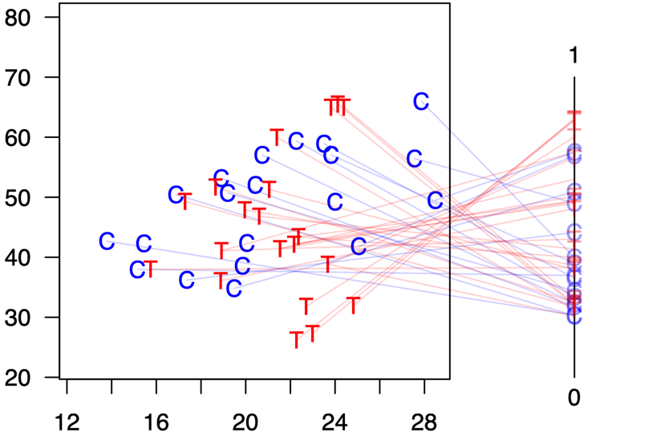

---

.center[
### Propensity Score Matching
]

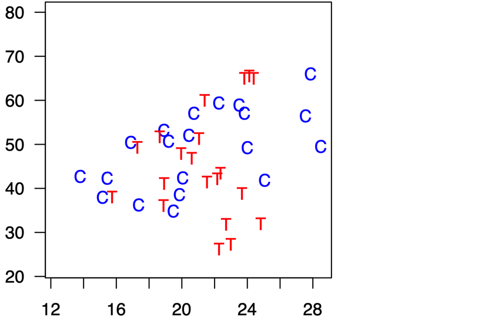

---

### The Propensity Score Matching Paradox

- Recall **_randomization can result in imbalance_** (even under the best circumstances)

--

- Propensity Score Matching **_approximates complete randomization_**... meaning it can _increase_ imbalance in data at times. 

--

- Problem grows as the **_dimensionality_** in $X$ grows.

--

- Recent push to away from propensity scores 

    - See "Why Propensity Scores Should Not Be Used for Matching" (suggested reading)

    - Suggest using methods that approximate a fully blocked experiment, like coursened exact matching
    
---

### The Matching Frontier

.center[

**Bias-Variance $\approx$ Imbalance-N**

]

- There are many matching methods one can try.

--

![:space 1]

- One should try all and see which yields the best matching sample. Quickly making this exercise an optimization problem!

--

![:space 1]

- Need to ensure optimality: i.e. we want to live in a world where no cherry picking is possible.

--

![:space 1]

- "Matching Frontier" Method scans all possible matching combinations and presents the "frontier" with the most optimal matches given pruning. 

- See "The Balance-Sample Size Frontier in Matching Methods for Causal Inference" ( King et al. 2017)

---

class: newsection

### Simulation Example

---

### Aim of the Simulation

- See how well these methods perform on "known" data

- Explore implementing the different matching methods

---

![:space 3]

```{r}
set.seed(123) # Seed for replication

N = 1000 # Sample Size

# Random explanatory variables
x1 <- rnorm(N)
x2 <- rnorm(N)

# Probability of being in the treatment group is a 
# function of existing covariates
z = -1 + x1 + x2  # Linear combination w/r/t pr(T=1)
pr_tr <- pnorm(z) # Probability of being treated 
tr <- rbinom(N,1,pr_tr) # 1, 0 -> treated or not

# Treatment is correlated with covariates

# Outcome (TREATMENT EFFECT == 1)
y = tr + x1*x2 + x1^2 + x1^3 + rnorm(N)

# Gather as a data frame
D = tibble(y,x1,x2,tr) 
```

---

```{r,fig.align="center",fig.width=9,fig.height=7}
pairs(D,col="steelblue")
```

---

```{r}
td = function(...) broom::tidy(...) %>%  
  mutate_if(is.numeric,function(x) round(x,2))

m1 <- lm(y ~ tr,data=D)
td(m1)
```


--

```{r}
m2 <- lm(y ~ tr + x1 + x2,data=D)
td(m2)
```

---

### Treatment effect can be recovered...

...If we know the functional form of the "true model" (i.e. the underlying data generating process)

--

```{r}
m3 <- lm(y ~ tr + x1*x2 + I(x1^2) + I(x1^3),data=D)
td(m3)
```

--

We rarely if ever know this...

---

```{r}
# Propensity Score Matching
m_out = matchit(tr ~ x1 + x2, 
                method="nearest",
                distance = "logit",
                discard = "both",
                data=D)
m_out$nn
```

--

```{r}
summary(m_out)
```


---

```{r,fig.align="center",fig.width=9,fig.height=7}
plot(m_out,type="hist")
```


---

![:space 15]
```{r}
D_m = match.data(m_out)
head(D_m)
```

```{r}
dim(D_m)
```

---

```{r,fig.align="center",fig.width=9,fig.height=6}
D_m %>% select(x1,x2,tr) %>% 
  gather(var,val,-tr) %>% 
  ggplot(aes(val,fill=factor(tr))) +
  geom_histogram(alpha=.7) +
  facet_wrap(~var,ncol = 2) 
```

---

![:space 15]
```{r}
D_m %>% 
  group_by(tr) %>% 
  summarize(x1 = mean(x1),
            x2 = mean(x2)) 
```


---

![:space 5]
```{r}
td(lm(y ~ tr , data=D_m))
td(lm(y ~ tr + x1 + x2, data=D_m))
```

---

![:space 15]

```{r}
# Mahalanobis Distance Matching
m_out2 = matchit(tr ~ x1 + x2, 
                 data=D,
                 method="nearest", 
                 distance="mahalanobis", 
                 discard = "both")

# Generate a matched data frame
D_m2 = match.data(m_out2)

m_out2$nn
```

---

```{r,fig.align="center",fig.width=9,fig.height=6}
D_m2 %>% select(x1,x2,tr) %>% 
  gather(var,val,-tr) %>% 
  ggplot(aes(val,fill=factor(tr))) +
  geom_histogram(alpha=.7) +
  facet_wrap(~var,ncol = 2) 
```

---

![:space 15]
```{r}
D_m2 %>% 
  group_by(tr) %>% 
  summarize(x1 = mean(x1),
            x2 = mean(x2)) 
```

---

![:space 5]
```{r}
td(lm(y ~ tr , data=D_m2))
td(lm(y ~ tr + x1 + x2, data=D_m2))
```

---

![:space 15]
```{r,fig.align="center",fig.width=9,fig.height=6}
# Course Exact Matching
m_out3 = matchit(tr ~ x1 + x2, 
                 method="cem",
                 discard = "both",
                 data=D)

# Generate a matched data frame
D_m3 = match.data(m_out3)

m_out3$nn
```

---

```{r,fig.align="center",fig.width=9,fig.height=6}
D_m3 %>% select(x1,x2,tr) %>% 
  gather(var,val,-tr) %>% 
  ggplot(aes(val,fill=factor(tr))) +
  geom_histogram(alpha=.7) +
  facet_wrap(~var,ncol = 2) 
```

---

![:space 15]
```{r}
D_m3 %>% 
  group_by(tr) %>% 
  summarize(x1 = mean(x1*weights),
            x2 = mean(x2*weights)) 
```

---

![:space 5]
```{r}
td(lm(y ~ tr , weights = D_m3$weights, data=D_m3))
td(lm(y ~ tr + x1 + x2,weights = D_m3$weights, data=D_m3))
```

---

### Keep in mind

- Matching is a preprocessing step useful to reduce model dependency by generating a balanced dataset.

- Not all matching methods are created equal. 

  - Need to explore different methods to see which one provides the best balance. 
  
  - New methods emerging that aid in locating the optimal match.
  
- When balancing, one must have all the covariates that related to the treatment assignment and the outcome. 

  - If you lack complete data, this can be a source of bias (i.e. you're not balancing on the dimensions that matter)
  
- Balancing becomes more difficult as the dimensionality of $X$ increases.


